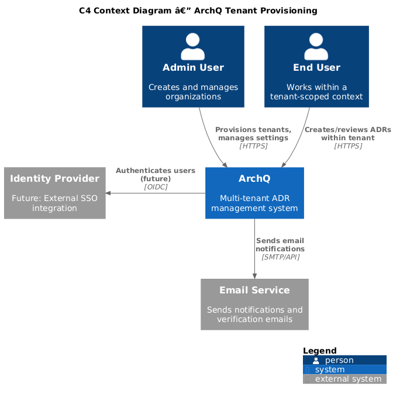
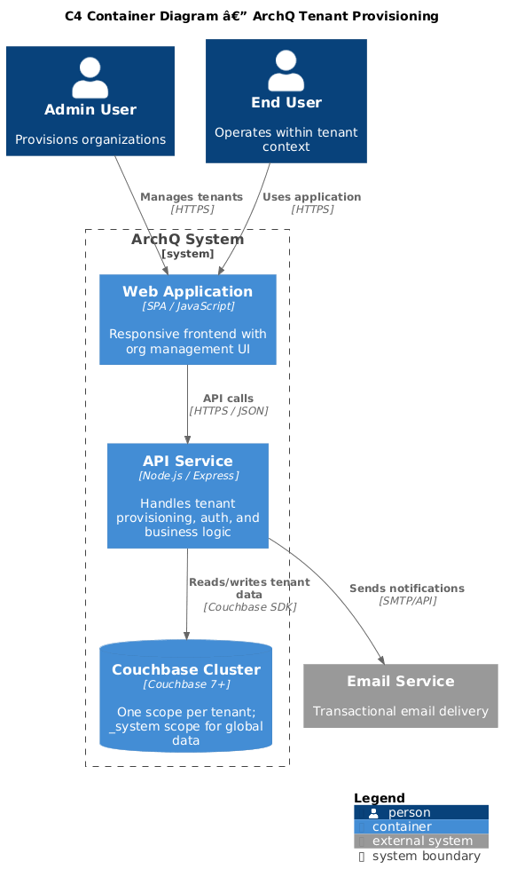
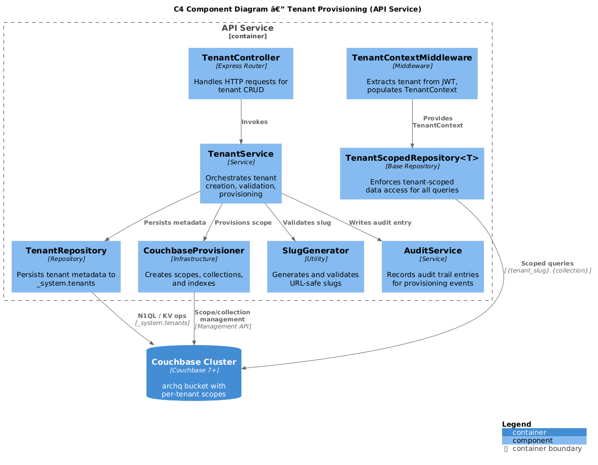
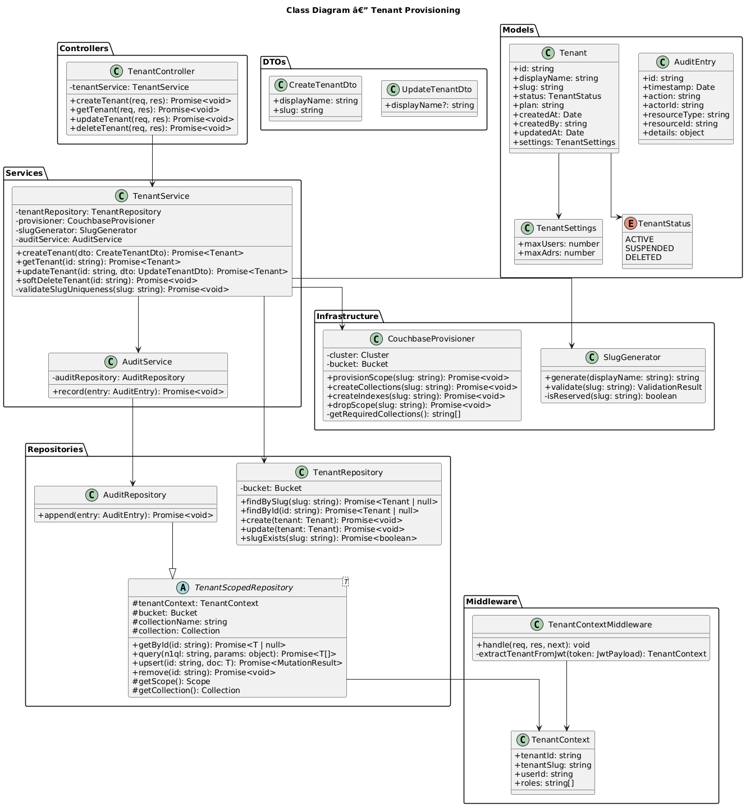
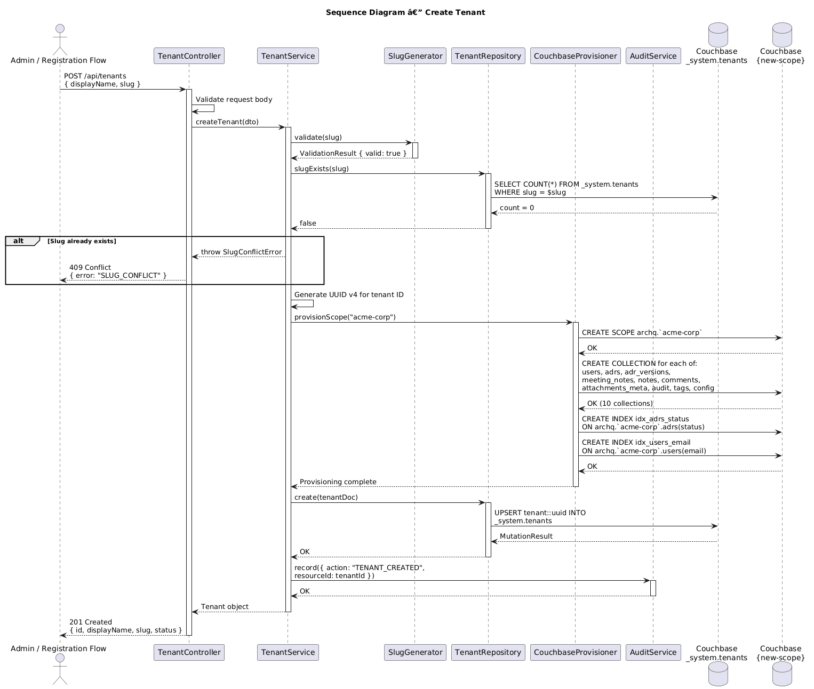

# Feature 01: Tenant Provisioning

**Traces to:** L2-001, L2-002

---

## 1. Overview

Tenant provisioning is the foundational capability that enables ArchQ's multi-tenant architecture. When an organization is created, the system provisions a dedicated Couchbase scope containing all required collections, establishing complete data isolation at the database level. Every subsequent data operation is automatically scoped to the authenticated user's active tenant, ensuring that application-level bugs cannot leak data across organizational boundaries.

### Goals

- Allow creation of organizations with a unique ID, display name, and URL-safe slug.
- Enforce slug uniqueness across the platform.
- Provision a Couchbase scope per tenant with all required collections and indexes.
- Guarantee tenant-scoped data access at the repository layer.
- Return 404 (not 403) for cross-tenant resource access attempts.

---

## 2. Architecture

### 2.1 C4 Context Diagram



The ArchQ system interacts with administrators who provision tenants, end users who consume tenant-scoped data, and the Couchbase cluster that stores all tenant data.

### 2.2 C4 Container Diagram



The system comprises a frontend SPA, a backend API service, and a Couchbase database cluster. Tenant provisioning is initiated through the API and results in database-level scope creation.

### 2.3 C4 Component Diagram



The backend API contains the following components relevant to tenant provisioning:

| Component | Responsibility |
|-----------|----------------|
| `TenantController` | Handles HTTP requests for tenant CRUD operations |
| `TenantService` | Orchestrates tenant creation, validation, and provisioning |
| `TenantRepository` | Persists tenant metadata to the `_system.tenants` collection |
| `CouchbaseProvisioner` | Creates Couchbase scopes, collections, and indexes |
| `TenantContextMiddleware` | Extracts tenant from JWT claims and sets `TenantContext` |
| `TenantScopedRepository<T>` | Base repository that enforces tenant-scoped queries |
| `SlugGenerator` | Generates and validates URL-safe slugs |

---

## 3. Component Details

### 3.1 TenantController

```
POST   /api/tenants          — Create a new tenant
GET    /api/tenants/:id      — Get tenant details (admin only)
PATCH  /api/tenants/:id      — Update tenant display name
DELETE /api/tenants/:id      — Soft-delete tenant (admin only)
```

### 3.2 TenantService

Orchestrates the provisioning workflow:

1. Validate input (display name, slug format).
2. Check slug uniqueness against `_system.tenants` collection.
3. Generate tenant ID (UUID v4).
4. Create Couchbase scope named after the slug.
5. Create all required collections within the scope.
6. Create primary and secondary indexes.
7. Persist tenant metadata document.
8. Write audit log entry.

### 3.3 TenantContextMiddleware

Runs on every authenticated request. Extracts the `tenant_id` and `tenant_slug` claims from the JWT and populates a request-scoped `TenantContext` object. If the JWT lacks tenant claims, the request is rejected with 401.

### 3.4 TenantScopedRepository<T>

Abstract base class for all data access. Every query method automatically targets the Couchbase scope corresponding to the active tenant. Subclasses cannot bypass tenant scoping.

```
class TenantScopedRepository<T> {
  #tenantContext: TenantContext
  #collection: Collection

  constructor(tenantContext, bucket, collectionName)
  getById(id: string): Promise<T | null>
  query(statement: string, params: Record<string, any>): Promise<T[]>
  upsert(id: string, doc: T): Promise<void>
  remove(id: string): Promise<void>
}
```

The constructor resolves the collection as: `bucket.scope(tenantContext.slug).collection(collectionName)`.

---

## 4. Data Model



### 4.1 Tenant Metadata Document

Stored in the `_system` scope, `tenants` collection. Document key: `tenant::{id}`.

```json
{
  "type": "tenant",
  "id": "uuid-v4",
  "displayName": "Acme Corp",
  "slug": "acme-corp",
  "status": "active",
  "plan": "standard",
  "createdAt": "2026-04-15T10:00:00Z",
  "createdBy": "user-uuid",
  "updatedAt": "2026-04-15T10:00:00Z",
  "settings": {
    "maxUsers": 50,
    "maxAdrs": 1000
  }
}
```

### 4.2 Couchbase Structure

```
Bucket: archq
├── _system (scope)
│   ├── tenants          — Tenant metadata documents
│   └── global_users     — Email-to-tenant mapping for login
├── acme-corp (scope)    — Tenant "Acme Corp"
│   ├── users
│   ├── adrs
│   ├── adr_versions
│   ├── meeting_notes
│   ├── notes
│   ├── comments
│   ├── attachments_meta
│   ├── audit
│   ├── tags
│   └── config
├── beta-inc (scope)     — Tenant "Beta Inc"
│   ├── users
│   ├── ...
```

### 4.3 Collections per Tenant Scope

| Collection | Purpose | Document Key Pattern |
|------------|---------|---------------------|
| `users` | User profiles within tenant | `user::{userId}` |
| `adrs` | ADR documents | `adr::{adrNumber}` |
| `adr_versions` | Version snapshots of ADR content | `adrver::{adrNumber}::v{version}` |
| `meeting_notes` | Meeting notes linked to ADRs | `mnote::{id}` |
| `notes` | General notes linked to ADRs | `note::{id}` |
| `comments` | Threaded comments on ADRs | `comment::{id}` |
| `attachments_meta` | Attachment metadata (file in object storage) | `attach::{id}` |
| `audit` | Immutable audit log entries | `audit::{timestamp}::{id}` |
| `tags` | Tag definitions | `tag::{slug}` |
| `config` | Tenant-level configuration | `config::{key}` |

### 4.4 Slug Validation Rules

- Lowercase alphanumeric and hyphens only: `^[a-z0-9][a-z0-9-]{1,61}[a-z0-9]$`
- Minimum 3 characters, maximum 63 characters
- Cannot start or end with hyphen
- Reserved slugs: `_system`, `_default`, `admin`, `api`, `www`, `app`

---

## 5. Key Workflows

### 5.1 Create Tenant



**Actor:** Admin user or registration flow

**Steps:**

1. Client sends `POST /api/tenants` with `{ displayName, slug }`.
2. `TenantController` validates the request body.
3. `TenantService.createTenant()` is invoked.
4. Slug uniqueness is checked via N1QL query on `_system.tenants`.
5. If slug exists, return `409 Conflict`.
6. `CouchbaseProvisioner.provisionScope()` creates the Couchbase scope.
7. `CouchbaseProvisioner.createCollections()` creates all 10 collections.
8. `CouchbaseProvisioner.createIndexes()` creates primary and secondary indexes.
9. Tenant metadata document is persisted to `_system.tenants`.
10. Audit entry is written.
11. Response: `201 Created` with tenant details.

### 5.2 Tenant-Scoped Query Enforcement

Every repository method resolves its target collection through `TenantContext`:

1. `TenantContextMiddleware` extracts `tenant_slug` from JWT.
2. Middleware populates `TenantContext` on the request.
3. Repository constructor calls `bucket.scope(ctx.slug).collection(name)`.
4. All N1QL queries automatically target the scoped collection.
5. Cross-tenant document IDs resolve to `null` (returns 404 to client).

---

## 6. API Contracts

### 6.1 Create Tenant

```
POST /api/tenants
Authorization: Bearer <jwt>
Content-Type: application/json

Request:
{
  "displayName": "Acme Corp",
  "slug": "acme-corp"
}

Response 201:
{
  "id": "550e8400-e29b-41d4-a716-446655440000",
  "displayName": "Acme Corp",
  "slug": "acme-corp",
  "status": "active",
  "createdAt": "2026-04-15T10:00:00Z"
}

Response 409:
{
  "error": "SLUG_CONFLICT",
  "message": "The organization slug 'acme-corp' is already in use."
}

Response 400:
{
  "error": "VALIDATION_ERROR",
  "message": "Slug must be 3-63 lowercase alphanumeric characters or hyphens."
}
```

### 6.2 Get Tenant

```
GET /api/tenants/:id
Authorization: Bearer <jwt>

Response 200:
{
  "id": "550e8400-e29b-41d4-a716-446655440000",
  "displayName": "Acme Corp",
  "slug": "acme-corp",
  "status": "active",
  "plan": "standard",
  "createdAt": "2026-04-15T10:00:00Z",
  "updatedAt": "2026-04-15T10:00:00Z",
  "settings": {
    "maxUsers": 50,
    "maxAdrs": 1000
  }
}
```

### 6.3 Update Tenant

```
PATCH /api/tenants/:id
Authorization: Bearer <jwt>
Content-Type: application/json

Request:
{
  "displayName": "Acme Corporation"
}

Response 200:
{
  "id": "550e8400-e29b-41d4-a716-446655440000",
  "displayName": "Acme Corporation",
  "slug": "acme-corp",
  "status": "active",
  "updatedAt": "2026-04-15T10:05:00Z"
}
```

---

## 7. Security Considerations

| Concern | Mitigation |
|---------|------------|
| Cross-tenant data leakage | Repository base class enforces scope-level isolation; no raw queries allowed |
| Tenant enumeration via slugs | Slug existence check available only to authenticated users during registration |
| Cross-tenant resource probing | Return 404 (not 403) when a resource belongs to another tenant |
| Slug injection | Strict regex validation; slugs used as Couchbase scope names must be sanitized |
| Unauthorized provisioning | Tenant creation restricted to Admin role or registration flow |
| Scope deletion | Soft-delete only; hard deletion requires manual operator intervention |

---

## 8. Open Questions

| # | Question | Status |
|---|----------|--------|
| 1 | Should tenant deletion cascade-delete all data or archive to cold storage? | Open |
| 2 | Maximum number of tenants per Couchbase cluster before horizontal scaling? | Open |
| 3 | Should slug changes be allowed after provisioning (requires scope rename)? | Decided: No |
| 4 | Do we need a tenant provisioning queue for async scope creation at scale? | Open |
| 5 | Should there be a "suspended" tenant status that blocks all API access? | Open |
