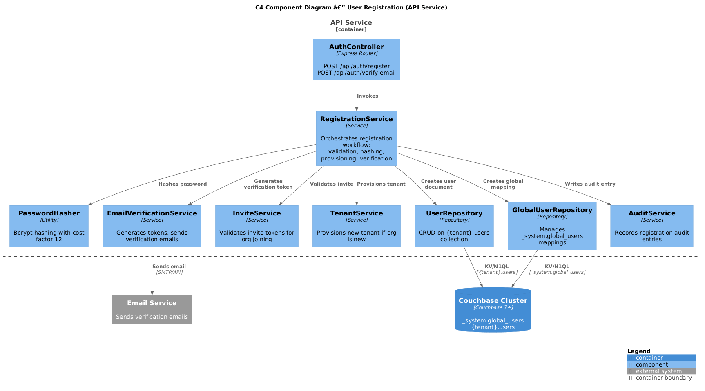
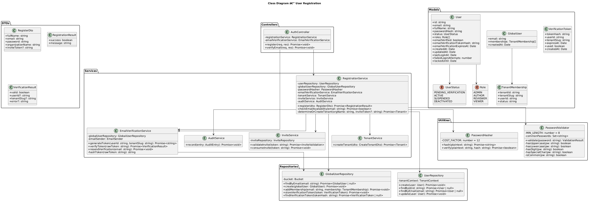
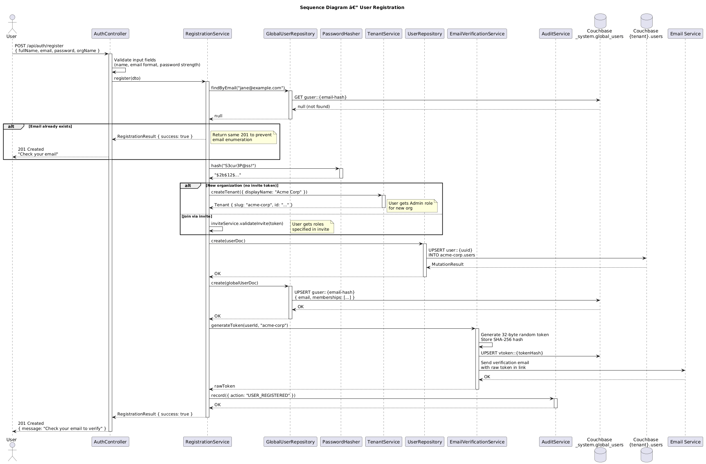

# Feature 02: User Registration

**Traces to:** L2-003

---

## 1. Overview

User registration is the entry point for new users into the ArchQ platform. The registration flow collects user credentials and organization information, creates a user account with a securely hashed password, optionally provisions a new tenant, and sends an email verification link. Accounts remain inactive until the email is verified, preventing unauthorized access and ensuring valid contact information.

### Goals

- Register users with email, password, full name, and organization name.
- Hash passwords using bcrypt with cost factor 12.
- Send email verification link; account inactive until verified.
- Return generic error on duplicate email (do not reveal account existence).
- Create a new tenant if the organization does not exist.
- Join an existing tenant via invite token.

---

## 2. Architecture

### 2.1 C4 Component Diagram



The registration feature involves the following components:

| Component | Responsibility |
|-----------|----------------|
| `AuthController` | Handles registration HTTP endpoint |
| `RegistrationService` | Orchestrates registration, validation, hashing, verification |
| `UserRepository` | Persists user documents to `{tenant}.users` |
| `GlobalUserRepository` | Manages email-to-tenant mappings in `_system.global_users` |
| `PasswordHasher` | Bcrypt hashing and verification (cost factor 12) |
| `EmailVerificationService` | Generates verification tokens and sends emails |
| `TenantService` | Creates new tenant when org does not exist |
| `InviteService` | Validates invite tokens for joining existing orgs |

---

## 3. Component Details

### 3.1 AuthController

```
POST /api/auth/register    — Register a new user account
POST /api/auth/verify-email — Verify email with token
```

### 3.2 RegistrationService

Orchestrates the full registration workflow:

1. Validate input fields (name, email format, password strength).
2. Check if email already exists in `_system.global_users`.
3. If duplicate, return generic success response (do not reveal existence).
4. Hash password using bcrypt (cost 12).
5. Determine tenant: create new or join via invite.
6. Create user document in `{tenant}.users`.
7. Create global user mapping in `_system.global_users`.
8. Generate email verification token (32-byte random, SHA-256 stored).
9. Send verification email with link.
10. Write audit entry.

### 3.3 PasswordHasher

Wraps bcrypt with enforced cost factor:

```
class PasswordHasher {
  COST_FACTOR = 12

  async hash(plaintext: string): Promise<string>
  async verify(plaintext: string, hash: string): Promise<boolean>
}
```

### 3.4 EmailVerificationService

```
class EmailVerificationService {
  TOKEN_EXPIRY_HOURS = 24

  async generateToken(userId: string, tenantSlug: string): Promise<string>
  async verifyToken(token: string): Promise<VerificationResult>
  async resendVerification(email: string): Promise<void>
}
```

Token is a 32-byte cryptographically random value. The SHA-256 hash of the token is stored; the raw token is sent to the user's email. This prevents token theft via database compromise.

### 3.5 Password Strength Rules

- Minimum 8 characters
- At least one uppercase letter
- At least one lowercase letter
- At least one digit
- At least one special character from: `!@#$%^&*()_+-=[]{}|;:,.<>?`
- Not in the top-10000 common passwords list

---

## 4. Data Model



### 4.1 User Document

Stored in `{tenant_slug}.users` collection. Key: `user::{userId}`.

```json
{
  "type": "user",
  "id": "uuid-v4",
  "email": "jane@example.com",
  "fullName": "Jane Smith",
  "passwordHash": "$2b$12$...",
  "status": "pending_verification",
  "roles": ["author"],
  "emailVerified": false,
  "emailVerificationTokenHash": "sha256-hex",
  "emailVerificationExpiresAt": "2026-04-16T10:00:00Z",
  "createdAt": "2026-04-15T10:00:00Z",
  "updatedAt": "2026-04-15T10:00:00Z",
  "lastLoginAt": null,
  "failedLoginAttempts": 0,
  "lockedUntil": null
}
```

### 4.2 Global User Mapping Document

Stored in `_system.global_users` collection. Key: `guser::{email-hash}`.

This collection maps email addresses to tenant memberships for login routing.

```json
{
  "type": "global_user",
  "email": "jane@example.com",
  "memberships": [
    {
      "tenantId": "uuid-tenant-1",
      "tenantSlug": "acme-corp",
      "userId": "uuid-user-1",
      "status": "active"
    }
  ],
  "createdAt": "2026-04-15T10:00:00Z"
}
```

### 4.3 Email Verification Token Document

Stored in `_system.global_users` as a sub-document or separate collection `_system.verification_tokens`. Key: `vtoken::{tokenHash}`.

```json
{
  "type": "verification_token",
  "tokenHash": "sha256-of-raw-token",
  "userId": "uuid-v4",
  "tenantSlug": "acme-corp",
  "expiresAt": "2026-04-16T10:00:00Z",
  "used": false,
  "createdAt": "2026-04-15T10:00:00Z"
}
```

---

## 5. Key Workflows

### 5.1 User Registration



**Actor:** Anonymous user

**Steps:**

1. User fills out registration form: full name, email, password, organization name.
2. Client sends `POST /api/auth/register`.
3. `AuthController` validates input.
4. `RegistrationService` checks email uniqueness via `GlobalUserRepository`.
5. If email exists, return `201` with generic "Check your email" message (prevents enumeration).
6. Password is hashed with bcrypt (cost 12).
7. If organization name matches no existing tenant, `TenantService.createTenant()` provisions a new scope. The registering user becomes the Admin.
8. If an invite token is present, `InviteService.validateInvite()` verifies it and associates the user with the existing tenant.
9. User document created in `{tenant}.users`.
10. Global user mapping created in `_system.global_users`.
11. Verification token generated and emailed.
12. Response: `201 Created` with "Check your email to verify your account."

### 5.2 Email Verification

1. User clicks verification link: `GET /verify-email?token=<raw-token>`.
2. Frontend extracts token and calls `POST /api/auth/verify-email { token }`.
3. `EmailVerificationService.verifyToken()` hashes the token and looks up `vtoken::{hash}`.
4. If not found or expired, return `400 Bad Request`.
5. User document updated: `emailVerified = true`, `status = "active"`.
6. Verification token marked as used.
7. Response: `200 OK` with "Email verified. You may now sign in."

---

## 6. API Contracts

### 6.1 Register

```
POST /api/auth/register
Content-Type: application/json

Request:
{
  "fullName": "Jane Smith",
  "email": "jane@example.com",
  "password": "S3cur3P@ss!",
  "organizationName": "Acme Corp",
  "inviteToken": null
}

Response 201:
{
  "message": "Registration successful. Please check your email to verify your account."
}

Response 400:
{
  "error": "VALIDATION_ERROR",
  "details": [
    { "field": "password", "message": "Password must be at least 8 characters with uppercase, lowercase, digit, and special character." }
  ]
}
```

Note: Duplicate email returns the same `201` response to prevent email enumeration.

### 6.2 Verify Email

```
POST /api/auth/verify-email
Content-Type: application/json

Request:
{
  "token": "abc123rawtoken..."
}

Response 200:
{
  "message": "Email verified successfully. You may now sign in."
}

Response 400:
{
  "error": "INVALID_TOKEN",
  "message": "Verification link is invalid or has expired."
}
```

---

## 7. UI Design

The registration page presents a centered card on a neutral background with ArchQ branding.

**Register Card Layout:**

- ArchQ logo with landmark icon (top center)
- "Create your account" heading
- Form fields:
  - Full Name (Input/Default)
  - Email Address (Input/Default, type=email)
  - Password (Input/Default, type=password, with strength indicator)
  - Organization Name (Input/Default)
- "Create Account" button (Button/Primary, full width)
- "Already have an account? Sign in" link (below button)

**Responsive behavior:**
- Desktop (>=768px): Card centered, max-width 440px
- Mobile (<768px): Card full-width with horizontal padding

---

## 8. Security Considerations

| Concern | Mitigation |
|---------|------------|
| Email enumeration | Always return 201 on register, regardless of whether email exists |
| Password brute force | Bcrypt cost 12 makes offline attacks expensive (~250ms per hash) |
| Verification token theft | Store SHA-256 of token; raw token only in email |
| Token replay | Tokens are single-use and expire after 24 hours |
| Weak passwords | Server-side strength validation with common password blocklist |
| Registration spam | Rate limiting: max 5 registrations per IP per hour |
| XSS in name fields | Input sanitization and output encoding on all user-supplied strings |

---

## 9. Open Questions

| # | Question | Status |
|---|----------|--------|
| 1 | Should we support social login (Google, GitHub) in the initial release? | Decided: No, future phase |
| 2 | Should organization name auto-generate slug or allow manual slug entry? | Decided: Auto-generate from name, editable |
| 3 | Maximum verification email resend attempts before cooldown? | Open |
| 4 | Should we offer a "join existing org" flow without an invite token? | Open |
