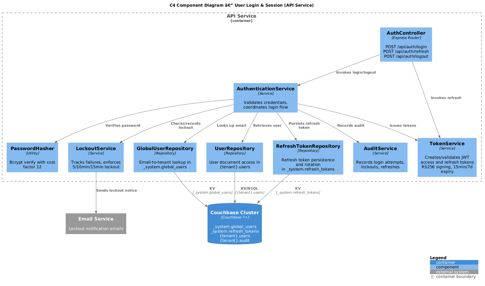
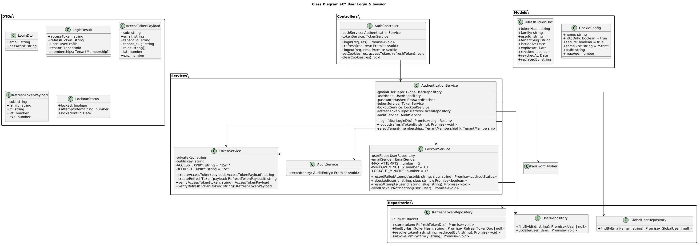
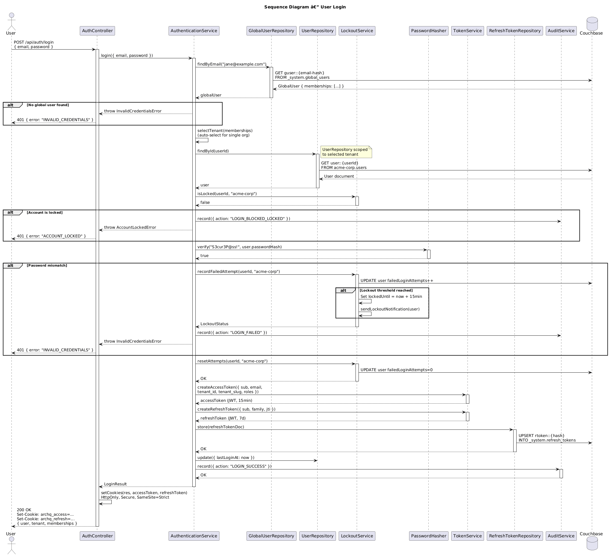
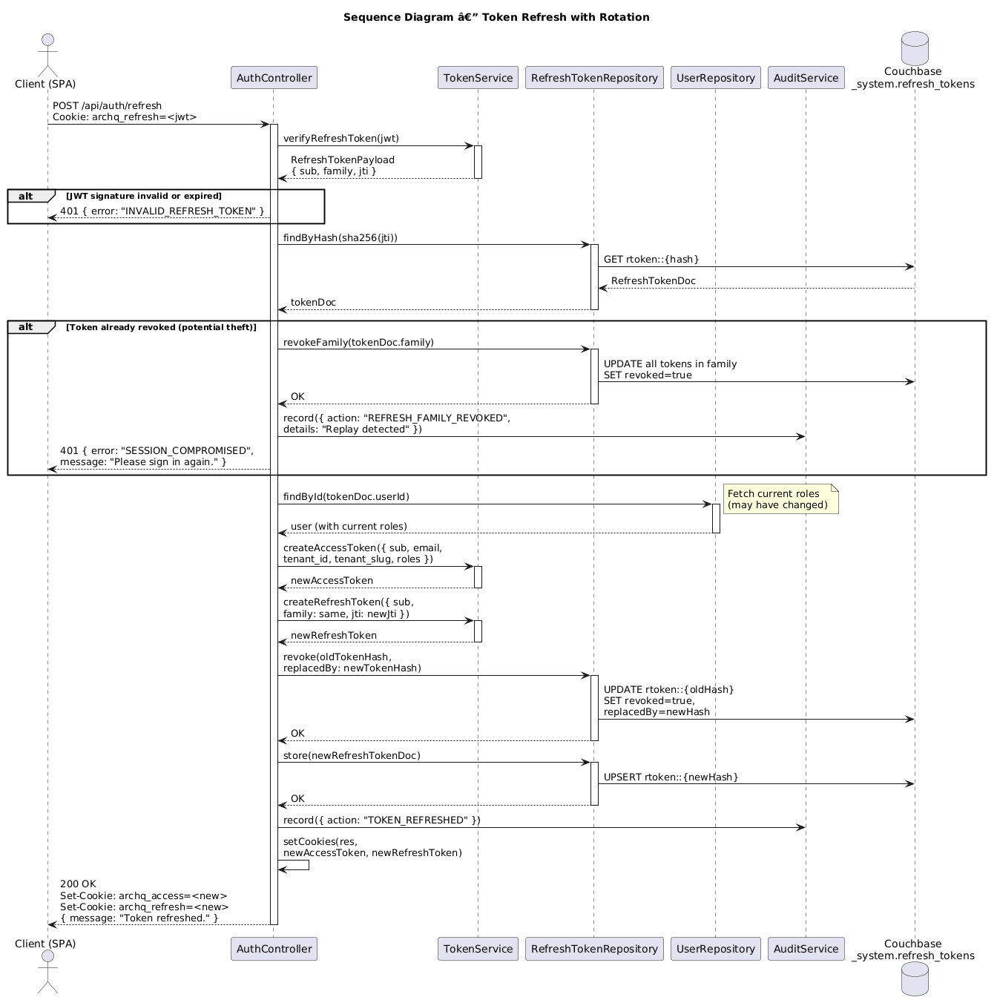

# Feature 03: User Login & Session

**Traces to:** L2-003, L2-025

---

## 1. Overview

User login authenticates credentials against stored bcrypt hashes and issues JWT-based session tokens. The system uses a dual-token strategy: a short-lived access token (15 minutes) for API authorization and a long-lived refresh token (7 days) for seamless session renewal. Both tokens are delivered via HttpOnly secure cookies to mitigate XSS-based token theft. Account lockout protects against brute-force attacks, and all connections require HTTPS.

### Goals

- Authenticate users with email and password.
- Issue JWT access tokens (15 min expiry) and refresh tokens (7 days expiry).
- Deliver tokens via HttpOnly, Secure, SameSite=Strict cookies.
- Return generic "invalid credentials" error on failure.
- Lock accounts after 5 failed attempts in 10 minutes (15-minute lockout).
- Send email notification on account lockout.
- Enforce HTTPS with 301 redirect.

---

## 2. Architecture

### 2.1 C4 Component Diagram



| Component | Responsibility |
|-----------|----------------|
| `AuthController` | Handles login, logout, and token refresh endpoints |
| `AuthenticationService` | Validates credentials, manages lockout, issues tokens |
| `TokenService` | Creates and validates JWT access and refresh tokens |
| `PasswordHasher` | Bcrypt verification (cost factor 12) |
| `LockoutService` | Tracks failed attempts, enforces lockout policy |
| `GlobalUserRepository` | Looks up email-to-tenant mappings for login routing |
| `UserRepository` | Reads/updates user documents within tenant scope |
| `RefreshTokenRepository` | Persists refresh token families for rotation/revocation |
| `AuditService` | Records login attempts, lockouts, token refreshes |

---

## 3. Component Details

### 3.1 AuthController

```
POST /api/auth/login         — Authenticate and issue tokens
POST /api/auth/refresh       — Refresh access token using refresh cookie
POST /api/auth/logout        — Revoke refresh token, clear cookies
```

### 3.2 TokenService

```
class TokenService {
  ACCESS_TOKEN_EXPIRY = '15m'
  REFRESH_TOKEN_EXPIRY = '7d'

  createAccessToken(payload: AccessTokenPayload): string
  createRefreshToken(payload: RefreshTokenPayload): string
  verifyAccessToken(token: string): AccessTokenPayload
  verifyRefreshToken(token: string): RefreshTokenPayload
}
```

**Access Token Payload:**

```json
{
  "sub": "user-uuid",
  "email": "jane@example.com",
  "tenant_id": "tenant-uuid",
  "tenant_slug": "acme-corp",
  "roles": ["author", "reviewer"],
  "iat": 1713178800,
  "exp": 1713179700
}
```

**Refresh Token Payload:**

```json
{
  "sub": "user-uuid",
  "family": "refresh-family-uuid",
  "iat": 1713178800,
  "exp": 1713783600
}
```

### 3.3 LockoutService

```
class LockoutService {
  MAX_ATTEMPTS = 5
  WINDOW_MINUTES = 10
  LOCKOUT_MINUTES = 15

  async recordFailedAttempt(userId: string, tenantSlug: string): Promise<LockoutStatus>
  async isLocked(userId: string, tenantSlug: string): Promise<boolean>
  async resetAttempts(userId: string, tenantSlug: string): Promise<void>
}
```

Failed attempt tracking uses the user document fields `failedLoginAttempts`, `firstFailedAttemptAt`, and `lockedUntil`.

### 3.4 Cookie Configuration

| Cookie | Value | HttpOnly | Secure | SameSite | Path | Max-Age |
|--------|-------|----------|--------|----------|------|---------|
| `archq_access` | JWT access token | Yes | Yes | Strict | `/api` | 900 (15 min) |
| `archq_refresh` | JWT refresh token | Yes | Yes | Strict | `/api/auth/refresh` | 604800 (7 days) |

### 3.5 Refresh Token Rotation

Each refresh token belongs to a "family" (UUID). When a refresh token is used:

1. The current refresh token is invalidated.
2. A new refresh token is issued in the same family.
3. If a previously invalidated token is replayed, the entire family is revoked (theft detection).

---

## 4. Data Model



### 4.1 User Document (login-relevant fields)

Stored in `{tenant_slug}.users`. Key: `user::{userId}`.

```json
{
  "type": "user",
  "id": "uuid-v4",
  "email": "jane@example.com",
  "passwordHash": "$2b$12$...",
  "status": "active",
  "roles": ["author", "reviewer"],
  "emailVerified": true,
  "failedLoginAttempts": 0,
  "firstFailedAttemptAt": null,
  "lockedUntil": null,
  "lastLoginAt": "2026-04-15T10:00:00Z"
}
```

### 4.2 Refresh Token Document

Stored in `_system.refresh_tokens`. Key: `rtoken::{tokenHash}`.

```json
{
  "type": "refresh_token",
  "tokenHash": "sha256-of-jti",
  "family": "family-uuid",
  "userId": "user-uuid",
  "tenantSlug": "acme-corp",
  "issuedAt": "2026-04-15T10:00:00Z",
  "expiresAt": "2026-04-22T10:00:00Z",
  "revoked": false,
  "revokedAt": null,
  "replacedBy": null
}
```

### 4.3 Login Attempt (Audit)

```json
{
  "type": "audit",
  "id": "uuid-v4",
  "timestamp": "2026-04-15T10:00:00Z",
  "action": "LOGIN_SUCCESS",
  "actorId": "user-uuid",
  "ip": "192.168.1.1",
  "userAgent": "Mozilla/5.0...",
  "details": {
    "tenantSlug": "acme-corp"
  }
}
```

---

## 5. Key Workflows

### 5.1 User Login



**Steps:**

1. User submits email and password via login form.
2. Client sends `POST /api/auth/login { email, password }`.
3. `AuthController` invokes `AuthenticationService.login()`.
4. `GlobalUserRepository.findByEmail()` retrieves tenant memberships.
5. If no global user found, return generic "Invalid credentials" (401).
6. For single-membership users, auto-select tenant. For multi-membership, use the first (or previously active) tenant.
7. `UserRepository.findById()` retrieves the user within the target tenant.
8. `LockoutService.isLocked()` checks if account is locked.
9. If locked, return `401` with "Account temporarily locked" (no timing details).
10. `PasswordHasher.verify()` compares submitted password against hash.
11. If mismatch, `LockoutService.recordFailedAttempt()`. If threshold reached, lock account and send email.
12. If match, `LockoutService.resetAttempts()`.
13. `TokenService.createAccessToken()` and `TokenService.createRefreshToken()` issue tokens.
14. Refresh token persisted to `_system.refresh_tokens`.
15. Cookies set on response.
16. Audit entry recorded.
17. Response: `200 OK` with user profile and tenant info.

### 5.2 Token Refresh



**Steps:**

1. Client's access token expires (or is about to).
2. Client sends `POST /api/auth/refresh` (refresh cookie sent automatically).
3. `TokenService.verifyRefreshToken()` validates the JWT.
4. `RefreshTokenRepository` checks the token is not revoked.
5. If revoked, revoke the entire family (potential theft), return `401`.
6. New access token and new refresh token are issued.
7. Old refresh token marked as revoked, `replacedBy` set to new token hash.
8. New refresh token persisted.
9. Updated cookies set on response.
10. Response: `200 OK`.

---

## 6. API Contracts

### 6.1 Login

```
POST /api/auth/login
Content-Type: application/json

Request:
{
  "email": "jane@example.com",
  "password": "S3cur3P@ss!"
}

Response 200:
Set-Cookie: archq_access=<jwt>; HttpOnly; Secure; SameSite=Strict; Path=/api; Max-Age=900
Set-Cookie: archq_refresh=<jwt>; HttpOnly; Secure; SameSite=Strict; Path=/api/auth/refresh; Max-Age=604800

{
  "user": {
    "id": "uuid-v4",
    "email": "jane@example.com",
    "fullName": "Jane Smith",
    "roles": ["author", "reviewer"]
  },
  "tenant": {
    "id": "tenant-uuid",
    "slug": "acme-corp",
    "displayName": "Acme Corp"
  },
  "memberships": [
    { "tenantId": "t1", "tenantSlug": "acme-corp", "displayName": "Acme Corp" },
    { "tenantId": "t2", "tenantSlug": "beta-inc", "displayName": "Beta Inc" }
  ]
}

Response 401:
{
  "error": "INVALID_CREDENTIALS",
  "message": "The email or password you entered is incorrect."
}
```

### 6.2 Refresh

```
POST /api/auth/refresh
Cookie: archq_refresh=<jwt>

Response 200:
Set-Cookie: archq_access=<new-jwt>; ...
Set-Cookie: archq_refresh=<new-jwt>; ...

{
  "message": "Token refreshed."
}

Response 401:
{
  "error": "INVALID_REFRESH_TOKEN",
  "message": "Session expired. Please sign in again."
}
```

### 6.3 Logout

```
POST /api/auth/logout
Cookie: archq_refresh=<jwt>

Response 200:
Set-Cookie: archq_access=; Max-Age=0; ...
Set-Cookie: archq_refresh=; Max-Age=0; ...

{
  "message": "Signed out successfully."
}
```

---

## 7. UI Design

The login page presents a centered card with ArchQ branding.

**Login Card Layout:**

- ArchQ logo with landmark icon (top center)
- "Sign in to ArchQ" heading
- Form fields:
  - Email Address (Input/Default, type=email)
  - Password (Input/Default, type=password)
- "Forgot password?" link (right-aligned below password)
- "Sign In" button (Button/Primary, full width)
- Horizontal divider with "OR"
- "Don't have an account? Sign up" link (centered)

**Responsive behavior:**
- Desktop (>=768px): Card centered, max-width 440px
- Mobile (<768px): Card full-width with horizontal padding

**Error states:**
- Invalid credentials: Alert banner above form fields
- Account locked: Alert banner with "Account temporarily locked. Try again later."

---

## 8. Security Considerations

| Concern | Mitigation |
|---------|------------|
| Credential stuffing | Account lockout after 5 failures in 10 min; rate limiting per IP |
| Token theft via XSS | HttpOnly cookies prevent JavaScript access |
| CSRF | SameSite=Strict cookies; API requires CORS origin check |
| Token replay | Refresh token rotation with family-based revocation |
| Man-in-the-middle | HTTPS enforced via 301 redirect; Secure cookie flag |
| Timing attacks on login | Constant-time bcrypt comparison; same response time for valid/invalid emails |
| JWT secret compromise | RS256 signing with rotatable key pairs; short access token expiry |
| Session fixation | New tokens issued on every login; old refresh tokens revoked |

---

## 9. Open Questions

| # | Question | Status |
|---|----------|--------|
| 1 | Should we support "Remember me" with extended refresh token (30 days)? | Open |
| 2 | Should lockout notification email include IP address and geolocation? | Open |
| 3 | RS256 vs HS256 for JWT signing? | Decided: RS256 for key rotation support |
| 4 | Should concurrent sessions be limited (e.g., max 5 active refresh families)? | Open |
| 5 | Should we implement progressive delays instead of hard lockout? | Open |
