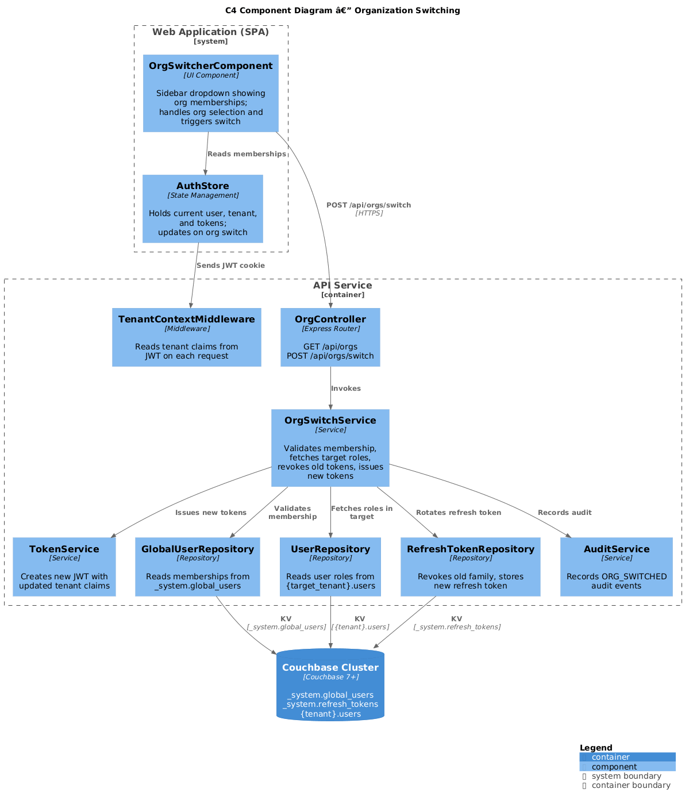
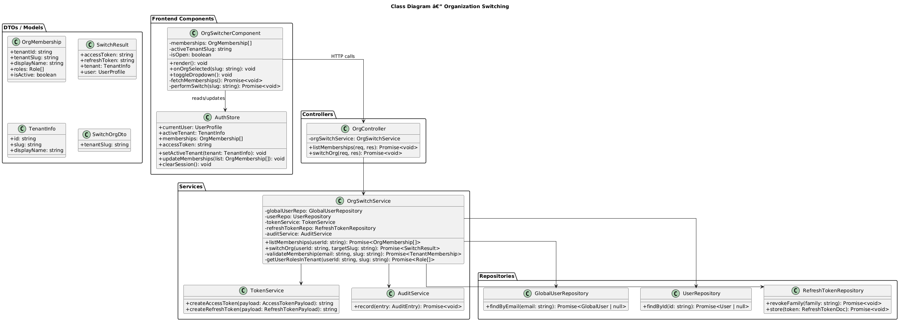
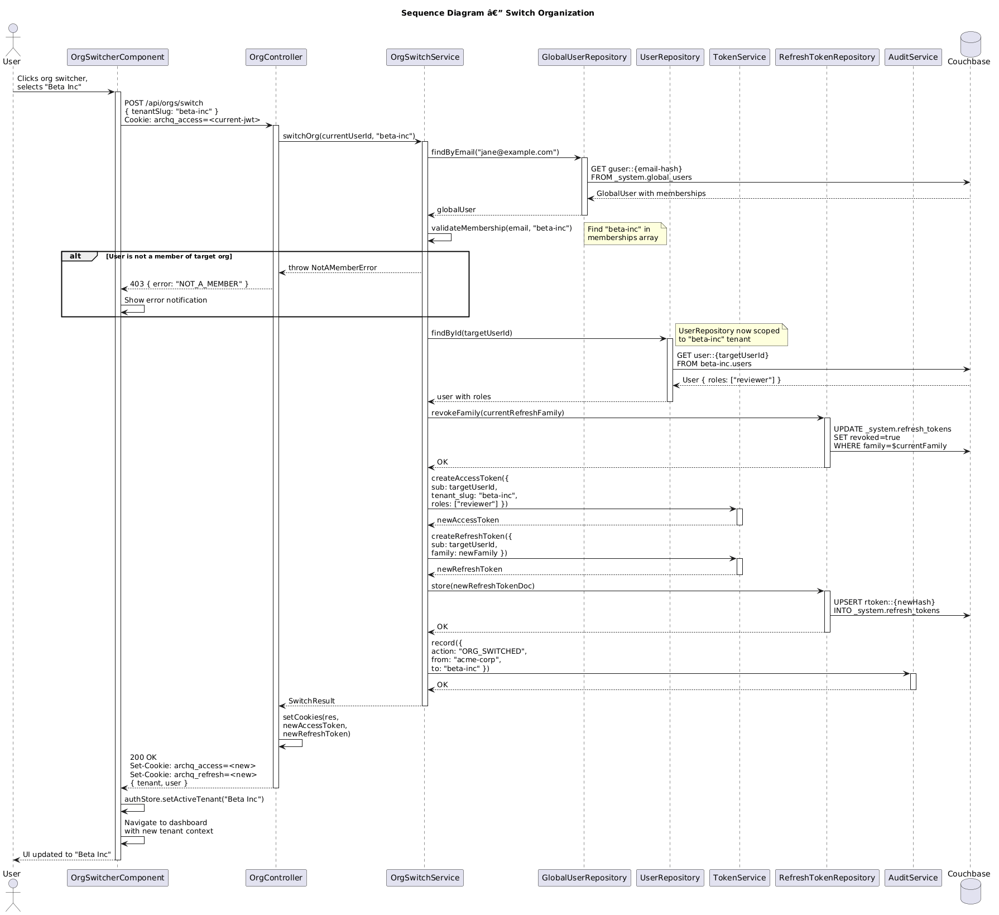

# Feature 04: Organization Switching

**Traces to:** L2-004, L2-002

---

## 1. Overview

Users in ArchQ may belong to multiple organizations. The organization switching feature allows users to change their active tenant context without re-authenticating. When a user switches organizations, the system issues a new JWT with updated tenant claims, and all subsequent API calls are scoped to the newly selected tenant. Single-organization users are auto-assigned without prompt.

### Goals

- Display all tenant memberships in a sidebar org switcher.
- Switch active tenant context by issuing a new JWT with updated claims.
- Auto-set tenant for single-org users without prompting.
- Ensure all subsequent API calls scope to the new tenant.
- Maintain session continuity (no re-authentication required).

---

## 2. Architecture

### 2.1 C4 Component Diagram



| Component | Responsibility |
|-----------|----------------|
| `OrgSwitcherComponent` | Frontend sidebar component displaying org list and handling selection |
| `OrgController` | Handles org listing and switch endpoint |
| `OrgSwitchService` | Validates membership, issues new tokens with updated tenant context |
| `TokenService` | Creates new JWT access/refresh tokens with new tenant claims |
| `GlobalUserRepository` | Retrieves user's tenant memberships |
| `UserRepository` | Retrieves user's roles within the target tenant |
| `TenantContextMiddleware` | Reads updated tenant claims from new JWT |
| `RefreshTokenRepository` | Manages refresh token rotation on switch |

---

## 3. Component Details

### 3.1 OrgController

```
GET  /api/orgs              — List user's organization memberships
POST /api/orgs/switch       — Switch active organization
```

### 3.2 OrgSwitchService

```
class OrgSwitchService {
  -globalUserRepo: GlobalUserRepository
  -userRepo: UserRepository
  -tokenService: TokenService
  -refreshTokenRepo: RefreshTokenRepository
  -auditService: AuditService

  async listMemberships(userId: string): Promise<OrgMembership[]>
  async switchOrg(userId: string, targetTenantSlug: string): Promise<SwitchResult>
  -validateMembership(userId: string, tenantSlug: string): Promise<TenantMembership>
  -getUserRolesInTenant(userId: string, tenantSlug: string): Promise<Role[]>
}
```

**Switch logic:**

1. Validate that the user has an active membership in the target tenant.
2. Retrieve the user's roles within the target tenant.
3. Revoke the current refresh token family.
4. Issue new access token and refresh token with the target tenant's `tenant_id`, `tenant_slug`, and `roles`.
5. Record audit entry.
6. Return new tokens and tenant info.

### 3.3 Frontend OrgSwitcherComponent

The org switcher is a dropdown pill in the sidebar, positioned below the ArchQ logo.

**Behavior:**

- Displays the current organization name with a chevrons-up-down icon.
- On click, opens a dropdown listing all memberships with display names.
- Selecting a different org triggers `POST /api/orgs/switch`.
- On success, the frontend stores the new tokens (via cookies) and reloads the application state.
- A brief loading indicator shows during the switch.
- Single-org users see the org name displayed (no dropdown interaction needed).

**Mobile behavior:**

- Org name displayed in a horizontal bar below the header.
- Tap opens a full-screen modal with org list.

---

## 4. Data Model



### 4.1 Global User Memberships (read model)

The `_system.global_users` document contains the memberships array (see Feature 02):

```json
{
  "type": "global_user",
  "email": "jane@example.com",
  "memberships": [
    {
      "tenantId": "uuid-t1",
      "tenantSlug": "acme-corp",
      "userId": "uuid-u1",
      "displayName": "Acme Corp",
      "status": "active",
      "joinedAt": "2026-01-15T10:00:00Z"
    },
    {
      "tenantId": "uuid-t2",
      "tenantSlug": "beta-inc",
      "userId": "uuid-u2",
      "displayName": "Beta Inc",
      "status": "active",
      "joinedAt": "2026-03-01T10:00:00Z"
    }
  ]
}
```

### 4.2 User Document in Target Tenant

The user's roles in the target tenant are read from `{target_tenant}.users`:

```json
{
  "type": "user",
  "id": "uuid-u2",
  "email": "jane@example.com",
  "roles": ["reviewer"],
  "status": "active"
}
```

### 4.3 Updated JWT Claims After Switch

```json
{
  "sub": "uuid-u2",
  "email": "jane@example.com",
  "tenant_id": "uuid-t2",
  "tenant_slug": "beta-inc",
  "roles": ["reviewer"],
  "iat": 1713178800,
  "exp": 1713179700
}
```

Note: The `sub` claim may change between tenants because the user document ID is tenant-specific.

---

## 5. Key Workflows

### 5.1 Switch Organization



**Actor:** Authenticated user with multiple org memberships

**Steps:**

1. User clicks org switcher in sidebar.
2. Frontend displays dropdown with all memberships (from login response or `/api/orgs`).
3. User selects "Beta Inc".
4. Frontend sends `POST /api/orgs/switch { tenantSlug: "beta-inc" }`.
5. `OrgController` invokes `OrgSwitchService.switchOrg()`.
6. Service validates user has active membership in "beta-inc" via `GlobalUserRepository`.
7. If no membership, return `403 Forbidden`.
8. Service retrieves user's roles in "beta-inc" via `UserRepository` (scoped to beta-inc).
9. Current refresh token family is revoked.
10. `TokenService` issues new access token with `tenant_slug: "beta-inc"` and the user's roles in that tenant.
11. New refresh token issued and persisted.
12. Audit entry recorded: `ORG_SWITCHED`.
13. Response: `200 OK` with new tokens (cookies) and tenant info.
14. Frontend receives response, updates UI state, navigates to dashboard.

### 5.2 Auto-Select for Single-Org User

During login (Feature 03), if `memberships.length === 1`:

1. `AuthenticationService.selectTenant()` returns the sole membership.
2. JWT is issued with that tenant's context.
3. Org switcher UI displays the org name but is non-interactive (no dropdown).

---

## 6. API Contracts

### 6.1 List Memberships

```
GET /api/orgs
Authorization: Bearer <jwt> (via cookie)

Response 200:
{
  "memberships": [
    {
      "tenantId": "uuid-t1",
      "tenantSlug": "acme-corp",
      "displayName": "Acme Corp",
      "roles": ["admin", "author"],
      "isActive": true
    },
    {
      "tenantId": "uuid-t2",
      "tenantSlug": "beta-inc",
      "displayName": "Beta Inc",
      "roles": ["reviewer"],
      "isActive": false
    }
  ]
}
```

### 6.2 Switch Organization

```
POST /api/orgs/switch
Authorization: Bearer <jwt> (via cookie)
Content-Type: application/json

Request:
{
  "tenantSlug": "beta-inc"
}

Response 200:
Set-Cookie: archq_access=<new-jwt>; HttpOnly; Secure; SameSite=Strict; Path=/api; Max-Age=900
Set-Cookie: archq_refresh=<new-jwt>; HttpOnly; Secure; SameSite=Strict; Path=/api/auth/refresh; Max-Age=604800

{
  "tenant": {
    "id": "uuid-t2",
    "slug": "beta-inc",
    "displayName": "Beta Inc"
  },
  "user": {
    "id": "uuid-u2",
    "roles": ["reviewer"]
  }
}

Response 403:
{
  "error": "NOT_A_MEMBER",
  "message": "You are not a member of this organization."
}
```

---

## 7. UI Design

### 7.1 Org Switcher (Desktop Sidebar)

- Position: Below ArchQ logo in sidebar, above navigation items.
- Appearance: Pill-shaped container showing current org name.
- Icon: `chevrons-up-down` on the right side.
- Dropdown: On click, shows list of orgs with checkmark on active org.
- Each org row: Avatar/initials + display name.
- Selecting an org closes dropdown and triggers switch.

### 7.2 Org Switcher (Mobile)

- Position: Horizontal bar below the header.
- Tap: Opens a full-screen bottom sheet with org list.
- Each org row: Same layout as desktop dropdown.

### 7.3 Design System Components Used

- Button/Ghost (org switcher pill)
- Avatar (org initials in dropdown)
- Divider (between orgs in dropdown)
- NavItem/Active (checkmark on current org)

---

## 8. Security Considerations

| Concern | Mitigation |
|---------|------------|
| Switching to unauthorized tenant | Membership validated against `_system.global_users` before token issuance |
| Stale roles after switch | Roles fetched fresh from target tenant's user document at switch time |
| Old tokens used after switch | Previous refresh token family revoked on switch |
| IDOR via tenantSlug parameter | Membership check ensures user belongs to target tenant |
| Race condition during switch | Token rotation is atomic; old token invalidated before new one returned |

---

## 9. Open Questions

| # | Question | Status |
|---|----------|--------|
| 1 | Should switching org preserve the user's current page (e.g., ADR list) or always go to dashboard? | Open |
| 2 | Should we cache memberships on the frontend or always fetch from API? | Decided: Cache at login, refresh on switch |
| 3 | Should there be an "Add Organization" action in the switcher dropdown? | Open |
| 4 | How to handle switch when the target tenant is suspended? | Open |
