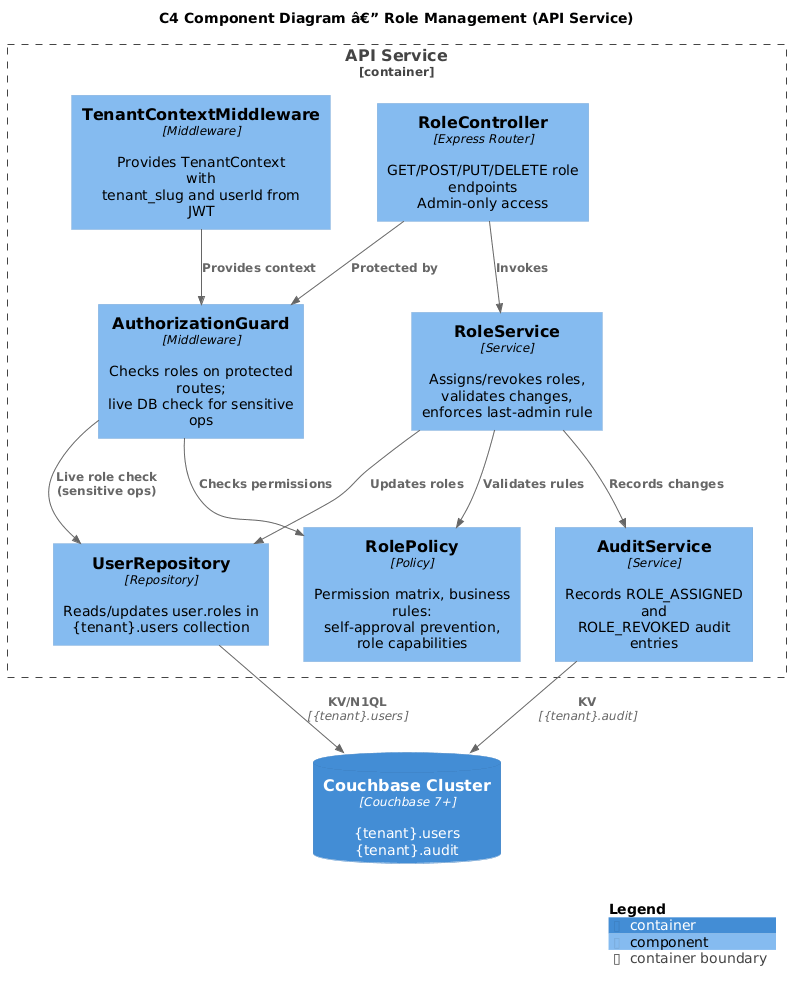
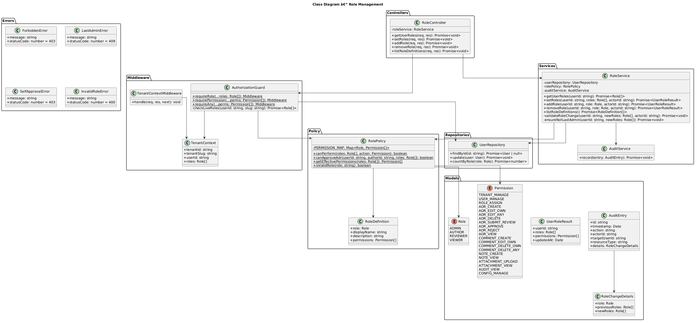
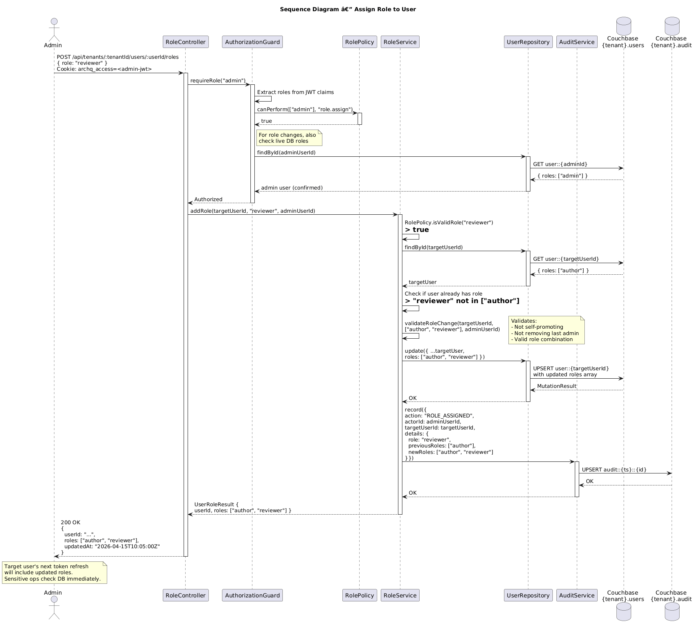

# Feature 05: Role Management

**Traces to:** L2-005, L2-006

---

## 1. Overview

Role management governs authorization within each ArchQ tenant. The system supports four roles -- Admin, Author, Reviewer, and Viewer -- each granting specific capabilities. Users may hold multiple roles within a single tenant, and role assignments are tenant-scoped. Admins assign and revoke roles, changes take effect immediately without requiring re-authentication, and every role change is recorded in the audit trail. Business rules enforce separation of duties: authors cannot approve their own ADRs even if they also hold the Reviewer role.

### Goals

- Support four roles per tenant: Admin, Author, Reviewer, Viewer.
- Allow users to hold multiple roles within a tenant.
- Admin-only role assignment and revocation.
- Immediate effect -- no re-authentication required.
- Author cannot approve their own ADR (even with Reviewer role).
- Viewer cannot create ADRs or comment.
- Author cannot approve ADRs.
- Full audit trail on all role changes.

---

## 2. Architecture

### 2.1 C4 Component Diagram



| Component | Responsibility |
|-----------|----------------|
| `RoleController` | HTTP endpoints for role assignment/revocation/listing |
| `RoleService` | Business logic for role management, validation, conflict rules |
| `AuthorizationGuard` | Middleware that checks roles on every protected endpoint |
| `RolePolicy` | Encodes role-permission matrix and business rules |
| `UserRepository` | Reads/updates user documents (including roles array) |
| `AuditService` | Records all role change events |
| `TokenService` | Referenced for understanding that roles are in JWT but also checked live |

---

## 3. Component Details

### 3.1 RoleController

```
GET    /api/tenants/:tenantId/users/:userId/roles  — Get user's roles
PUT    /api/tenants/:tenantId/users/:userId/roles  — Set user's roles (full replace)
POST   /api/tenants/:tenantId/users/:userId/roles  — Add role(s) to user
DELETE /api/tenants/:tenantId/users/:userId/roles/:role — Remove a specific role
GET    /api/tenants/:tenantId/roles                — List all roles with descriptions
```

All endpoints require the caller to have the `Admin` role in the active tenant.

### 3.2 RoleService

```
class RoleService {
  -userRepository: UserRepository
  -rolePolicy: RolePolicy
  -auditService: AuditService

  async getUserRoles(userId: string): Promise<Role[]>
  async setRoles(userId: string, roles: Role[], actorId: string): Promise<void>
  async addRole(userId: string, role: Role, actorId: string): Promise<void>
  async removeRole(userId: string, role: Role, actorId: string): Promise<void>
  async listRoleDefinitions(): Promise<RoleDefinition[]>
  -validateRoleChange(userId: string, newRoles: Role[]): Promise<void>
}
```

### 3.3 RolePolicy

Encodes the permission matrix and business rules:

```
class RolePolicy {
  static PERMISSIONS: Record<Role, Permission[]>
  static canPerform(roles: Role[], action: Permission): boolean
  static canApproveAdr(userId: string, adrAuthorId: string, roles: Role[]): boolean
  static getEffectivePermissions(roles: Role[]): Permission[]
}
```

**Permission Matrix:**

| Permission | Admin | Author | Reviewer | Viewer |
|------------|:-----:|:------:|:--------:|:------:|
| `tenant.manage` | X | | | |
| `user.manage` | X | | | |
| `role.assign` | X | | | |
| `adr.create` | X | X | | |
| `adr.edit.own` | X | X | | |
| `adr.edit.any` | X | | | |
| `adr.delete` | X | | | |
| `adr.submit_review` | X | X | | |
| `adr.approve` | X | | X | |
| `adr.reject` | X | | X | |
| `adr.view` | X | X | X | X |
| `comment.create` | X | X | X | |
| `comment.edit.own` | X | X | X | |
| `comment.delete.own` | X | X | X | |
| `comment.delete.any` | X | | | |
| `note.create` | X | X | | |
| `note.view` | X | X | X | X |
| `attachment.upload` | X | X | | |
| `attachment.view` | X | X | X | X |
| `audit.view` | X | | | |
| `config.manage` | X | | | |

### 3.4 AuthorizationGuard

Middleware that runs after `TenantContextMiddleware` on protected routes:

```
class AuthorizationGuard {
  static requireRole(...roles: Role[]): Middleware
  static requirePermission(...permissions: Permission[]): Middleware
  static requireAny(...permissions: Permission[]): Middleware
}
```

**Role checking strategy:** The guard checks roles from the JWT for fast-path authorization. For sensitive operations (approve, role changes), it also reads the live roles from the database to prevent stale JWT claims from granting access.

### 3.5 Self-Approval Prevention

When a user with both Author and Reviewer roles attempts to approve an ADR:

1. `AuthorizationGuard` confirms the user has `adr.approve` permission (Reviewer role).
2. The approval endpoint additionally calls `RolePolicy.canApproveAdr(userId, adr.authorId, roles)`.
3. If `userId === adr.authorId`, the request is rejected with `403 Forbidden`: "Authors cannot approve their own ADRs."

This check is in the service layer, not just the guard, to prevent bypass.

### 3.6 Immediate Role Effect

When roles are changed:

1. The user document is updated in Couchbase.
2. The user's current JWT still contains old roles, but:
   - The `AuthorizationGuard` performs a live database check for sensitive operations.
   - For standard operations, the JWT roles are used (acceptable staleness up to 15 min).
3. On next token refresh (max 15 min), the new access token will contain updated roles.
4. No forced logout or token revocation on role change.

---

## 4. Data Model



### 4.1 User Document (role-relevant fields)

Stored in `{tenant_slug}.users`. Key: `user::{userId}`.

```json
{
  "type": "user",
  "id": "uuid-v4",
  "email": "jane@example.com",
  "fullName": "Jane Smith",
  "roles": ["author", "reviewer"],
  "status": "active"
}
```

### 4.2 Role Definition (static reference)

```json
{
  "role": "admin",
  "displayName": "Admin",
  "description": "Full tenant management including user and role administration.",
  "permissions": ["tenant.manage", "user.manage", "role.assign", "adr.create", "adr.edit.own", "adr.edit.any", "adr.delete", "adr.submit_review", "adr.approve", "adr.reject", "adr.view", "comment.create", "comment.edit.own", "comment.delete.own", "comment.delete.any", "note.create", "note.view", "attachment.upload", "attachment.view", "audit.view", "config.manage"]
}
```

### 4.3 Audit Entry for Role Change

Stored in `{tenant_slug}.audit`. Key: `audit::{timestamp}::{id}`.

```json
{
  "type": "audit",
  "id": "uuid-v4",
  "timestamp": "2026-04-15T10:00:00Z",
  "action": "ROLE_ASSIGNED",
  "actorId": "admin-user-uuid",
  "targetUserId": "jane-user-uuid",
  "resourceType": "user_role",
  "details": {
    "role": "reviewer",
    "previousRoles": ["author"],
    "newRoles": ["author", "reviewer"]
  }
}
```

---

## 5. Key Workflows

### 5.1 Assign Role



**Actor:** Admin user

**Steps:**

1. Admin navigates to user management, selects a user.
2. Admin adds the "Reviewer" role.
3. Frontend sends `POST /api/tenants/:tenantId/users/:userId/roles { role: "reviewer" }`.
4. `AuthorizationGuard.requireRole("admin")` validates the caller is an admin.
5. `RoleService.addRole()` is invoked.
6. Service validates the role is a valid enum value.
7. Service checks if user already has the role (idempotent -- no error).
8. `UserRepository.update()` appends the role to the user's roles array.
9. `AuditService.record()` writes the role change audit entry.
10. Response: `200 OK` with updated roles.

### 5.2 Revoke Role

1. Admin sends `DELETE /api/tenants/:tenantId/users/:userId/roles/reviewer`.
2. `AuthorizationGuard` validates admin.
3. `RoleService.removeRole()` validates the change.
4. Validation: Cannot remove the last Admin if it would leave the tenant with zero admins.
5. User document updated with the role removed.
6. Audit entry recorded: `ROLE_REVOKED`.
7. If user had ADRs in Draft, they keep read access but lose edit access (enforced by `AuthorizationGuard` on edit endpoints).

### 5.3 Self-Approval Prevention

1. User (Author + Reviewer) opens their own ADR in "In Review" status.
2. Frontend shows "Approve" button (user has Reviewer role).
3. User clicks "Approve".
4. `POST /api/adrs/:id/approve` hits the API.
5. `AuthorizationGuard.requirePermission("adr.approve")` passes (Reviewer role).
6. `ApprovalService` calls `RolePolicy.canApproveAdr(userId, adr.authorId, roles)`.
7. `userId === adr.authorId` returns `true`.
8. Service throws `SelfApprovalError`.
9. Response: `403 Forbidden` -- "Authors cannot approve their own ADRs."

---

## 6. API Contracts

### 6.1 Add Role

```
POST /api/tenants/:tenantId/users/:userId/roles
Authorization: Bearer <jwt> (Admin role required)
Content-Type: application/json

Request:
{
  "role": "reviewer"
}

Response 200:
{
  "userId": "uuid-v4",
  "roles": ["author", "reviewer"],
  "updatedAt": "2026-04-15T10:05:00Z"
}

Response 403:
{
  "error": "FORBIDDEN",
  "message": "Only admins can manage roles."
}

Response 400:
{
  "error": "INVALID_ROLE",
  "message": "Role 'superadmin' is not a valid role. Valid roles: admin, author, reviewer, viewer."
}
```

### 6.2 Remove Role

```
DELETE /api/tenants/:tenantId/users/:userId/roles/reviewer
Authorization: Bearer <jwt> (Admin role required)

Response 200:
{
  "userId": "uuid-v4",
  "roles": ["author"],
  "updatedAt": "2026-04-15T10:06:00Z"
}

Response 409:
{
  "error": "LAST_ADMIN",
  "message": "Cannot remove the last admin. Assign another admin first."
}
```

### 6.3 Set Roles (Full Replace)

```
PUT /api/tenants/:tenantId/users/:userId/roles
Authorization: Bearer <jwt> (Admin role required)
Content-Type: application/json

Request:
{
  "roles": ["author", "reviewer"]
}

Response 200:
{
  "userId": "uuid-v4",
  "roles": ["author", "reviewer"],
  "updatedAt": "2026-04-15T10:07:00Z"
}
```

### 6.4 Get User Roles

```
GET /api/tenants/:tenantId/users/:userId/roles
Authorization: Bearer <jwt>

Response 200:
{
  "userId": "uuid-v4",
  "roles": ["author", "reviewer"],
  "permissions": ["adr.create", "adr.edit.own", "adr.submit_review", "adr.approve", "adr.reject", "adr.view", "comment.create", "comment.edit.own", "comment.delete.own", "note.create", "note.view", "attachment.upload", "attachment.view"]
}
```

---

## 7. Security Considerations

| Concern | Mitigation |
|---------|------------|
| Privilege escalation | Only Admin role can assign/revoke roles; guard checks caller's live roles |
| Self-promotion | Admin cannot assign Admin role to themselves (must be done by another Admin) |
| Self-approval | `RolePolicy.canApproveAdr()` blocks authors from approving their own ADRs |
| Last admin removal | Validation prevents removing the last Admin from a tenant |
| Stale JWT roles | Sensitive operations (approve, role changes) check live DB roles |
| Role enumeration | Role list endpoint accessible to all authenticated users (roles are not secret) |
| Audit tampering | Audit entries are append-only; no update/delete endpoints exist |
| Viewer data access | AuthorizationGuard blocks Viewer from create/edit/comment endpoints |

---

## 8. Open Questions

| # | Question | Status |
|---|----------|--------|
| 1 | Should we support custom roles beyond the four defined roles? | Decided: No, fixed roles for v1 |
| 2 | Should role changes force immediate token revocation/reissue? | Decided: No, live DB check for sensitive ops is sufficient |
| 3 | Should there be a "default role" setting per tenant for new users? | Open |
| 4 | Should Admin be able to change their own roles? | Decided: No, another Admin must do it |
| 5 | Should we implement role inheritance (e.g., Admin inherits all Author+Reviewer permissions)? | Decided: Yes, Admin has superset of all permissions |
