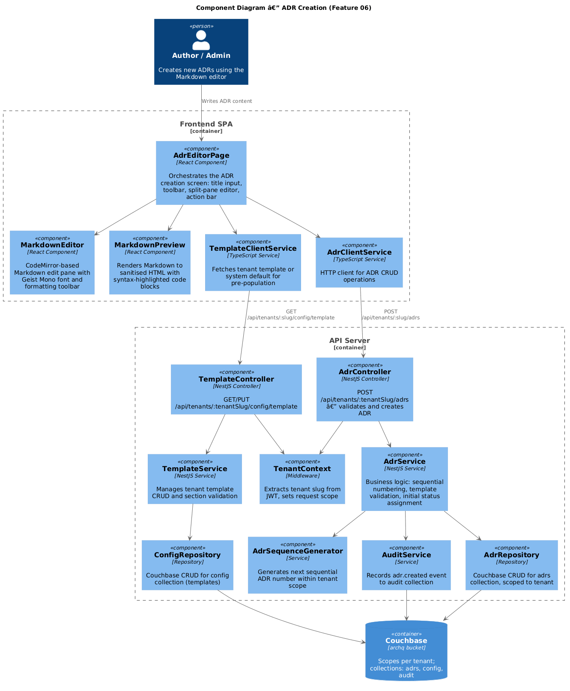
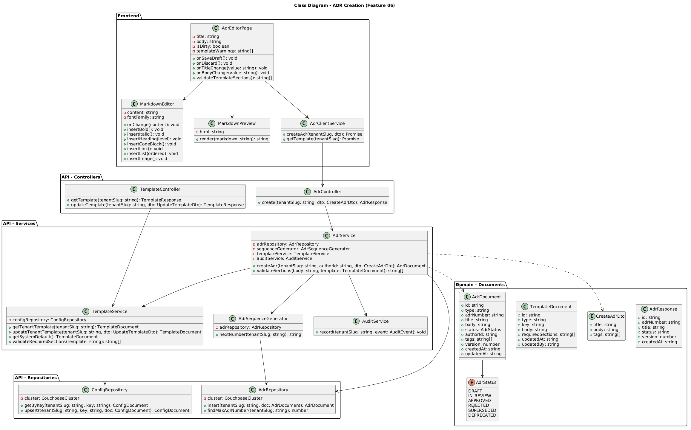
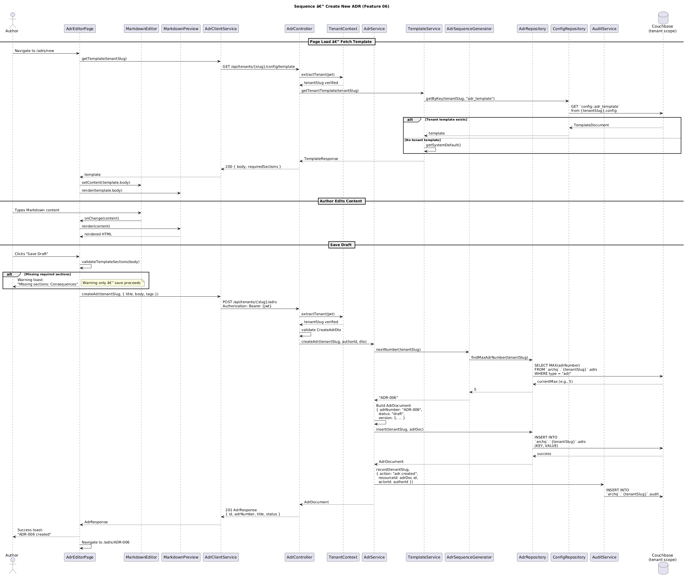

# Feature 06 — ADR Creation

**Traces to:** L2-007, L2-009

---

## 1. Overview

This feature provides the ability for Authors and Admins to create new Architecture Decision Records (ADRs) using an integrated Markdown editor. Each ADR is assigned a sequential number within the tenant (ADR-001, ADR-002, ...) and starts in **Draft** status.

The editor provides a split-pane layout on desktop (edit left, live preview right) and a tabbed layout on mobile (Edit / Preview tabs). The editor pre-populates content from the tenant's custom template or the system default template, which includes sections for Title, Status, Context, Decision, Consequences, and Participants. Admins can customize the tenant template. Template validation warns (but does not block) if required sections are missing.

---

## 2. Architecture

### 2.1 C4 Component Diagram



The diagram shows three boundaries:

- **Frontend SPA** — `AdrEditorPage` orchestrates the creation screen, delegating to `MarkdownEditor` (CodeMirror-based, Geist Mono font), `MarkdownPreview` (sanitised HTML renderer), `TemplateClientService`, and `AdrClientService`.
- **API Server** — `AdrController` and `TemplateController` handle HTTP requests. `AdrService` contains the core business logic (sequential numbering, status assignment). `TemplateService` manages template CRUD and section validation. `TenantContext` middleware enforces tenant scoping.
- **Couchbase** — `archq` bucket with per-tenant scopes. Collections used: `adrs`, `config`, `audit`.

---

## 3. Component Details

### 3.1 Frontend Components

| Component | Responsibility |
|-----------|---------------|
| `AdrEditorPage` | Top-level page component. Manages title input, split-pane/tabbed editor, toolbar, action bar (Discard ghost button, Save Draft primary button), Draft badge. Validates template sections on save. |
| `MarkdownEditor` | CodeMirror 6 editor with Geist Mono monospace font. Toolbar provides: bold, italic, heading, code, link, list, image formatting actions. Emits `onChange(content)`. |
| `MarkdownPreview` | Converts Markdown to sanitised HTML using `marked` + `DOMPurify`. Syntax-highlights code blocks via `highlight.js`. Supports headings, lists, code blocks, tables, links, images. |
| `TemplateClientService` | Fetches tenant template via `GET /api/tenants/:slug/config/template`. Falls back to system default if no tenant template exists. |
| `AdrClientService` | Sends `POST /api/tenants/:slug/adrs` with `CreateAdrDto`. Returns `AdrResponse`. |

### 3.2 Desktop Layout (>= 768px)

```
+------+-------------------------------------------------------------+
|      | [Draft Badge]                    [Discard] [Save Draft]      |
| Side |-------------------------------------------------------------+
| bar  | Title: [________________________________]                    |
| (ADR |-------------------------------------------------------------+
| Rec- | [B] [I] [H] [<>] [Link] [List] [Img]        (toolbar)      |
| ords |------------------------------|------------------------------+
| act- | Edit Pane (Geist Mono)       | Preview Pane                 |
| ive) | # Context                    | Context (rendered H1)        |
|      | We need to decide...         | We need to decide...         |
|      |                              |                              |
+------+------------------------------+------------------------------+
```

### 3.3 Mobile Layout (< 576px)

```
+---------------------------------------------+
| [Hamburger] ArchQ             [Avatar]       |
|---------------------------------------------|
| [Draft Badge]        [Discard] [Save Draft] |
|---------------------------------------------|
| Title: [_______________________________]    |
|---------------------------------------------|
| [Edit] [Preview]              (tabs)        |
|---------------------------------------------|
| [B] [I] [H] [<>] [Link] [List] [Img]       |
|---------------------------------------------|
| (full-width editor or preview)              |
|                                             |
+---------------------------------------------+
```

### 3.4 API Server Components

| Component | Responsibility |
|-----------|---------------|
| `AdrController` | `POST /api/tenants/:tenantSlug/adrs` — validates `CreateAdrDto`, delegates to `AdrService`, returns `201` with `AdrResponse`. |
| `TemplateController` | `GET /api/tenants/:tenantSlug/config/template` — returns tenant template or system default. `PUT /api/tenants/:tenantSlug/config/template` — Admin-only, updates tenant template. |
| `AdrService` | Generates sequential ADR number via `AdrSequenceGenerator`. Builds `AdrDocument` with `status: "draft"`, `version: 1`. Persists via `AdrRepository`. Records `adr.created` audit event. Validates template sections if requested. |
| `TemplateService` | Loads tenant template from `config` collection (key `adr_template`). Falls back to system default. Validates required sections (Title, Status, Context, Decision, Consequences). |
| `AdrSequenceGenerator` | Queries `SELECT MAX(adrNumber) FROM adrs WHERE type = "adr"` within tenant scope. Increments and returns next number formatted as `ADR-NNN`. |
| `AdrRepository` | Couchbase CRUD scoped to `archq.{tenantSlug}.adrs`. Provides `insert()` and `findMaxAdrNumber()`. |
| `ConfigRepository` | Couchbase CRUD scoped to `archq.{tenantSlug}.config`. Provides `getByKey()` and `upsert()`. |
| `AuditService` | Inserts audit documents into `archq.{tenantSlug}.audit`. |
| `TenantContext` | Middleware that extracts tenant slug from JWT `tenant` claim, validates it exists, and attaches it to the request context. |

---

## 4. Data Model

### 4.1 Class Diagram



### 4.2 Couchbase Document — ADR

**Collection:** `archq.{tenantSlug}.adrs`
**Document key:** `adr::{uuid}`

```json
{
  "id": "adr::550e8400-e29b-41d4-a716-446655440000",
  "type": "adr",
  "adrNumber": "ADR-001",
  "title": "Use Event-Driven Architecture for Order Processing",
  "body": "## Status\n\nDraft\n\n## Context\n\nWe need to...\n\n## Decision\n\nWe will...\n\n## Consequences\n\n- Pro: ...\n- Con: ...\n\n## Participants\n\n- Alice\n- Bob",
  "status": "draft",
  "authorId": "user::a1b2c3d4",
  "tags": [],
  "version": 1,
  "createdAt": "2026-04-15T10:30:00.000Z",
  "updatedAt": "2026-04-15T10:30:00.000Z"
}
```

### 4.3 Couchbase Document — Template Config

**Collection:** `archq.{tenantSlug}.config`
**Document key:** `config::adr_template`

```json
{
  "id": "config::adr_template",
  "type": "config",
  "key": "adr_template",
  "body": "## Status\n\nDraft\n\n## Context\n\n[Describe the context...]\n\n## Decision\n\n[Describe the decision...]\n\n## Consequences\n\n[List consequences...]\n\n## Participants\n\n- [Name]",
  "requiredSections": ["Status", "Context", "Decision", "Consequences"],
  "updatedAt": "2026-04-10T08:00:00.000Z",
  "updatedBy": "user::admin-uuid"
}
```

### 4.4 Couchbase Document — Audit Entry

**Collection:** `archq.{tenantSlug}.audit`
**Document key:** `audit::{uuid}`

```json
{
  "id": "audit::uuid",
  "type": "audit",
  "action": "adr.created",
  "resourceType": "adr",
  "resourceId": "adr::550e8400-e29b-41d4-a716-446655440000",
  "actorId": "user::a1b2c3d4",
  "timestamp": "2026-04-15T10:30:00.000Z",
  "metadata": {
    "adrNumber": "ADR-001",
    "title": "Use Event-Driven Architecture for Order Processing"
  }
}
```

---

## 5. Key Workflows

### 5.1 Create ADR Sequence



**Flow summary:**

1. Author navigates to `/adrs/new`. The page fetches the tenant template via `GET /api/tenants/{slug}/config/template`.
2. If a tenant-specific template exists in `config::adr_template`, it is returned. Otherwise the system default is used.
3. The editor pre-populates with the template body. The author edits the title and body content. `MarkdownPreview` renders live as the author types.
4. On "Save Draft", the page validates template sections. If required sections are missing, a warning toast is shown (save still proceeds).
5. `POST /api/tenants/{slug}/adrs` is called with `{ title, body, tags }`.
6. `AdrService` generates the next sequential number by querying `MAX(adrNumber)` and incrementing.
7. An `AdrDocument` is built with `status: "draft"`, `version: 1`, and inserted into the `adrs` collection.
8. An `adr.created` audit event is recorded.
9. `201 Created` is returned with the new ADR details. The frontend navigates to the ADR detail view.

### 5.2 ADR Sequential Numbering

The `AdrSequenceGenerator` ensures uniqueness within a tenant scope:

```sql
SELECT MAX(TONUMBER(REPLACE(adrNumber, "ADR-", ""))) AS maxNum
FROM `archq`.`{tenantSlug}`.adrs
WHERE type = "adr"
```

The result is incremented by 1 and zero-padded to 3 digits (e.g., `ADR-006`). If no ADRs exist, numbering starts at `ADR-001`. A Couchbase CAS (Compare-And-Swap) operation on insert prevents duplicate numbers under concurrent creation.

### 5.3 Template Section Validation

On save, the frontend parses the Markdown body for H2 headings (`## SectionName`) and compares against the template's `requiredSections` array. Missing sections produce warning messages displayed as toasts. This validation is advisory, not blocking.

---

## 6. API Contracts

### 6.1 Create ADR

```
POST /api/tenants/{tenantSlug}/adrs
Authorization: Bearer {jwt}
Content-Type: application/json
```

**Request body (`CreateAdrDto`):**

```json
{
  "title": "Use Event-Driven Architecture for Order Processing",
  "body": "## Status\n\nDraft\n\n## Context\n\n...",
  "tags": ["architecture", "events"]
}
```

**Validation rules:**

| Field | Rule |
|-------|------|
| `title` | Required. 1-200 characters. Trimmed. No HTML. |
| `body` | Required. 1-50,000 characters. |
| `tags` | Optional. Array of strings, max 20 items, each 1-50 characters. |

**Response — `201 Created`:**

```json
{
  "id": "adr::550e8400-e29b-41d4-a716-446655440000",
  "adrNumber": "ADR-006",
  "title": "Use Event-Driven Architecture for Order Processing",
  "status": "draft",
  "authorId": "user::a1b2c3d4",
  "tags": ["architecture", "events"],
  "version": 1,
  "createdAt": "2026-04-15T10:30:00.000Z",
  "updatedAt": "2026-04-15T10:30:00.000Z"
}
```

**Error responses:**

| Status | Condition |
|--------|-----------|
| `400` | Validation failure (missing title, body too long, etc.) |
| `401` | Missing or invalid JWT |
| `403` | User lacks Author or Admin role in this tenant |
| `404` | Tenant not found |

### 6.2 Get Tenant Template

```
GET /api/tenants/{tenantSlug}/config/template
Authorization: Bearer {jwt}
```

**Response — `200 OK`:**

```json
{
  "body": "## Status\n\nDraft\n\n## Context\n\n...",
  "requiredSections": ["Status", "Context", "Decision", "Consequences"],
  "isCustom": true,
  "updatedAt": "2026-04-10T08:00:00.000Z"
}
```

If no custom template exists, `isCustom` is `false` and the system default body is returned.

### 6.3 Update Tenant Template (Admin only)

```
PUT /api/tenants/{tenantSlug}/config/template
Authorization: Bearer {jwt}
Content-Type: application/json
```

**Request body (`UpdateTemplateDto`):**

```json
{
  "body": "## Status\n\nDraft\n\n## Context\n\n...\n\n## Custom Section\n\n...",
  "requiredSections": ["Status", "Context", "Decision", "Consequences", "Custom Section"]
}
```

**Validation rules:**

| Field | Rule |
|-------|------|
| `body` | Required. 1-50,000 characters. |
| `requiredSections` | Optional. Array of strings matching H2 headings in body. |

**Response — `200 OK`:** Returns updated `TemplateResponse`.

**Error responses:**

| Status | Condition |
|--------|-----------|
| `400` | Validation failure |
| `403` | User lacks Admin role |

---

## 7. Security Considerations

| Concern | Mitigation |
|---------|------------|
| **Tenant isolation** | `TenantContext` middleware extracts tenant from JWT. `AdrRepository` always scopes queries to `archq.{tenantSlug}.adrs`. No cross-tenant data access possible at the repository layer. |
| **Authorization** | Only users with `Author` or `Admin` role can create ADRs. Template management restricted to `Admin`. Role check enforced by guard on controller. |
| **XSS via Markdown** | `MarkdownPreview` sanitises rendered HTML with `DOMPurify`. Raw HTML in Markdown is stripped. Code blocks are escaped before syntax highlighting. |
| **Input validation** | `CreateAdrDto` validated with class-validator: title length, body length, tag constraints. Server-side validation mirrors client-side. |
| **Sequential number integrity** | CAS (Compare-And-Swap) on insert prevents duplicate ADR numbers under concurrent creation. On CAS conflict, the service retries with the next number (max 3 retries). |
| **Audit trail** | Every ADR creation is recorded in the `audit` collection with actor, timestamp, and resource details. Audit documents are append-only. |
| **Template injection** | Template body is treated as Markdown text, not executable code. No server-side template rendering occurs. |

---

## 8. Open Questions

| # | Question | Status |
|---|----------|--------|
| 1 | Should sequential numbering support gaps (e.g., if ADR-003 is deleted, next is still ADR-004)? | Proposed: Yes, numbers are never reused. |
| 2 | Maximum number of ADRs per tenant before switching from 3-digit to 4-digit zero-padding? | Proposed: Auto-expand padding when count exceeds 999. |
| 3 | Should template validation block save or only warn? | Decided: Warn only (per L2-009 AC-3). |
| 4 | Should "Discard" require confirmation if content has changed? | Proposed: Yes, show confirmation dialog when `isDirty` is true. |
| 5 | Should the system support multiple named templates per tenant? | Deferred: V1 supports one template per tenant. |
