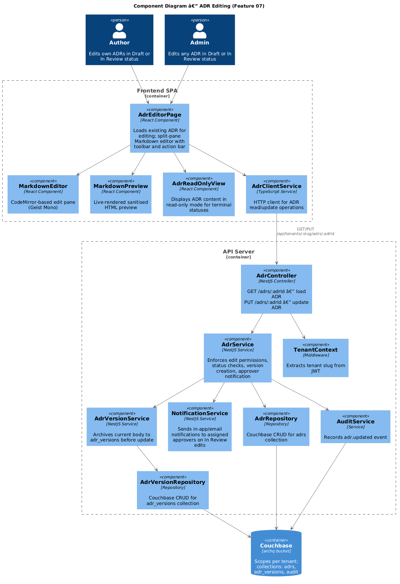
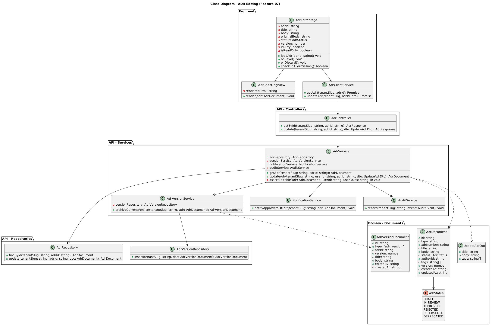
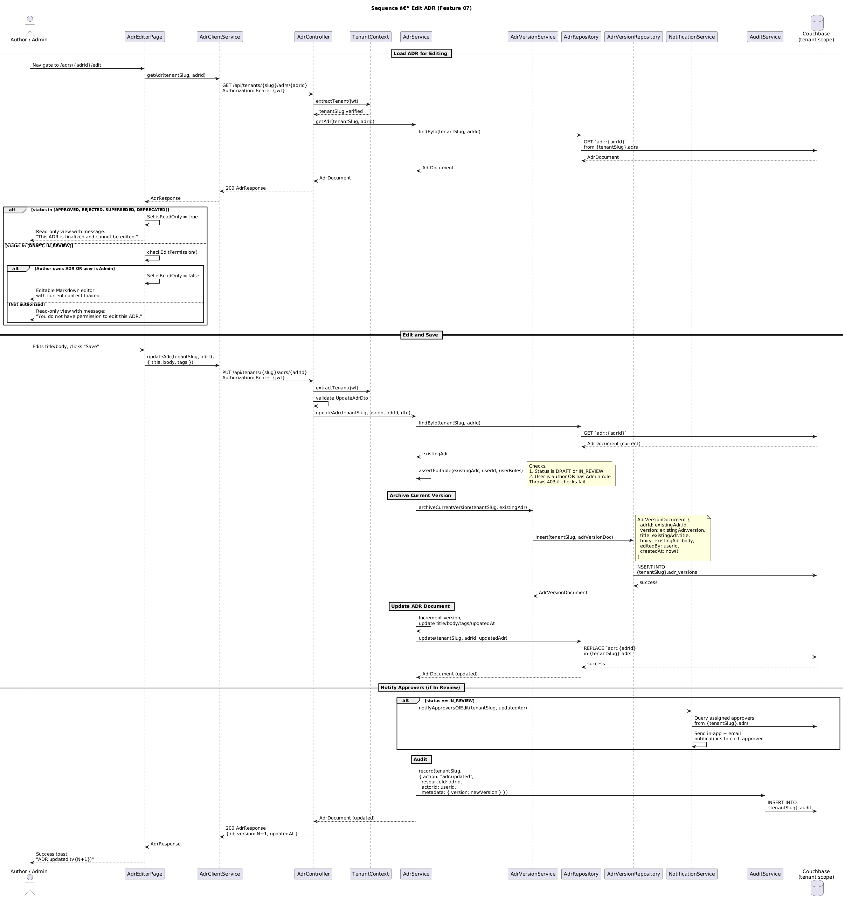

# Feature 07 — ADR Editing

**Traces to:** L2-008

---

## 1. Overview

This feature enables Authors and Admins to edit existing Architecture Decision Records. Editing is permitted only when an ADR is in **Draft** or **In Review** status. Terminal statuses (Approved, Rejected, Superseded, Deprecated) render the ADR read-only. Every save creates a new revision archived in the `adr_versions` collection and increments the version counter on the ADR document. When an ADR in **In Review** status is edited, all assigned approvers are notified.

---

## 2. Architecture

### 2.1 C4 Component Diagram



The editing flow reuses the same `MarkdownEditor` and `MarkdownPreview` components from ADR Creation (Feature 06). The key additions are:

- **`AdrReadOnlyView`** — rendered instead of the editor when the ADR is in a terminal status.
- **`AdrVersionService`** — archives the current body/title to `adr_versions` before applying updates.
- **`NotificationService`** — sends notifications to assigned approvers when an In Review ADR is modified.

---

## 3. Component Details

### 3.1 Frontend Components

| Component | Responsibility |
|-----------|---------------|
| `AdrEditorPage` | Loads ADR by ID. Determines edit vs. read-only mode based on status and user permissions. Renders editor or `AdrReadOnlyView`. Tracks dirty state. |
| `AdrReadOnlyView` | Renders the ADR body as sanitised HTML. Displays a banner: "This ADR is finalized and cannot be edited." for terminal statuses, or "You do not have permission to edit this ADR." for non-owners. |
| `MarkdownEditor` | Same component as Feature 06. Loaded with existing ADR body content. |
| `MarkdownPreview` | Same component as Feature 06. |
| `AdrClientService` | `getAdr()` fetches the ADR. `updateAdr()` sends PUT with updated fields. |

### 3.2 Edit Permission Matrix

| Status | Author (own ADR) | Admin | Reviewer / Viewer |
|--------|:-:|:-:|:-:|
| Draft | Edit | Edit | Read-only |
| In Review | Edit | Edit | Read-only |
| Approved | Read-only | Read-only | Read-only |
| Rejected | Read-only | Read-only | Read-only |
| Superseded | Read-only | Read-only | Read-only |
| Deprecated | Read-only | Read-only | Read-only |

### 3.3 API Server Components

| Component | Responsibility |
|-----------|---------------|
| `AdrController` | `GET /api/tenants/:slug/adrs/:adrId` — returns ADR document. `PUT /api/tenants/:slug/adrs/:adrId` — validates DTO, delegates to `AdrService`. |
| `AdrService.updateAdr()` | Loads existing ADR. Calls `assertEditable()` to check status + permissions. Delegates to `AdrVersionService` to archive current version. Updates ADR document (title, body, tags, version++, updatedAt). Triggers approver notification if In Review. Records audit event. |
| `AdrService.assertEditable()` | Throws `403 Forbidden` if: (a) status is terminal, or (b) user is not the author and lacks Admin role. |
| `AdrVersionService` | Creates an `AdrVersionDocument` capturing the pre-edit state (title, body, version number, editor identity, timestamp). Inserts into `adr_versions` collection. |
| `NotificationService` | Queries approvers assigned to the ADR. Sends in-app notification and optional email to each approver indicating the ADR content has changed. |
| `AuditService` | Records `adr.updated` event with old and new version numbers. |

---

## 4. Data Model

### 4.1 Class Diagram



### 4.2 Couchbase Document — ADR (after edit)

**Collection:** `archq.{tenantSlug}.adrs`
**Document key:** `adr::{uuid}`

```json
{
  "id": "adr::550e8400-e29b-41d4-a716-446655440000",
  "type": "adr",
  "adrNumber": "ADR-003",
  "title": "Use Event-Driven Architecture for Order Processing (revised)",
  "body": "## Status\n\nDraft\n\n## Context\n\nUpdated context...",
  "status": "draft",
  "authorId": "user::a1b2c3d4",
  "tags": ["architecture", "events"],
  "version": 3,
  "createdAt": "2026-04-10T08:00:00.000Z",
  "updatedAt": "2026-04-15T14:22:00.000Z"
}
```

### 4.3 Couchbase Document — ADR Version (archived revision)

**Collection:** `archq.{tenantSlug}.adr_versions`
**Document key:** `adr_version::{uuid}`

```json
{
  "id": "adr_version::7f3a1b2c-d4e5-6789-abcd-ef0123456789",
  "type": "adr_version",
  "adrId": "adr::550e8400-e29b-41d4-a716-446655440000",
  "version": 2,
  "title": "Use Event-Driven Architecture for Order Processing",
  "body": "## Status\n\nDraft\n\n## Context\n\nOriginal context...",
  "editedBy": "user::a1b2c3d4",
  "createdAt": "2026-04-14T09:15:00.000Z"
}
```

### 4.4 Couchbase Document — Audit Entry

**Collection:** `archq.{tenantSlug}.audit`

```json
{
  "id": "audit::uuid",
  "type": "audit",
  "action": "adr.updated",
  "resourceType": "adr",
  "resourceId": "adr::550e8400-e29b-41d4-a716-446655440000",
  "actorId": "user::a1b2c3d4",
  "timestamp": "2026-04-15T14:22:00.000Z",
  "metadata": {
    "adrNumber": "ADR-003",
    "previousVersion": 2,
    "newVersion": 3
  }
}
```

---

## 5. Key Workflows

### 5.1 Edit ADR Sequence



**Flow summary:**

1. User navigates to `/adrs/{adrId}/edit`. The page fetches the ADR via `GET /api/tenants/{slug}/adrs/{adrId}`.
2. The frontend evaluates the ADR's status and the user's role:
   - If the status is terminal (Approved, Rejected, Superseded, Deprecated), the `AdrReadOnlyView` is rendered with a finalized banner.
   - If the status is Draft or In Review and the user is the author or an Admin, the `MarkdownEditor` is rendered with the current body loaded.
   - Otherwise, `AdrReadOnlyView` is shown with a permissions banner.
3. The user edits title/body/tags and clicks "Save".
4. `PUT /api/tenants/{slug}/adrs/{adrId}` is called with the `UpdateAdrDto`.
5. `AdrService.assertEditable()` re-checks status and permissions server-side.
6. `AdrVersionService.archiveCurrentVersion()` saves the pre-edit state to `adr_versions`.
7. The ADR document is updated with new content, `version` is incremented, and `updatedAt` is set.
8. If the status is **In Review**, `NotificationService` sends notifications to all assigned approvers.
9. An `adr.updated` audit event is recorded.
10. `200 OK` is returned with the updated ADR. The frontend shows a success toast with the new version number.

### 5.2 Version Archiving Strategy

Each save creates a snapshot of the **pre-edit** state in `adr_versions`. This means:

- Version 1 is the original content (archived on first edit).
- The current ADR document always holds the latest version.
- To reconstruct version N, query `adr_versions` with `adrId` and `version = N`.
- The full version history is available for Feature 18 (Version History & Diff).

**Couchbase query to list versions:**

```sql
SELECT v.*
FROM `archq`.`{tenantSlug}`.adr_versions v
WHERE v.type = "adr_version"
  AND v.adrId = $adrId
ORDER BY v.version DESC
```

### 5.3 Optimistic Concurrency

The `AdrRepository.update()` method uses Couchbase CAS (Compare-And-Swap) to prevent lost updates when two users edit the same ADR concurrently. If a CAS mismatch is detected, the service returns `409 Conflict` and the frontend prompts the user to reload and re-apply changes.

---

## 6. API Contracts

### 6.1 Get ADR

```
GET /api/tenants/{tenantSlug}/adrs/{adrId}
Authorization: Bearer {jwt}
```

**Response — `200 OK`:**

```json
{
  "id": "adr::550e8400-e29b-41d4-a716-446655440000",
  "adrNumber": "ADR-003",
  "title": "Use Event-Driven Architecture for Order Processing",
  "body": "## Status\n\nDraft\n\n## Context\n\n...",
  "status": "draft",
  "authorId": "user::a1b2c3d4",
  "tags": ["architecture", "events"],
  "version": 2,
  "createdAt": "2026-04-10T08:00:00.000Z",
  "updatedAt": "2026-04-14T09:15:00.000Z"
}
```

**Error responses:**

| Status | Condition |
|--------|-----------|
| `401` | Missing or invalid JWT |
| `404` | ADR not found in this tenant scope |

### 6.2 Update ADR

```
PUT /api/tenants/{tenantSlug}/adrs/{adrId}
Authorization: Bearer {jwt}
Content-Type: application/json
```

**Request body (`UpdateAdrDto`):**

```json
{
  "title": "Use Event-Driven Architecture for Order Processing (revised)",
  "body": "## Status\n\nDraft\n\n## Context\n\nUpdated context...",
  "tags": ["architecture", "events", "messaging"]
}
```

**Validation rules:**

| Field | Rule |
|-------|------|
| `title` | Required. 1-200 characters. Trimmed. No HTML. |
| `body` | Required. 1-50,000 characters. |
| `tags` | Optional. Array of strings, max 20 items, each 1-50 characters. |

**Response — `200 OK`:**

```json
{
  "id": "adr::550e8400-e29b-41d4-a716-446655440000",
  "adrNumber": "ADR-003",
  "title": "Use Event-Driven Architecture for Order Processing (revised)",
  "status": "draft",
  "version": 3,
  "updatedAt": "2026-04-15T14:22:00.000Z"
}
```

**Error responses:**

| Status | Condition |
|--------|-----------|
| `400` | Validation failure |
| `401` | Missing or invalid JWT |
| `403` | User is not the author and lacks Admin role, or ADR is in a terminal status |
| `404` | ADR not found in this tenant scope |
| `409` | Concurrent edit detected (CAS mismatch). Client should reload and retry. |

---

## 7. Security Considerations

| Concern | Mitigation |
|---------|------------|
| **Tenant isolation** | `TenantContext` extracts tenant from JWT. Repository scopes all queries to `archq.{tenantSlug}`. ADR ID alone cannot access cross-tenant data. |
| **Authorization** | `assertEditable()` enforces: only Author (own ADR) or Admin can edit; only Draft/In Review statuses are editable. Double-checked server-side regardless of frontend state. |
| **Lost updates** | CAS-based optimistic concurrency on Couchbase REPLACE prevents silent overwrites. `409 Conflict` returned on CAS mismatch. |
| **Version integrity** | Version archival is performed in the same service transaction as the update. If archival fails, the update does not proceed. |
| **XSS** | Same DOMPurify sanitisation as Feature 06 applies to rendered preview. |
| **Notification leakage** | `NotificationService` only notifies users who are assigned approvers within the same tenant scope. No cross-tenant notification possible. |
| **Audit completeness** | Every edit is recorded with actor, timestamp, previous version, and new version. Audit documents are append-only. |

---

## 8. Open Questions

| # | Question | Status |
|---|----------|--------|
| 1 | Should the conflict resolution UI show a diff between the user's changes and the concurrent edit? | Proposed: V1 shows a reload prompt; V2 adds inline diff. |
| 2 | Should edits to In Review ADRs reset existing approval decisions? | Proposed: No, but approvers are notified and can change their decision. |
| 3 | Should there be an auto-save / draft recovery mechanism? | Deferred: V1 requires explicit save. LocalStorage backup for crash recovery considered for V2. |
| 4 | Maximum number of versions retained per ADR? | Proposed: No limit in V1. Consider archival policy for V2. |
