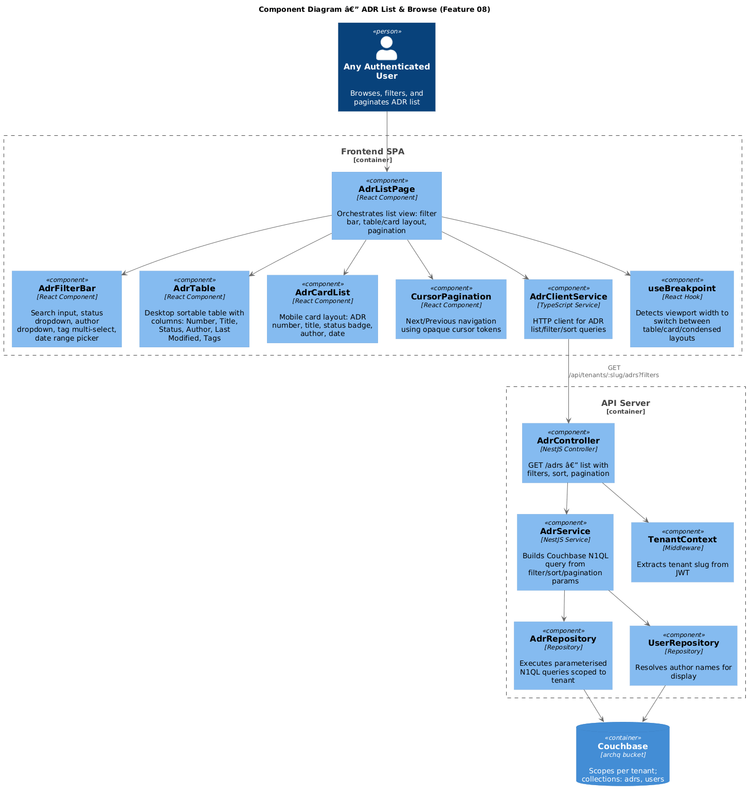
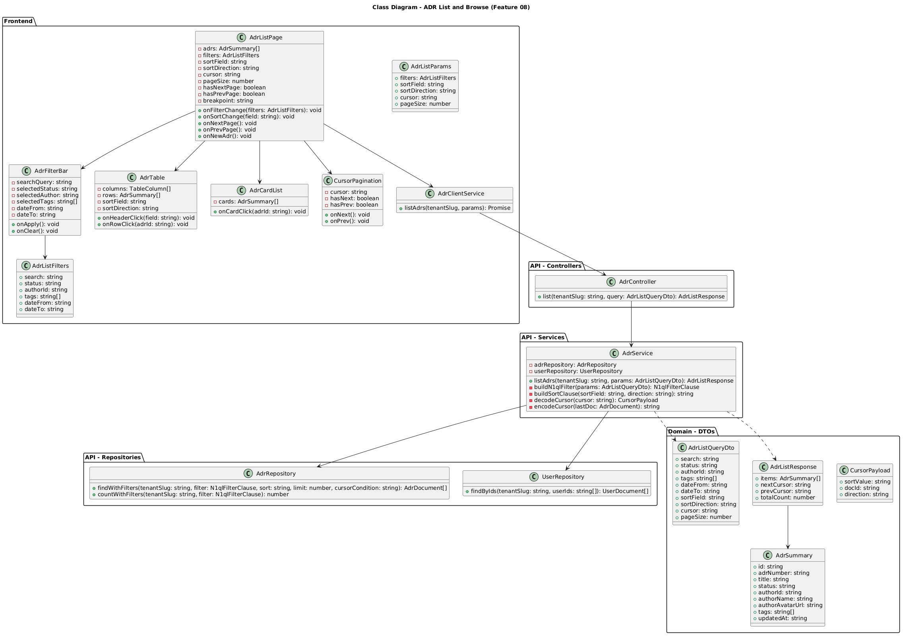
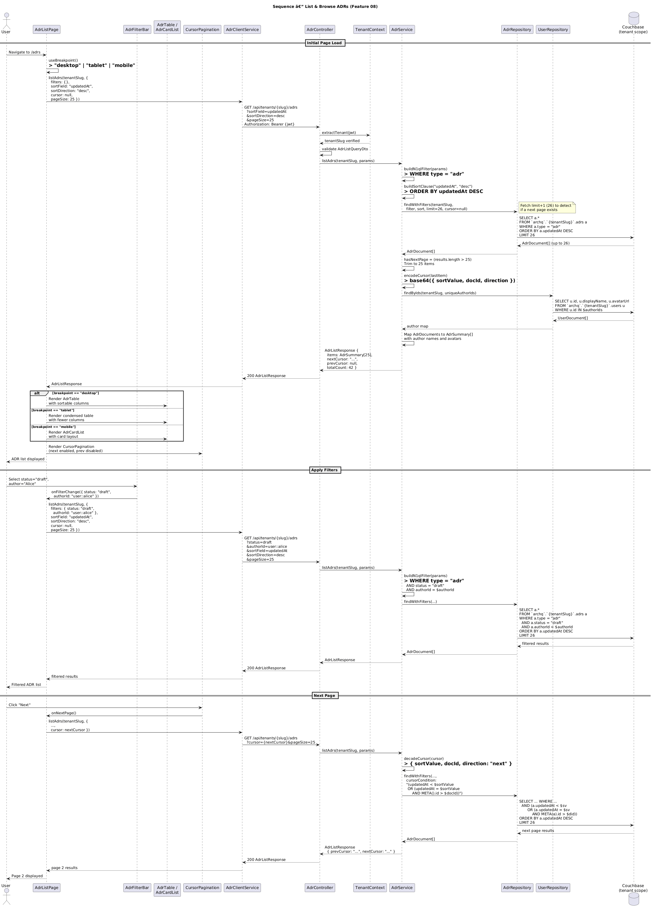

# Feature 08 — ADR List & Browse

**Traces to:** L2-020, L2-028, L2-029

---

## 1. Overview

This feature provides the primary ADR browsing experience. Users can view all ADRs within their tenant, filter by status, author, date range, and tags, sort by any column, and paginate through results using cursor-based pagination. The UI is fully responsive with three distinct layouts:

- **Desktop (>= 768px):** Sortable data table with columns for Number, Title, Status, Author, Last Modified, and Tags.
- **Tablet (576-767px):** Condensed table with fewer columns and a compact header bar.
- **Mobile (< 576px):** Card-based layout with ADR number, title, status badge, author, and date.

Default sort is last-modified descending. Page size defaults to 25, maximum 100.

---

## 2. Architecture

### 2.1 C4 Component Diagram



Key architectural decisions:

- **Cursor-based pagination** is used instead of offset-based to ensure consistent results when ADRs are created/updated between page loads.
- **Author resolution** is handled server-side: the API joins author IDs with the `users` collection to return display names and avatar URLs.
- **Responsive layout** is determined client-side via the `useBreakpoint` hook, which renders `AdrTable`, a condensed table, or `AdrCardList` accordingly.

---

## 3. Component Details

### 3.1 Frontend Components

| Component | Responsibility |
|-----------|---------------|
| `AdrListPage` | Top-level page. Manages filter state, sort state, pagination cursor, and breakpoint detection. Renders filter bar, display component, and pagination. "New ADR" button navigates to `/adrs/new`. |
| `AdrFilterBar` | Desktop: search bar (Input/Search), status dropdown, author dropdown, tag multi-select, date range picker in a horizontal row. Mobile: filter pills (All / Draft / In Review / Approved) with a collapsible drawer for advanced filters. Tablet: status + author filters below header. |
| `AdrTable` | Desktop sortable table. Columns: Number, Title, Status (Badge component), Author (Avatar + name), Last Modified, Tags (Tag chips). Clicking a header toggles sort. Clicking a row navigates to ADR detail. |
| `AdrCardList` | Mobile card list. Each card shows ADR number + status badge on top row, title in the middle, author + date on the bottom. Cards are tappable. |
| `CursorPagination` | Displays "Previous" and "Next" buttons. Buttons are disabled when `prevCursor` or `nextCursor` is null. |
| `AdrClientService` | Builds query string from `AdrListParams` and calls `GET /api/tenants/:slug/adrs`. |
| `useBreakpoint` | React hook that returns `"mobile"` (< 576px), `"tablet"` (576-767px), or `"desktop"` (>= 768px) based on `window.innerWidth` with debounced resize listener. |

### 3.2 Desktop Layout (>= 768px)

```
+------+---------------------------------------------------------------+
|      | Architecture Decision Records              [+ New ADR]        |
| Side |---------------------------------------------------------------|
| bar  | [Search...] [Status v] [Author v] [Tags v] [Date range]       |
| (ADR |---------------------------------------------------------------|
| Rec- | # Number | Title          | Status    | Author   | Modified  |
| ords | ADR-012  | Use gRPC for.. | Draft     | @Alice   | Apr 14    |
| act- | ADR-011  | Adopt K8s...   | Approved  | @Bob     | Apr 13    |
| ive) | ADR-010  | Event Sourci.. | In Review | @Carol   | Apr 12    |
|      | ...      | ...            | ...       | ...      | ...       |
|      |---------------------------------------------------------------|
|      |                          [< Prev] [Next >]                    |
+------+---------------------------------------------------------------+
```

### 3.3 Mobile Layout (< 576px)

```
+---------------------------------------------+
| [=] ArchQ                         [Avatar]   |
|---------------------------------------------|
| Acme Corp                                   |
|---------------------------------------------|
| Architecture Decision Records    [+]        |
|---------------------------------------------|
| [All] [Draft] [In Review] [Approved]        |
|---------------------------------------------|
| +---------------------------------------+   |
| | ADR-012              [Draft]          |   |
| | Use gRPC for Internal Services        |   |
| | Alice Chen  *  Apr 14, 2026           |   |
| +---------------------------------------+   |
| +---------------------------------------+   |
| | ADR-011              [Approved]       |   |
| | Adopt Kubernetes for Deployment       |   |
| | Bob Smith  *  Apr 13, 2026            |   |
| +---------------------------------------+   |
| ...                                         |
|---------------------------------------------|
|              [< Prev] [Next >]              |
+---------------------------------------------+
```

### 3.4 Tablet Layout (576-767px)

```
+-----------------------------------------------------------+
| [Logo] Acme Corp    [Search...]              [Avatar]      |
|-----------------------------------------------------------|
| Architecture Decision Records          [+ New ADR]        |
|-----------------------------------------------------------|
| [Status v] [Author v]                                     |
|-----------------------------------------------------------|
| # Number | Title               | Status    | Modified    |
| ADR-012  | Use gRPC for...     | Draft     | Apr 14      |
| ADR-011  | Adopt K8s...        | Approved  | Apr 13      |
| ...      | ...                 | ...       | ...         |
|-----------------------------------------------------------|
|                    [< Prev] [Next >]                      |
+-----------------------------------------------------------+
```

### 3.5 API Server Components

| Component | Responsibility |
|-----------|---------------|
| `AdrController.list()` | Accepts query parameters for filters, sort, cursor, and page size. Validates via `AdrListQueryDto`. Delegates to `AdrService.listAdrs()`. |
| `AdrService.listAdrs()` | Builds N1QL WHERE clause from filter params. Builds ORDER BY from sort params. Decodes cursor for pagination offset. Fetches `limit+1` documents to detect next page existence. Resolves author details via `UserRepository`. Encodes next/prev cursors. Returns `AdrListResponse`. |
| `AdrRepository.findWithFilters()` | Executes parameterised N1QL query scoped to `archq.{tenantSlug}.adrs`. Returns `AdrDocument[]`. |
| `UserRepository.findByIds()` | Batch-fetches user documents by ID array from `archq.{tenantSlug}.users`. Returns display names and avatar URLs. |

---

## 4. Data Model

### 4.1 Class Diagram



### 4.2 AdrSummary (API response item)

```json
{
  "id": "adr::550e8400-e29b-41d4-a716-446655440000",
  "adrNumber": "ADR-012",
  "title": "Use gRPC for Internal Service Communication",
  "status": "draft",
  "authorId": "user::a1b2c3d4",
  "authorName": "Alice Chen",
  "authorAvatarUrl": "https://cdn.archq.io/avatars/a1b2c3d4.jpg",
  "tags": ["architecture", "grpc", "microservices"],
  "updatedAt": "2026-04-14T16:30:00.000Z"
}
```

### 4.3 Cursor Encoding

Cursors are Base64-encoded JSON payloads containing the sort value and document ID of the last item on the current page:

```json
{
  "sortValue": "2026-04-14T16:30:00.000Z",
  "docId": "adr::550e8400-e29b-41d4-a716-446655440000",
  "direction": "next"
}
```

This enables stable pagination even when documents are updated between page loads.

### 4.4 Couchbase Indexes

The following Global Secondary Indexes (GSI) support efficient list queries:

```sql
-- Primary list/filter index
CREATE INDEX idx_adrs_list
ON `archq`.`{tenantSlug}`.adrs(status, authorId, updatedAt DESC, tags)
WHERE type = "adr";

-- Tag-based filter index
CREATE INDEX idx_adrs_tags
ON `archq`.`{tenantSlug}`.adrs(DISTINCT ARRAY t FOR t IN tags END, updatedAt DESC)
WHERE type = "adr";

-- Date range filter index
CREATE INDEX idx_adrs_daterange
ON `archq`.`{tenantSlug}`.adrs(updatedAt, status)
WHERE type = "adr";
```

---

## 5. Key Workflows

### 5.1 List ADRs Sequence



**Flow summary:**

1. User navigates to `/adrs`. The `useBreakpoint` hook determines the layout mode.
2. The page sends `GET /api/tenants/{slug}/adrs` with default params: `sortField=updatedAt`, `sortDirection=desc`, `pageSize=25`, no cursor.
3. `AdrService` builds the N1QL query with a `WHERE type = "adr"` clause. It fetches `limit+1` (26) documents.
4. If 26 documents are returned, `hasNextPage` is true and the result is trimmed to 25. A `nextCursor` is encoded from the last item's sort value and document ID.
5. Author IDs are extracted and batch-resolved via `UserRepository` to get display names and avatars.
6. `AdrListResponse` is returned with items, cursors, and total count.
7. The frontend renders the appropriate layout based on breakpoint.

### 5.2 Filtering

Filters are applied as additional WHERE clauses in the N1QL query:

```sql
SELECT a.*, META(a).id AS id
FROM `archq`.`{tenantSlug}`.adrs a
WHERE a.type = "adr"
  AND ($status IS NULL OR a.status = $status)
  AND ($authorId IS NULL OR a.authorId = $authorId)
  AND ($dateFrom IS NULL OR a.updatedAt >= $dateFrom)
  AND ($dateTo IS NULL OR a.updatedAt <= $dateTo)
  AND ($tags IS NULL OR EVERY t IN $tags SATISFIES t IN a.tags END)
ORDER BY a.updatedAt DESC
LIMIT 26
```

All filter parameters are parameterised to prevent N1QL injection.

### 5.3 Sorting

Sortable fields: `adrNumber`, `title`, `status`, `updatedAt`. The sort clause is built server-side from validated field names (whitelist approach). Default: `updatedAt DESC`.

### 5.4 Cursor-Based Pagination

The cursor encodes the sort value and document ID of the boundary item. For "next page":

```sql
WHERE ... AND (a.updatedAt < $sortValue
              OR (a.updatedAt = $sortValue AND META(a).id > $docId))
```

For "previous page", the comparison operators are reversed and results are re-sorted.

---

## 6. API Contracts

### 6.1 List ADRs

```
GET /api/tenants/{tenantSlug}/adrs
Authorization: Bearer {jwt}
```

**Query parameters:**

| Parameter | Type | Default | Description |
|-----------|------|---------|-------------|
| `search` | string | null | Text search filter (delegated to Feature 09 FTS if present) |
| `status` | string | null | Filter by status: `draft`, `in_review`, `approved`, `rejected`, `superseded`, `deprecated` |
| `authorId` | string | null | Filter by author user ID |
| `tags` | string[] | null | Filter by tags (comma-separated, AND logic) |
| `dateFrom` | ISO8601 | null | Filter: updatedAt >= dateFrom |
| `dateTo` | ISO8601 | null | Filter: updatedAt <= dateTo |
| `sortField` | string | `updatedAt` | One of: `adrNumber`, `title`, `status`, `updatedAt` |
| `sortDirection` | string | `desc` | `asc` or `desc` |
| `cursor` | string | null | Opaque pagination cursor |
| `pageSize` | number | 25 | Items per page (1-100) |

**Response — `200 OK`:**

```json
{
  "items": [
    {
      "id": "adr::550e8400-e29b-41d4-a716-446655440000",
      "adrNumber": "ADR-012",
      "title": "Use gRPC for Internal Service Communication",
      "status": "draft",
      "authorId": "user::a1b2c3d4",
      "authorName": "Alice Chen",
      "authorAvatarUrl": "https://cdn.archq.io/avatars/a1b2c3d4.jpg",
      "tags": ["architecture", "grpc"],
      "updatedAt": "2026-04-14T16:30:00.000Z"
    }
  ],
  "nextCursor": "eyJzb3J0VmFsdWUiOiIyMDI2LTA0LTE0VDE2OjMwOjAwLjAwMFoiLCJkb2NJZCI6ImFkcjo6NTUwZTg0MDAiLCJkaXJlY3Rpb24iOiJuZXh0In0=",
  "prevCursor": null,
  "totalCount": 42
}
```

**Error responses:**

| Status | Condition |
|--------|-----------|
| `400` | Invalid query parameters (e.g., pageSize > 100, unknown sortField) |
| `401` | Missing or invalid JWT |
| `404` | Tenant not found |

---

## 7. Security Considerations

| Concern | Mitigation |
|---------|------------|
| **Tenant isolation** | All N1QL queries are scoped to `archq.{tenantSlug}.adrs`. Cursor tokens do not contain tenant information; tenant is always derived from JWT. |
| **N1QL injection** | All filter values are passed as parameterised query parameters (`$status`, `$authorId`, etc.), never interpolated into the query string. |
| **Cursor tampering** | Cursor tokens are opaque Base64-encoded JSON. Server validates cursor structure and ignores malformed cursors (falls back to first page). Cursor does not contain sensitive data. |
| **Authorization** | All authenticated users (Admin, Author, Reviewer, Viewer) can browse ADRs. No role restriction on read. |
| **Data exposure** | The list endpoint returns `AdrSummary` (no full body content), minimising data transfer and exposure. Full body is only returned by the detail endpoint. |
| **Pagination abuse** | `pageSize` is capped at 100 server-side. Requests exceeding 100 are reduced to 100. |
| **Sort field injection** | Sort field is validated against a whitelist: `["adrNumber", "title", "status", "updatedAt"]`. Unknown values default to `updatedAt`. |

---

## 8. Open Questions

| # | Question | Status |
|---|----------|--------|
| 1 | Should `totalCount` be returned on every request or only on the first page (for performance)? | Proposed: Return on every request; cache the count query result for 30 seconds. |
| 2 | Should the mobile filter pills support "Rejected" and other statuses, or only the most common? | Proposed: Show All/Draft/In Review/Approved as pills; other statuses available via "More" drawer. |
| 3 | Should table column visibility be user-configurable? | Deferred: V1 uses fixed columns per breakpoint. |
| 4 | Should the list endpoint support bulk selection for batch operations? | Deferred: V1 is read-only list. Batch operations considered for V2. |
| 5 | Should search in the filter bar use the FTS index (Feature 09) or simple N1QL LIKE? | Proposed: If `search` param is present, delegate to the FTS service (Feature 09). Simple LIKE is not performant on body content. |
