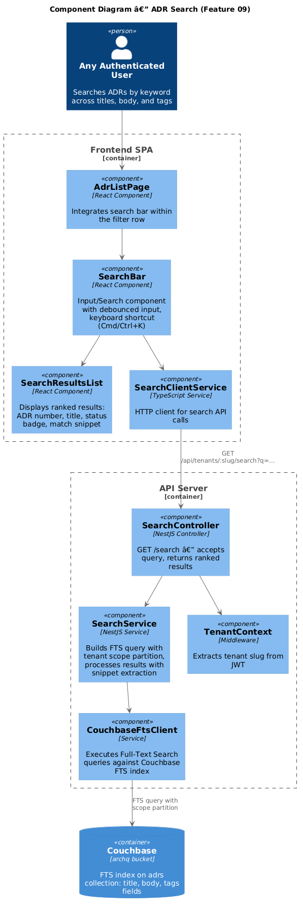
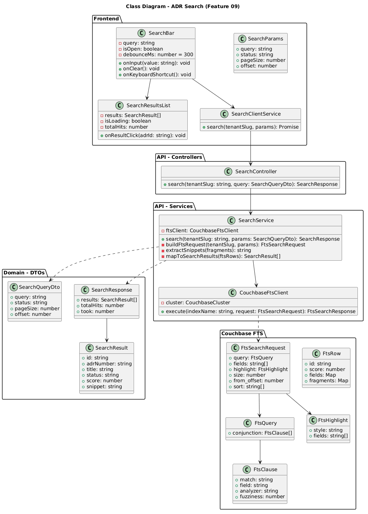
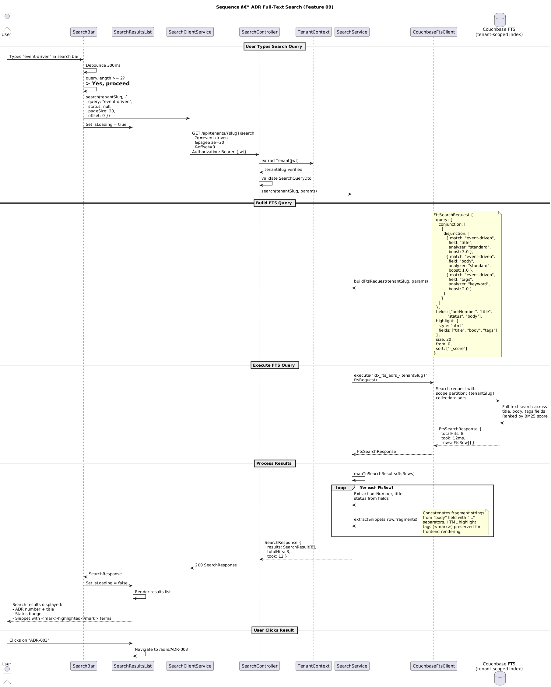

# Feature 09 — ADR Search

**Traces to:** L2-019

---

## 1. Overview

This feature provides full-text search across ADR titles, body content, and tags within a tenant. Results are ranked by relevance using Couchbase Full-Text Search (FTS) with BM25 scoring. Each result displays the ADR number, title, status, and a text snippet with highlighted match context. Search is strictly tenant-scoped: zero cross-tenant data leakage is enforced through FTS scope partitioning.

The search bar is integrated into the ADR list page (Feature 08) filter row on desktop, the header bar on tablet, and behind a search icon in the mobile header.

---

## 2. Architecture

### 2.1 C4 Component Diagram



Key architectural decisions:

- **Couchbase FTS** is used rather than N1QL LIKE queries for performance and relevance ranking. FTS provides BM25 scoring, fragment highlighting, and fuzzy matching.
- **One FTS index per tenant scope** ensures complete data isolation at the search engine level. The index name follows the convention `idx_fts_adrs_{tenantSlug}`.
- **Debounced input** (300ms) on the frontend prevents excessive API calls during typing.
- **Snippet extraction** is performed server-side using FTS fragment highlighting, avoiding the need to send full document bodies to the client.

---

## 3. Component Details

### 3.1 Frontend Components

| Component | Responsibility |
|-----------|---------------|
| `SearchBar` | Input/Search design system component. Debounces input by 300ms. Minimum query length: 2 characters. Supports keyboard shortcut (Cmd/Ctrl+K) to focus. Displays a clear button when query is non-empty. |
| `SearchResultsList` | Renders search results as a dropdown or inline list. Each result shows: ADR number, title, status badge (Badge component), and a snippet with `<mark>` tags for highlighted terms. Loading spinner while search is in progress. |
| `SearchClientService` | Calls `GET /api/tenants/:slug/search` with query params. Returns `SearchResponse`. |

### 3.2 Search Bar Placement

| Breakpoint | Placement |
|------------|-----------|
| Desktop (>= 768px) | In the filter row of `AdrListPage`, left-aligned as an Input/Search component. Results appear as a dropdown below the search bar. |
| Tablet (576-767px) | In the header bar, between the logo/org pill and the avatar. Full-width search bar. Results appear inline below filters. |
| Mobile (< 576px) | Search icon in the mobile header. Tapping expands a full-width search bar. Results replace the card list. |

### 3.3 API Server Components

| Component | Responsibility |
|-----------|---------------|
| `SearchController` | `GET /api/tenants/:tenantSlug/search` — validates `SearchQueryDto`, delegates to `SearchService`, returns `SearchResponse`. |
| `SearchService` | Builds FTS query with field boosting (title 3x, tags 2x, body 1x). Executes via `CouchbaseFtsClient`. Extracts snippets from FTS fragments. Maps FTS rows to `SearchResult[]`. |
| `CouchbaseFtsClient` | Thin wrapper around the Couchbase SDK `SearchQuery` API. Executes search requests against a named FTS index. |
| `TenantContext` | Same middleware as other features. Ensures tenant slug from JWT. |

---

## 4. Data Model

### 4.1 Class Diagram



### 4.2 Couchbase FTS Index Definition

**Index name:** `idx_fts_adrs_{tenantSlug}`
**Scope:** `{tenantSlug}`
**Collection:** `adrs`

```json
{
  "name": "idx_fts_adrs_{tenantSlug}",
  "type": "fulltext-index",
  "params": {
    "doc_config": {
      "mode": "scope.collection.type_field",
      "type_field": "type"
    },
    "mapping": {
      "default_mapping": {
        "enabled": false
      },
      "types": {
        "{tenantSlug}.adrs": {
          "enabled": true,
          "dynamic": false,
          "properties": {
            "title": {
              "enabled": true,
              "fields": [
                {
                  "name": "title",
                  "type": "text",
                  "analyzer": "standard",
                  "store": true,
                  "index": true,
                  "include_term_vectors": true
                }
              ]
            },
            "body": {
              "enabled": true,
              "fields": [
                {
                  "name": "body",
                  "type": "text",
                  "analyzer": "standard",
                  "store": true,
                  "index": true,
                  "include_term_vectors": true
                }
              ]
            },
            "tags": {
              "enabled": true,
              "fields": [
                {
                  "name": "tags",
                  "type": "text",
                  "analyzer": "keyword",
                  "store": true,
                  "index": true,
                  "include_term_vectors": true
                }
              ]
            },
            "adrNumber": {
              "enabled": true,
              "fields": [
                {
                  "name": "adrNumber",
                  "type": "text",
                  "analyzer": "keyword",
                  "store": true,
                  "index": true
                }
              ]
            },
            "status": {
              "enabled": true,
              "fields": [
                {
                  "name": "status",
                  "type": "text",
                  "analyzer": "keyword",
                  "store": true,
                  "index": false
                }
              ]
            }
          }
        }
      }
    },
    "store": {
      "indexType": "scorch"
    }
  },
  "sourceType": "couchbase",
  "sourceName": "archq"
}
```

### 4.3 Field Boosting Strategy

| Field | Analyzer | Boost | Rationale |
|-------|----------|-------|-----------|
| `title` | standard | 3.0 | Title matches are most relevant; users often search by ADR name. |
| `tags` | keyword | 2.0 | Tag matches indicate strong topical relevance. Keyword analyzer ensures exact tag matching. |
| `body` | standard | 1.0 | Body matches provide broad coverage but are less precise. |

### 4.4 SearchResult (API response item)

```json
{
  "id": "adr::550e8400-e29b-41d4-a716-446655440000",
  "adrNumber": "ADR-003",
  "title": "Use <mark>Event-Driven</mark> Architecture for Order Processing",
  "status": "approved",
  "score": 2.847,
  "snippet": "...we decided to adopt an <mark>event-driven</mark> approach using Apache Kafka for asynchronous communication between services. This <mark>event-driven</mark> pattern..."
}
```

---

## 5. Key Workflows

### 5.1 Search Sequence



**Flow summary:**

1. User types a query in the `SearchBar`. After 300ms of inactivity (debounce), and if the query is at least 2 characters, the search is triggered.
2. `GET /api/tenants/{slug}/search?q=event-driven&pageSize=20&offset=0` is called.
3. `SearchService` builds an FTS request with:
   - A disjunction query across `title` (boost 3.0), `body` (boost 1.0), and `tags` (boost 2.0).
   - HTML-style highlighting on `title`, `body`, and `tags` fields.
   - Sort by `_score` descending (relevance).
4. The FTS query is executed against the tenant-scoped index `idx_fts_adrs_{tenantSlug}`.
5. Couchbase FTS returns ranked rows with scores and fragment highlights.
6. `SearchService` maps each FTS row to a `SearchResult`, extracting snippets from the fragment map and preserving `<mark>` highlight tags.
7. The response includes total hit count, processing time, and the result array.
8. The frontend renders results with highlighted terms. Clicking a result navigates to the ADR detail page.

### 5.2 FTS Index Provisioning

FTS indexes are created during tenant provisioning (Feature 01). When a new tenant scope is created, the provisioning service also creates the `idx_fts_adrs_{tenantSlug}` FTS index. The index definition is templated and the tenant slug is substituted at creation time.

**Provisioning N1QL (index creation is via REST API):**

```
PUT /api/index/idx_fts_adrs_{tenantSlug}
Content-Type: application/json
Body: { ... index definition with tenantSlug substituted ... }
```

### 5.3 Search with Status Filter

When the user combines search with a status filter (from the filter bar), the FTS query includes an additional conjunction clause:

```json
{
  "conjunction": [
    {
      "disjunction": [
        { "match": "event-driven", "field": "title", "boost": 3.0 },
        { "match": "event-driven", "field": "body", "boost": 1.0 },
        { "match": "event-driven", "field": "tags", "boost": 2.0 }
      ]
    },
    {
      "term": "approved",
      "field": "status"
    }
  ]
}
```

### 5.4 Fuzzy Matching

For queries longer than 4 characters, fuzziness of 1 (edit distance) is applied to tolerate typos:

```json
{ "match": "event-driven", "field": "title", "fuzziness": 1 }
```

Queries of 4 characters or fewer use exact matching to avoid noisy results.

---

## 6. API Contracts

### 6.1 Search ADRs

```
GET /api/tenants/{tenantSlug}/search
Authorization: Bearer {jwt}
```

**Query parameters:**

| Parameter | Type | Default | Description |
|-----------|------|---------|-------------|
| `q` | string | (required) | Search query, minimum 2 characters |
| `status` | string | null | Optional status filter |
| `pageSize` | number | 20 | Results per page (1-50) |
| `offset` | number | 0 | Offset for pagination |

**Response — `200 OK`:**

```json
{
  "results": [
    {
      "id": "adr::550e8400-e29b-41d4-a716-446655440000",
      "adrNumber": "ADR-003",
      "title": "Use <mark>Event-Driven</mark> Architecture for Order Processing",
      "status": "approved",
      "score": 2.847,
      "snippet": "...we decided to adopt an <mark>event-driven</mark> approach using Apache Kafka..."
    },
    {
      "id": "adr::661f9511-f3ac-52e5-b827-557766551111",
      "adrNumber": "ADR-007",
      "title": "Adopt CQRS with <mark>Event</mark> Sourcing",
      "status": "draft",
      "score": 1.523,
      "snippet": "...the <mark>event</mark>-<mark>driven</mark> nature of the system suggests..."
    }
  ],
  "totalHits": 8,
  "took": 12
}
```

**Error responses:**

| Status | Condition |
|--------|-----------|
| `400` | Query too short (< 2 chars), invalid pageSize or offset |
| `401` | Missing or invalid JWT |
| `404` | Tenant not found |
| `503` | FTS index unavailable or not yet built |

---

## 7. Security Considerations

| Concern | Mitigation |
|---------|------------|
| **Tenant isolation (critical)** | Each tenant has its own FTS index (`idx_fts_adrs_{tenantSlug}`) scoped to the tenant's Couchbase scope. FTS queries target only the tenant-specific index. Even if an attacker modifies the query, the index physically contains only the tenant's data. |
| **Cross-tenant leakage** | The `SearchService` constructs the index name from the JWT-verified tenant slug, never from user input. There is no API parameter to specify an index name. |
| **Query injection** | FTS queries are built programmatically using the Couchbase SDK's `SearchQuery` builder, not string concatenation. User input is passed as match terms, not as raw query syntax. |
| **XSS via snippets** | Snippets contain `<mark>` tags from FTS highlighting. The frontend renders snippets using a whitelist-based sanitiser that allows only `<mark>` tags. All other HTML is stripped. |
| **Denial of service** | Search results are capped at `pageSize` (max 50). Debounce on the frontend (300ms) limits request rate. Server-side rate limiting (per Feature 20) applies. |
| **Index availability** | If the FTS index is not yet built (e.g., during tenant provisioning), the search endpoint returns `503 Service Unavailable` with a `Retry-After` header. |

---

## 8. Open Questions

| # | Question | Status |
|---|----------|--------|
| 1 | Should search support advanced syntax (e.g., `status:draft title:"event driven"`)? | Deferred: V1 uses simple keyword search. Advanced syntax considered for V2. |
| 2 | Should search results include author name and tags in the result card? | Proposed: V1 shows ADR number, title, status, snippet. Author/tags can be added if UX testing shows demand. |
| 3 | Should there be a separate search page or is the inline dropdown sufficient? | Proposed: Desktop uses inline dropdown under search bar. Mobile navigates to a full search results page. |
| 4 | Should recently viewed ADRs appear as suggestions when the search bar is focused but empty? | Deferred: V1 shows no suggestions. V2 can add recent/popular suggestions. |
| 5 | How frequently should the FTS index be rebuilt or optimized? | Proposed: FTS indexes update in near-real-time via DCP (Database Change Protocol). No manual rebuild needed. Monitor index lag in production. |
| 6 | Should search work across all document types (ADRs, meeting notes, general notes) or only ADRs? | Proposed: V1 searches ADRs only. V2 can extend to other document types with a unified search index. |
