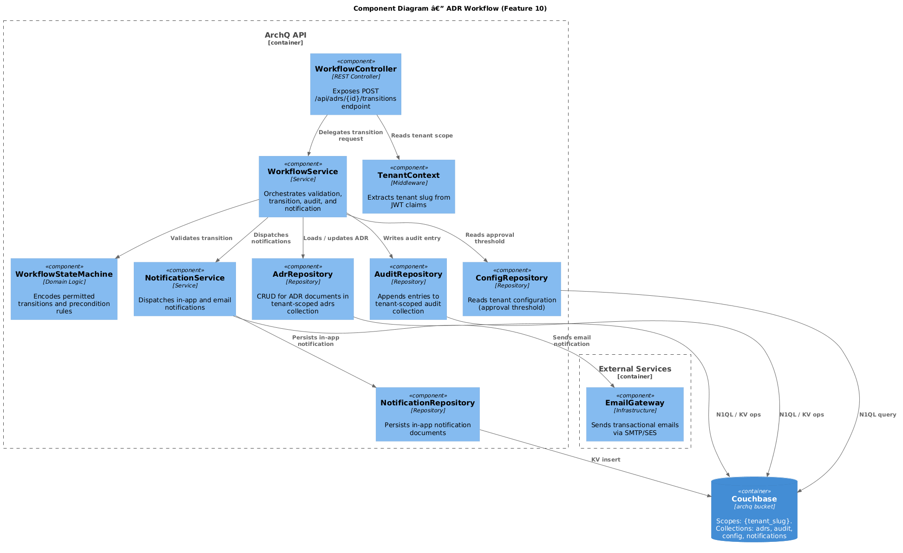
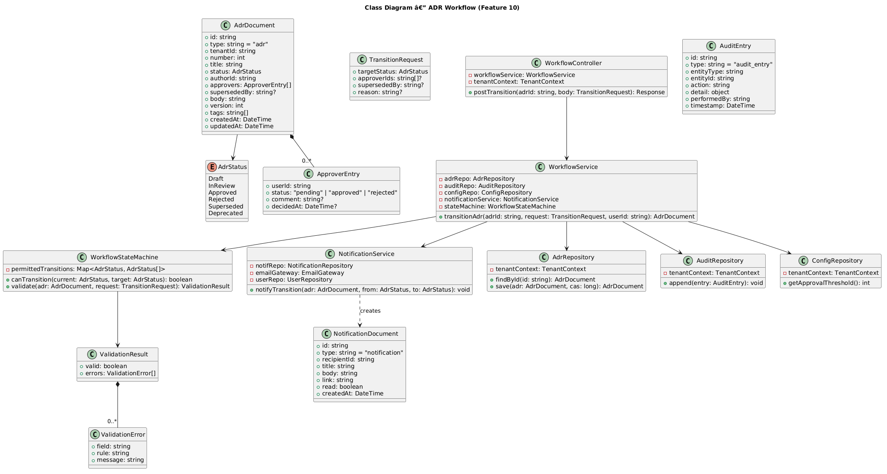
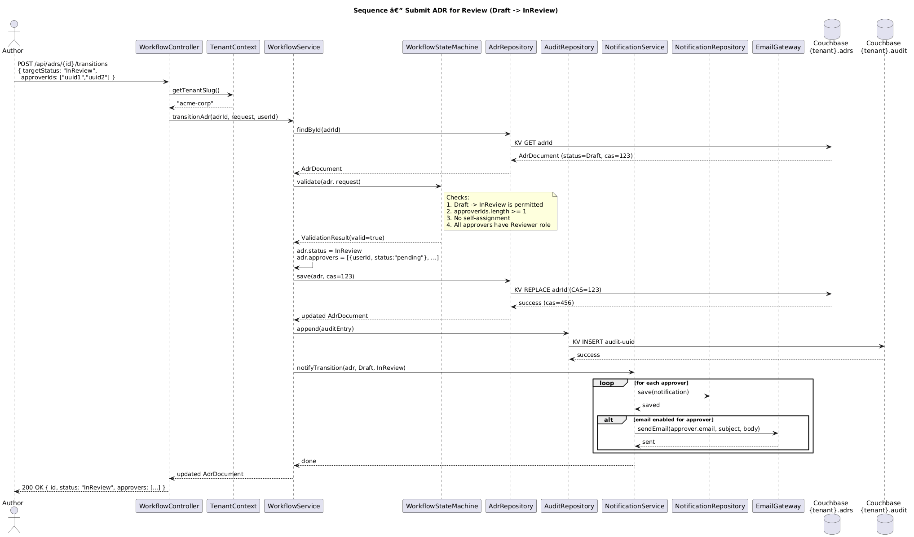
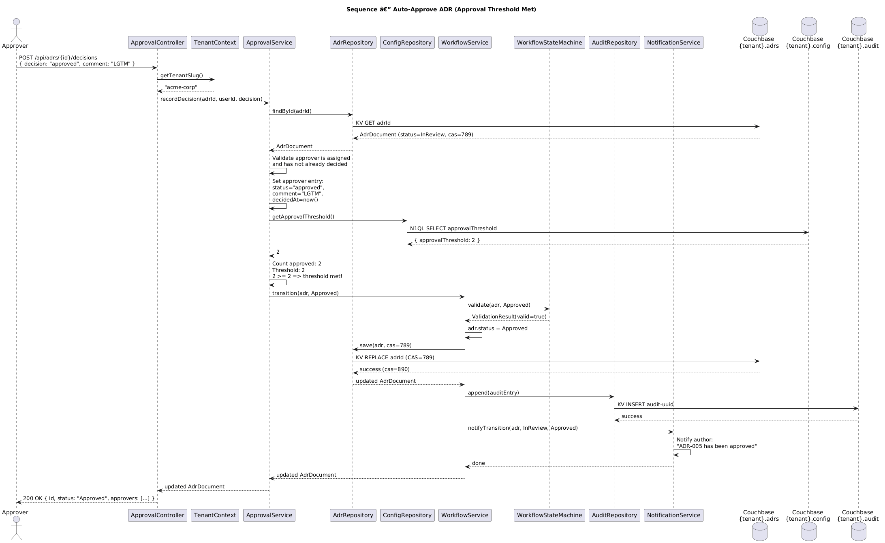

# Feature 10: ADR Workflow

**Traces to:** L2-010, L2-011

## 1. Overview

The ADR Workflow feature implements a finite state machine governing the lifecycle of Architecture Decision Records. Each ADR transitions through a well-defined set of statuses — Draft, InReview, Approved, Rejected, Superseded, and Deprecated — with transitions validated against permitted rules. The system sends in-app and optional email notifications on every transition, ensuring all stakeholders stay informed.

## 2. Architecture

### 2.1 C4 Component Diagram



The workflow engine sits between the API layer and the Couchbase data layer. It enforces transition rules via a `WorkflowStateMachine`, dispatches notifications through a `NotificationService`, and records every transition in the `audit` collection.

### 2.2 Key Components

| Component | Responsibility |
|-----------|---------------|
| `WorkflowController` | REST endpoint for status transitions |
| `WorkflowService` | Orchestrates validation, transition, notification, and audit |
| `WorkflowStateMachine` | Pure function: validates whether a transition is permitted |
| `AdrRepository` | Reads/writes ADR documents in tenant-scoped `adrs` collection |
| `AuditRepository` | Appends immutable audit entries to tenant-scoped `audit` collection |
| `NotificationService` | Dispatches in-app and email notifications |
| `NotificationRepository` | Persists in-app notification documents |
| `EmailGateway` | Sends transactional emails via external SMTP/SES |
| `TenantContext` | Middleware providing tenant scope from JWT |

## 3. Component Details

### 3.1 WorkflowStateMachine

A stateless utility class encoding the permitted transitions:

```
PERMITTED_TRANSITIONS = {
  Draft       -> [InReview],
  InReview    -> [Approved, Rejected],
  Approved    -> [Superseded, Deprecated],
  Rejected    -> [Draft],
  Superseded  -> [],
  Deprecated  -> []
}
```

**Methods:**

| Method | Signature | Description |
|--------|-----------|-------------|
| `canTransition` | `(currentStatus: AdrStatus, targetStatus: AdrStatus) -> bool` | Returns true if the transition is permitted |
| `validate` | `(adr: AdrDocument, targetStatus: AdrStatus) -> ValidationResult` | Validates preconditions (e.g., approvers assigned for Draft->InReview) |

**Precondition rules:**

| Transition | Precondition |
|-----------|-------------|
| Draft -> InReview | `adr.approvers.length >= 1` |
| InReview -> Approved | Triggered automatically when approval threshold met |
| InReview -> Rejected | Triggered automatically when any approver rejects |
| Rejected -> Draft | Clears `adr.approvers[*].status` to `"cleared"` and removes decisions |
| Approved -> Superseded | `supersededBy` ADR ID must be provided |
| Approved -> Deprecated | Requires Admin role |

### 3.2 WorkflowService

Orchestration layer that coordinates the transition:

1. Load ADR from `AdrRepository`
2. Call `WorkflowStateMachine.validate(adr, targetStatus)`
3. If valid, update `adr.status` and status-specific fields
4. Persist updated ADR via `AdrRepository`
5. Write audit entry via `AuditRepository`
6. Dispatch notifications via `NotificationService`
7. Return updated ADR

### 3.3 NotificationService

Determines notification recipients based on transition type:

| Transition | Recipients | Channel |
|-----------|-----------|---------|
| Draft -> InReview | All assigned approvers | In-app + email |
| InReview -> Approved | ADR author | In-app + email |
| InReview -> Rejected | ADR author | In-app + email |
| Approved -> Superseded | ADR author | In-app + email |
| Approved -> Deprecated | ADR author | In-app + email |
| Rejected -> Draft | All previously assigned approvers | In-app |

Email notifications are conditional on the user's `emailNotificationsEnabled` preference in the `users` collection.

## 4. Data Model

### 4.1 Class Diagram



### 4.2 ADR Document (adrs collection)

```json
{
  "type": "adr",
  "id": "adr-uuid",
  "tenantId": "tenant-slug",
  "number": 5,
  "title": "Use Event Sourcing for Order Management",
  "status": "InReview",
  "authorId": "user-uuid",
  "approvers": [
    {
      "userId": "reviewer-uuid-1",
      "status": "pending",
      "comment": null,
      "decidedAt": null
    }
  ],
  "supersededBy": null,
  "body": "## Context\n...",
  "version": 3,
  "tags": ["event-sourcing", "orders"],
  "createdAt": "2026-04-10T09:00:00Z",
  "updatedAt": "2026-04-12T14:30:00Z"
}
```

### 4.3 Audit Entry (audit collection)

```json
{
  "type": "audit_entry",
  "id": "audit-uuid",
  "entityType": "adr",
  "entityId": "adr-uuid",
  "action": "status_transition",
  "detail": {
    "from": "Draft",
    "to": "InReview",
    "approversAssigned": ["reviewer-uuid-1"]
  },
  "performedBy": "user-uuid",
  "timestamp": "2026-04-12T14:30:00Z"
}
```

### 4.4 Notification Document (notifications collection)

```json
{
  "type": "notification",
  "id": "notif-uuid",
  "recipientId": "user-uuid",
  "title": "ADR-005 submitted for review",
  "body": "You have been assigned as an approver for ADR-005.",
  "link": "/adrs/adr-uuid",
  "read": false,
  "createdAt": "2026-04-12T14:30:00Z"
}
```

## 5. Key Workflows

### 5.1 Submit for Review (Draft -> InReview)



**Steps:**

1. Author calls `POST /api/adrs/{id}/transitions` with `{ "targetStatus": "InReview", "approverIds": ["uuid1", "uuid2"] }`
2. `WorkflowController` extracts tenant from `TenantContext` and delegates to `WorkflowService`
3. `WorkflowService` loads the ADR from `AdrRepository`
4. `WorkflowStateMachine.validate()` checks current status is Draft and at least 1 approver is assigned
5. `WorkflowService` updates ADR status to InReview, populates `approvers` array
6. `AdrRepository` persists the update using CAS (Compare-And-Swap) for optimistic concurrency
7. `AuditRepository` writes an audit entry
8. `NotificationService` sends in-app notifications to all approvers and emails to those with email enabled
9. Response returns the updated ADR with 200 OK

### 5.2 Auto-Approve (InReview -> Approved)



**Steps:**

1. Approver calls `POST /api/adrs/{id}/decisions` with `{ "decision": "approved", "comment": "LGTM" }`
2. `ApprovalService` records the decision on the approver entry
3. `ApprovalService` loads the tenant's approval threshold from the `config` collection
4. `ApprovalService` counts approvals: if `approvedCount >= threshold`, calls `WorkflowService.transition(adr, Approved)`
5. `WorkflowService` updates ADR status to Approved
6. `AuditRepository` writes an audit entry
7. `NotificationService` notifies the author of approval
8. Response returns 200 OK

## 6. API Contracts

### 6.1 Transition ADR Status

```
POST /api/adrs/{adrId}/transitions
Authorization: Bearer <jwt>
Content-Type: application/json

Request Body:
{
  "targetStatus": "InReview",
  "approverIds": ["uuid1", "uuid2"],   // Required for Draft->InReview
  "supersededBy": "adr-uuid",          // Required for Approved->Superseded
  "reason": "string"                   // Optional context
}

Response 200:
{
  "id": "adr-uuid",
  "status": "InReview",
  "approvers": [...],
  "updatedAt": "2026-04-12T14:30:00Z"
}

Response 400:
{
  "error": "INVALID_TRANSITION",
  "message": "Cannot transition from Draft to Approved."
}

Response 422:
{
  "error": "VALIDATION_FAILED",
  "message": "At least one approver is required to submit for review.",
  "details": [{ "field": "approverIds", "rule": "minLength", "value": 1 }]
}
```

### 6.2 Error Codes

| HTTP Status | Error Code | Condition |
|------------|------------|-----------|
| 400 | `INVALID_TRANSITION` | Transition not in permitted set |
| 403 | `FORBIDDEN` | User lacks permission for this transition |
| 404 | `ADR_NOT_FOUND` | ADR does not exist in tenant scope |
| 409 | `CONFLICT` | Optimistic concurrency conflict (stale CAS) |
| 422 | `VALIDATION_FAILED` | Precondition not met (e.g., no approvers) |

## 7. Couchbase Queries

### 7.1 Load ADR by ID (tenant-scoped)

```sql
SELECT META().id, a.*
FROM `archq`.`{tenant_slug}`.`adrs` a
WHERE META().id = $adrId
  AND a.type = "adr"
```

### 7.2 Load Tenant Approval Threshold

```sql
SELECT c.approvalThreshold
FROM `archq`.`{tenant_slug}`.`config` c
WHERE c.type = "tenant_config"
LIMIT 1
```

## 8. UI Behavior

### 8.1 Desktop Layout

The ADR Detail page displays:

- **Status Badge** (Badge/{status}) at the top of the detail view alongside the ADR title
- **Right Sidebar — Approval Status card**: Shows assigned approvers with their decision status (pending/approved/rejected) and timestamps
- **Workflow Action Buttons** (contextual):
  - Draft status: Button/Primary "Submit for Review" (visible to Author/Admin)
  - InReview status: Button/Primary "Approve", Button/Danger "Reject" (visible to assigned approvers)
  - Rejected status: Button/Secondary "Return to Draft" (visible to Author/Admin)
  - Approved status: Button/Ghost "Mark Deprecated" (visible to Admin)

### 8.2 Mobile Layout

- Status badge displayed below ADR title
- Accordion section "Approval Status" replaces sidebar card
- Workflow action buttons rendered as full-width sticky footer buttons
- Approval decision buttons stacked vertically (Approve above Reject)

## 9. Security Considerations

| Concern | Mitigation |
|---------|-----------|
| Unauthorized transitions | `WorkflowService` checks user role and ownership before allowing transitions |
| Tenant isolation | `TenantContext` middleware ensures all queries are scoped to JWT tenant claim |
| Optimistic concurrency | CAS-based updates prevent lost writes from concurrent transitions |
| Notification data leakage | Notifications reference ADR by ID; content is fetched with tenant-scoped queries |
| Email spoofing | Transactional emails sent via verified sender domain with SPF/DKIM |

## 10. Open Questions

| # | Question | Status |
|---|----------|--------|
| 1 | Should there be a configurable time window for InReview before auto-escalation? | Open |
| 2 | Should the Superseded transition be automatic when a new ADR references the old one, or require manual confirmation? | Open |
| 3 | Should Deprecated transitions require a reason/comment? | Open |
| 4 | Should email notifications be batched/digested or sent immediately? | Open |
