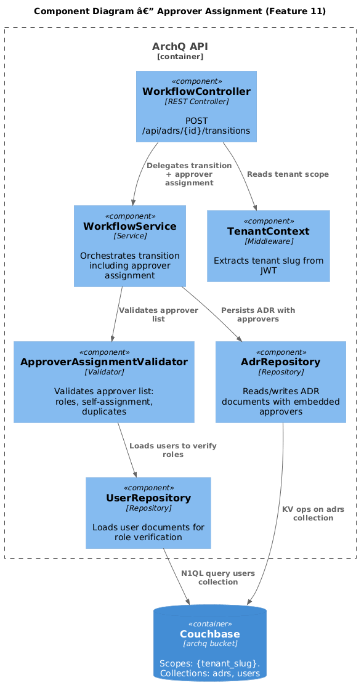
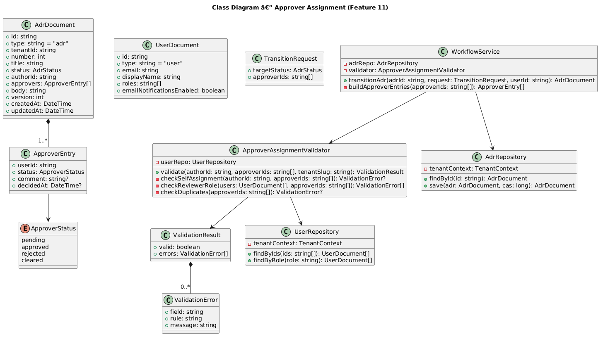
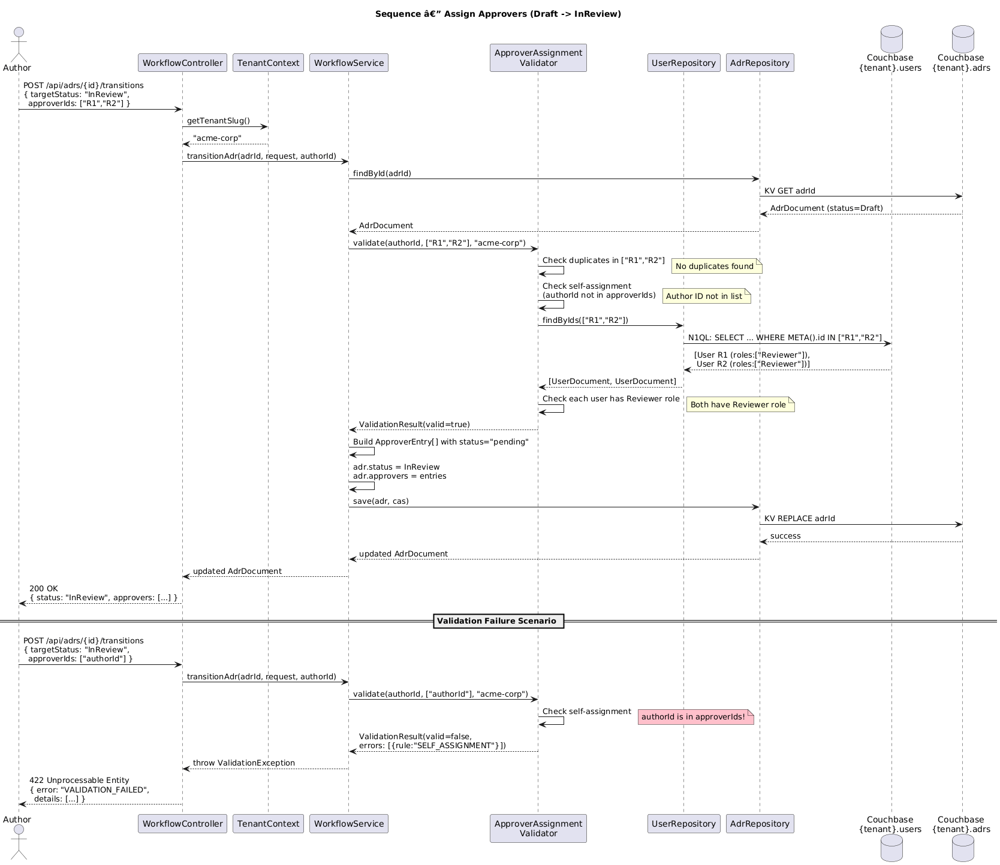

# Feature 11: Approver Assignment

**Traces to:** L2-012

## 1. Overview

The Approver Assignment feature enables ADR authors to designate one or more users with the Reviewer role as approvers when submitting an ADR for review. The system validates that assignees hold the Reviewer role, are not the ADR author, and that at least one approver is provided. Assigned approvers are embedded in the ADR document as pending entries, ready to record their decisions.

## 2. Architecture

### 2.1 C4 Component Diagram



### 2.2 Key Components

| Component | Responsibility |
|-----------|---------------|
| `WorkflowController` | Accepts transition requests including approver assignments |
| `ApproverAssignmentValidator` | Validates approver list against business rules |
| `UserRepository` | Loads user documents to verify roles |
| `AdrRepository` | Reads/writes ADR documents with approver entries |
| `TenantContext` | Provides tenant scope from JWT |

## 3. Component Details

### 3.1 ApproverAssignmentValidator

Encapsulates all assignment validation rules. Invoked by `WorkflowService` during the Draft -> InReview transition.

**Validation Rules:**

| Rule | Error Code | Message |
|------|-----------|---------|
| At least 1 approver required | `APPROVERS_REQUIRED` | "At least one approver must be assigned to submit for review." |
| Author cannot self-assign | `SELF_ASSIGNMENT` | "Authors cannot approve their own ADRs." |
| User must have Reviewer role | `INVALID_ROLE` | "User {displayName} does not have the Reviewer role." |
| User must exist in tenant | `USER_NOT_FOUND` | "User {userId} not found." |
| No duplicate approvers | `DUPLICATE_APPROVER` | "User {displayName} is already assigned as an approver." |

**Method Signature:**

```
validate(authorId: string, approverIds: string[], tenantSlug: string): ValidationResult
```

### 3.2 ApproverEntry Structure

Each approver is stored as an embedded object within the ADR document's `approvers` array:

```json
{
  "userId": "reviewer-uuid",
  "status": "pending",
  "comment": null,
  "decidedAt": null
}
```

**Status values:**

| Status | Meaning |
|--------|---------|
| `pending` | Approver assigned but has not yet decided |
| `approved` | Approver approved the ADR |
| `rejected` | Approver rejected the ADR |
| `cleared` | Decisions cleared after Rejected -> Draft transition |

## 4. Data Model

### 4.1 Class Diagram



### 4.2 ADR Document with Approvers (adrs collection)

```json
{
  "type": "adr",
  "id": "adr-005",
  "tenantId": "acme-corp",
  "number": 5,
  "title": "Use Event Sourcing",
  "status": "InReview",
  "authorId": "author-uuid",
  "approvers": [
    {
      "userId": "reviewer-uuid-1",
      "status": "pending",
      "comment": null,
      "decidedAt": null
    },
    {
      "userId": "reviewer-uuid-2",
      "status": "pending",
      "comment": null,
      "decidedAt": null
    }
  ],
  "body": "...",
  "version": 2,
  "createdAt": "2026-04-10T09:00:00Z",
  "updatedAt": "2026-04-12T14:30:00Z"
}
```

### 4.3 User Document (users collection) — relevant fields

```json
{
  "type": "user",
  "id": "reviewer-uuid-1",
  "email": "reviewer@example.com",
  "displayName": "Jane Reviewer",
  "roles": ["Reviewer"],
  "emailNotificationsEnabled": true
}
```

## 5. Key Workflows

### 5.1 Assign Approvers



**Steps:**

1. Author calls `POST /api/adrs/{id}/transitions` with `targetStatus: "InReview"` and `approverIds: ["uuid1", "uuid2"]`
2. `WorkflowController` delegates to `WorkflowService`
3. `WorkflowService` invokes `ApproverAssignmentValidator.validate(authorId, approverIds, tenantSlug)`
4. Validator loads each user from `UserRepository` and checks:
   - User exists in the tenant
   - User has the Reviewer role
   - User is not the ADR author
   - No duplicates in the list
5. If validation passes, `WorkflowService` builds `ApproverEntry[]` with status `"pending"` and attaches to the ADR
6. ADR status transitions to InReview, approvers are persisted
7. Notifications dispatched to all assigned approvers

**Error scenarios:**

- If any validation rule fails, the entire request is rejected with a 422 response containing all validation errors (fail-fast on first error per approver, collect all approver errors).

## 6. API Contracts

### 6.1 Assign Approvers (part of transition endpoint)

```
POST /api/adrs/{adrId}/transitions
Authorization: Bearer <jwt>
Content-Type: application/json

Request Body:
{
  "targetStatus": "InReview",
  "approverIds": ["reviewer-uuid-1", "reviewer-uuid-2"]
}

Response 200:
{
  "id": "adr-005",
  "status": "InReview",
  "approvers": [
    { "userId": "reviewer-uuid-1", "status": "pending", "comment": null, "decidedAt": null },
    { "userId": "reviewer-uuid-2", "status": "pending", "comment": null, "decidedAt": null }
  ],
  "updatedAt": "2026-04-12T14:30:00Z"
}

Response 422 (self-assignment):
{
  "error": "VALIDATION_FAILED",
  "message": "Approver assignment validation failed.",
  "details": [
    { "field": "approverIds", "rule": "SELF_ASSIGNMENT", "message": "Authors cannot approve their own ADRs." }
  ]
}

Response 422 (invalid role):
{
  "error": "VALIDATION_FAILED",
  "message": "Approver assignment validation failed.",
  "details": [
    { "field": "approverIds[1]", "rule": "INVALID_ROLE", "message": "User Jane Viewer does not have the Reviewer role." }
  ]
}
```

### 6.2 List Available Reviewers

```
GET /api/users?role=Reviewer
Authorization: Bearer <jwt>

Response 200:
{
  "items": [
    { "id": "reviewer-uuid-1", "displayName": "Jane Reviewer", "email": "jane@example.com" },
    { "id": "reviewer-uuid-2", "displayName": "Bob Reviewer", "email": "bob@example.com" }
  ]
}
```

## 7. Couchbase Queries

### 7.1 Load Users by IDs (for validation)

```sql
SELECT META().id, u.displayName, u.roles, u.email
FROM `archq`.`{tenant_slug}`.`users` u
WHERE META().id IN $approverIds
  AND u.type = "user"
```

### 7.2 List Users with Reviewer Role

```sql
SELECT META().id, u.displayName, u.email
FROM `archq`.`{tenant_slug}`.`users` u
WHERE u.type = "user"
  AND "Reviewer" IN u.roles
ORDER BY u.displayName ASC
```

## 8. UI Behavior

### 8.1 Approver Selection (Submit for Review Dialog)

When the Author clicks "Submit for Review":

1. A modal dialog opens with a multi-select dropdown (Input/Search) listing users with the Reviewer role
2. The Author's own name is excluded from the list
3. Selected users appear as Tag components below the dropdown
4. Each tag has a dismiss (x) button to remove the approver
5. Button/Primary "Submit" is disabled until at least 1 approver is selected
6. On submit, validation errors display inline below the affected field

### 8.2 Approval Status Display

- **Desktop**: Right sidebar "Approval Status" card lists each approver with an Avatar, display name, and Badge showing their status (pending/approved/rejected)
- **Mobile**: Accordion section "Approval Status" with the same content stacked vertically

## 9. Security Considerations

| Concern | Mitigation |
|---------|-----------|
| Assigning non-existent users | Validator loads each user from the tenant-scoped collection; 404 on missing |
| Role escalation | Validator confirms Reviewer role from the authoritative user document, not from client claims |
| Self-approval bypass | Server-side check compares `authorId` against each `approverIds` entry |
| Tenant boundary | All user lookups scoped to the authenticated tenant via `TenantContext` |

## 10. Open Questions

| # | Question | Status |
|---|----------|--------|
| 1 | Can approvers be added or removed after the ADR is already InReview? | Open |
| 2 | Should there be a maximum number of approvers per ADR? | Open |
| 3 | Should the system suggest approvers based on ADR tags or previous review history? | Open |
