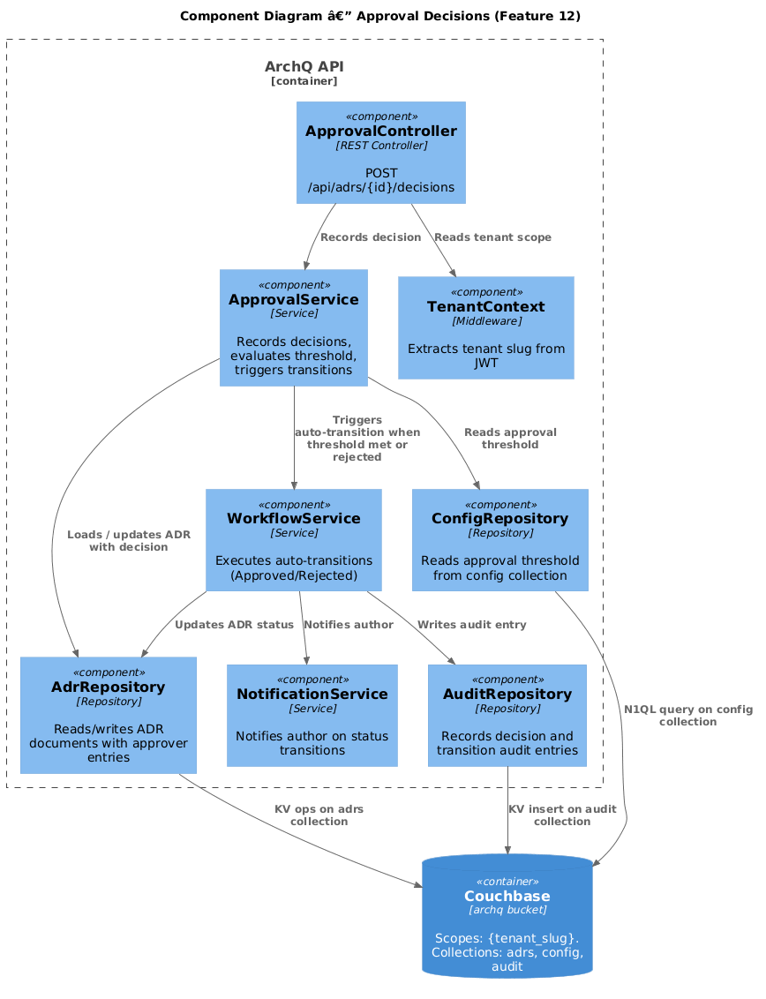
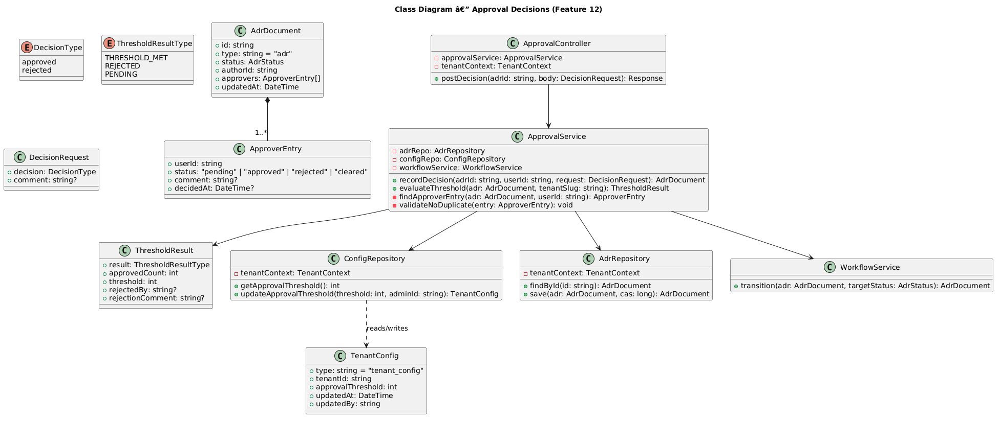
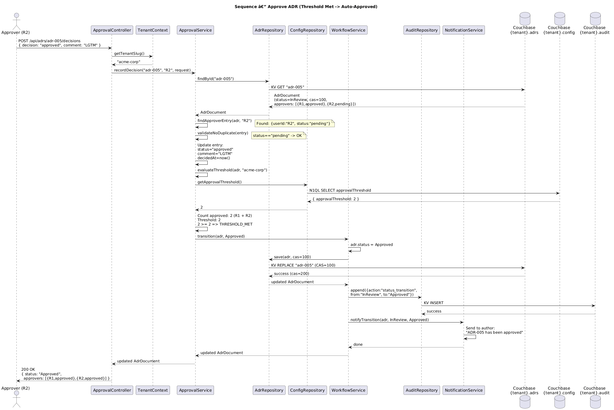
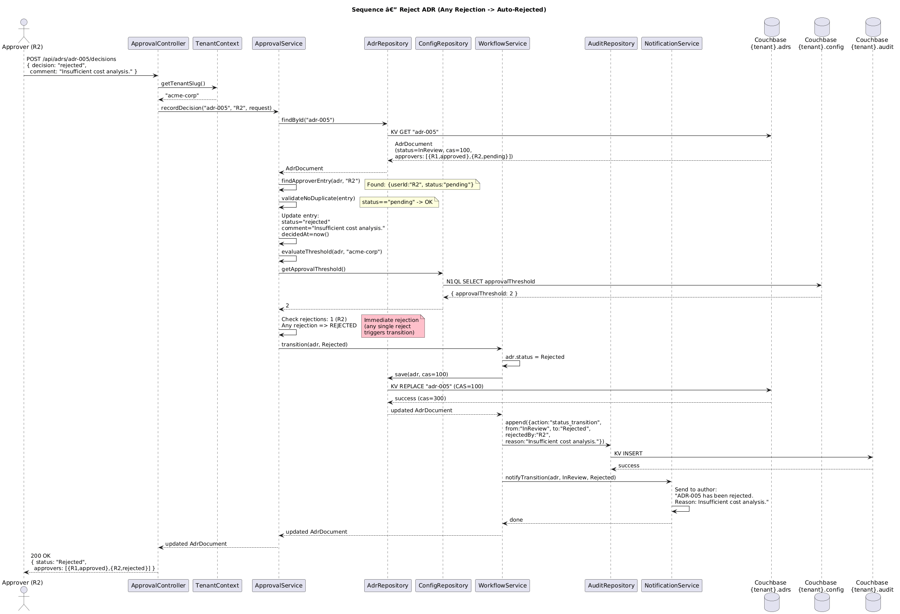

# Feature 12: Approval Decisions

**Traces to:** L2-013, L2-014

## 1. Overview

The Approval Decisions feature allows assigned approvers to record Approve or Reject decisions on ADRs in InReview status. Each decision includes the approver's identity, timestamp, and an optional comment. The system prevents duplicate decisions, enforces a configurable approval threshold per tenant, and automatically transitions the ADR to Approved when the threshold is met or to Rejected when any approver rejects.

## 2. Architecture

### 2.1 C4 Component Diagram



### 2.2 Key Components

| Component | Responsibility |
|-----------|---------------|
| `ApprovalController` | REST endpoint for recording approval decisions |
| `ApprovalService` | Records decisions, evaluates threshold, triggers auto-transitions |
| `ConfigRepository` | Reads tenant approval threshold from `config` collection |
| `WorkflowService` | Executes status transitions when threshold met or rejection occurs |
| `AdrRepository` | Reads/writes ADR documents with embedded approver decisions |
| `AuditRepository` | Records decision events in the audit trail |
| `NotificationService` | Notifies the author on Approved/Rejected transitions |
| `TenantContext` | Provides tenant scope from JWT |

## 3. Component Details

### 3.1 ApprovalService

Core service handling decision recording and threshold evaluation.

**Methods:**

| Method | Signature | Description |
|--------|-----------|-------------|
| `recordDecision` | `(adrId: string, userId: string, decision: DecisionRequest) -> AdrDocument` | Records an approve/reject decision |
| `evaluateThreshold` | `(adr: AdrDocument, tenantSlug: string) -> ThresholdResult` | Checks if approval threshold is met |

**Decision recording flow:**

1. Load ADR and verify status is InReview
2. Find the approver entry matching the authenticated user
3. Verify the approver has not already decided (prevent duplicates)
4. Update the approver entry with decision, comment, and timestamp
5. Persist the updated ADR
6. Evaluate whether the threshold triggers a transition

### 3.2 Threshold Evaluation

The `evaluateThreshold` method:

1. Loads `approvalThreshold` from the `config` collection (default: 1)
2. Counts entries with `status = "approved"`
3. Checks if any entry has `status = "rejected"`
4. Returns one of:
   - `THRESHOLD_MET` — approved count >= threshold, no rejections
   - `REJECTED` — at least one rejection exists
   - `PENDING` — neither condition met

### 3.3 Tenant Config Document (config collection)

```json
{
  "type": "tenant_config",
  "tenantId": "acme-corp",
  "approvalThreshold": 2,
  "updatedAt": "2026-04-01T00:00:00Z",
  "updatedBy": "admin-uuid"
}
```

## 4. Data Model

### 4.1 Class Diagram



### 4.2 Decision Request

```json
{
  "decision": "approved",
  "comment": "LGTM — well-structured analysis."
}
```

### 4.3 ApproverEntry (after decision)

```json
{
  "userId": "reviewer-uuid-1",
  "status": "approved",
  "comment": "LGTM — well-structured analysis.",
  "decidedAt": "2026-04-13T10:15:00Z"
}
```

### 4.4 ADR Document After All Approvals

```json
{
  "type": "adr",
  "id": "adr-005",
  "status": "Approved",
  "approvers": [
    { "userId": "R1", "status": "approved", "comment": "LGTM", "decidedAt": "2026-04-13T10:00:00Z" },
    { "userId": "R2", "status": "approved", "comment": "Solid analysis.", "decidedAt": "2026-04-13T10:15:00Z" }
  ],
  "updatedAt": "2026-04-13T10:15:00Z"
}
```

### 4.5 ADR Document After Rejection

```json
{
  "type": "adr",
  "id": "adr-005",
  "status": "Rejected",
  "approvers": [
    { "userId": "R1", "status": "approved", "comment": "LGTM", "decidedAt": "2026-04-13T10:00:00Z" },
    { "userId": "R2", "status": "rejected", "comment": "Insufficient cost analysis.", "decidedAt": "2026-04-13T11:00:00Z" }
  ],
  "updatedAt": "2026-04-13T11:00:00Z"
}
```

## 5. Key Workflows

### 5.1 Approve ADR



**Steps:**

1. Approver calls `POST /api/adrs/{id}/decisions` with `{ "decision": "approved", "comment": "LGTM" }`
2. `ApprovalController` extracts user ID from JWT and delegates to `ApprovalService`
3. `ApprovalService` loads the ADR, verifies status is InReview
4. Finds the matching approver entry, verifies status is `"pending"` (no duplicate decision)
5. Updates the entry: `status = "approved"`, `comment`, `decidedAt = now()`
6. Calls `evaluateThreshold()`:
   - Loads threshold from `ConfigRepository` (e.g., 2)
   - Counts approved entries (e.g., 2)
   - 2 >= 2: threshold met
7. Calls `WorkflowService.transition(adr, Approved)`
8. ADR status set to Approved, persisted via CAS
9. Audit entry written
10. Author notified via `NotificationService`

### 5.2 Reject ADR



**Steps:**

1. Approver calls `POST /api/adrs/{id}/decisions` with `{ "decision": "rejected", "comment": "Insufficient cost analysis." }`
2. `ApprovalService` loads the ADR, verifies InReview status
3. Finds the matching approver entry, verifies no prior decision
4. Updates the entry: `status = "rejected"`, `comment`, `decidedAt = now()`
5. Calls `evaluateThreshold()`: detects rejection
6. Calls `WorkflowService.transition(adr, Rejected)`
7. ADR status set to Rejected, persisted
8. Audit entry written with rejection reason
9. Author notified with rejection reason included

## 6. API Contracts

### 6.1 Record Decision

```
POST /api/adrs/{adrId}/decisions
Authorization: Bearer <jwt>
Content-Type: application/json

Request Body:
{
  "decision": "approved" | "rejected",
  "comment": "Optional comment text"
}

Response 200 (decision recorded, no transition):
{
  "id": "adr-005",
  "status": "InReview",
  "approvers": [
    { "userId": "R1", "status": "approved", "comment": "LGTM", "decidedAt": "..." },
    { "userId": "R2", "status": "pending", "comment": null, "decidedAt": null }
  ],
  "updatedAt": "2026-04-13T10:00:00Z"
}

Response 200 (threshold met, auto-approved):
{
  "id": "adr-005",
  "status": "Approved",
  "approvers": [
    { "userId": "R1", "status": "approved", "comment": "LGTM", "decidedAt": "..." },
    { "userId": "R2", "status": "approved", "comment": "Solid.", "decidedAt": "..." }
  ],
  "updatedAt": "2026-04-13T10:15:00Z"
}
```

### 6.2 Get Approval Threshold

```
GET /api/config/approval-threshold
Authorization: Bearer <jwt>
Roles: Admin

Response 200:
{
  "approvalThreshold": 2
}
```

### 6.3 Update Approval Threshold

```
PUT /api/config/approval-threshold
Authorization: Bearer <jwt>
Roles: Admin
Content-Type: application/json

Request Body:
{
  "approvalThreshold": 3
}

Response 200:
{
  "approvalThreshold": 3,
  "updatedAt": "2026-04-13T12:00:00Z",
  "updatedBy": "admin-uuid"
}
```

### 6.4 Error Codes

| HTTP Status | Error Code | Condition |
|------------|------------|-----------|
| 400 | `INVALID_DECISION` | Decision value not "approved" or "rejected" |
| 403 | `NOT_ASSIGNED_APPROVER` | Authenticated user is not an assigned approver |
| 404 | `ADR_NOT_FOUND` | ADR does not exist in tenant scope |
| 409 | `DUPLICATE_DECISION` | Approver has already recorded a decision |
| 409 | `CONFLICT` | Optimistic concurrency conflict |
| 422 | `INVALID_STATUS` | ADR is not in InReview status |

## 7. Couchbase Queries

### 7.1 Load Tenant Config

```sql
SELECT c.approvalThreshold
FROM `archq`.`{tenant_slug}`.`config` c
WHERE c.type = "tenant_config"
LIMIT 1
```

### 7.2 Update Approval Threshold

```sql
UPDATE `archq`.`{tenant_slug}`.`config` c
SET c.approvalThreshold = $threshold,
    c.updatedAt = $now,
    c.updatedBy = $adminId
WHERE c.type = "tenant_config"
```

## 8. UI Behavior

### 8.1 Desktop — ADR Detail Right Sidebar

**Approval Status Card:**

- Card title: "Approval Status" with Badge showing threshold (e.g., "2 required")
- List of approvers, each row showing:
  - Avatar component with user initials
  - Display name
  - Badge/Draft "Pending", Badge/Approved "Approved", or Badge/Rejected "Rejected"
  - Timestamp of decision (if decided)
  - Comment text (if provided), truncated with expand toggle
- Divider between approver rows
- If the authenticated user is an assigned pending approver:
  - Button/Primary "Approve" and Button/Danger "Reject" at the bottom of the card
  - Clicking either opens an inline textarea for an optional comment
  - Button/Primary "Confirm Approval" or Button/Danger "Confirm Rejection" to submit

### 8.2 Mobile — ADR Detail

- Accordion section "Approval Status" below the ADR content
- Same approver list as desktop, stacked vertically
- Full-width Button/Primary "Approve" and Button/Danger "Reject" as sticky footer when user is a pending approver
- Comment input appears as a bottom sheet modal

## 9. Security Considerations

| Concern | Mitigation |
|---------|-----------|
| Non-approver submitting decision | `ApprovalService` checks authenticated user is in `adr.approvers[]` |
| Duplicate decisions | Server checks `approverEntry.status === "pending"` before accepting |
| Threshold tampering | Threshold read server-side from `config` collection, never from client |
| Race conditions | CAS-based updates prevent concurrent decision conflicts |
| Tenant isolation | All queries scoped via `TenantContext`; config loaded per-tenant |

## 10. Open Questions

| # | Question | Status |
|---|----------|--------|
| 1 | Should approvers be allowed to change their decision before the ADR transitions? | Open |
| 2 | Should the approval threshold be configurable per-ADR or only per-tenant? | Open |
| 3 | Should the system support abstain/delegate as decision options? | Open |
| 4 | Should partial approval progress be visible to the author in real time? | Open |
