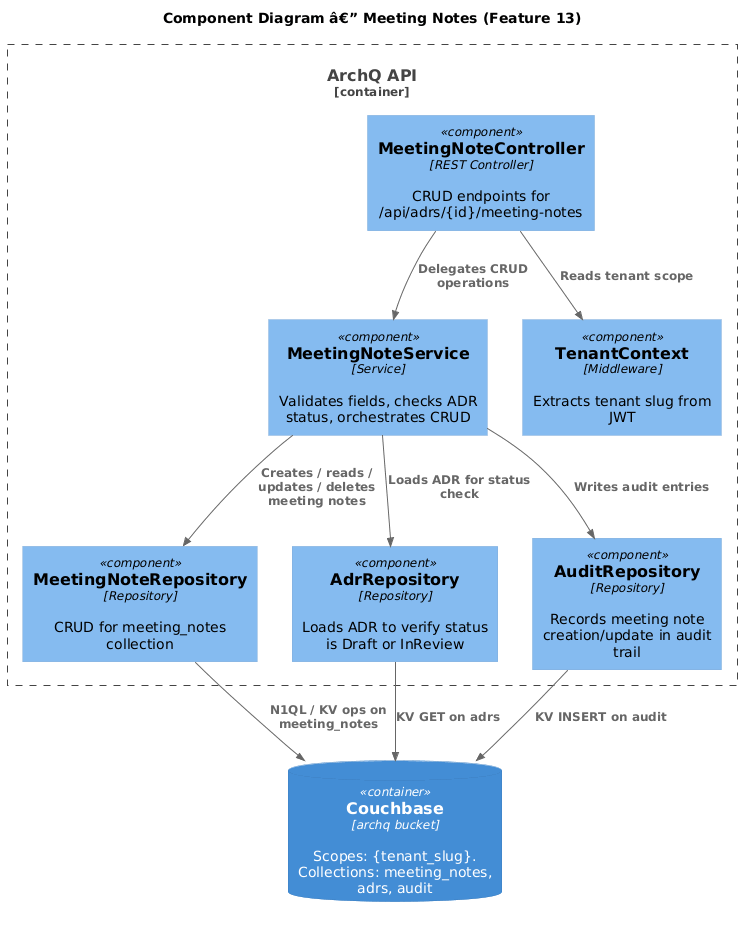
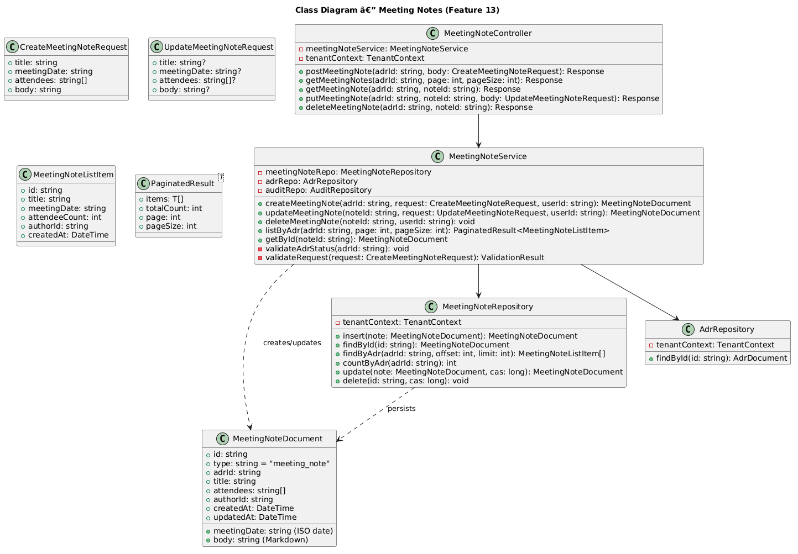
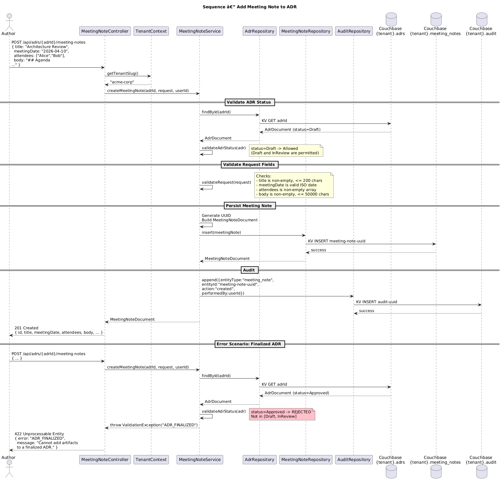

# Feature 13: Meeting Notes

**Traces to:** L2-015

## 1. Overview

The Meeting Notes feature allows users to attach structured meeting notes to ADRs that are in Draft or InReview status. Each meeting note captures a title, meeting date, list of attendees, and a Markdown body. Meeting notes are listed in reverse chronological order by meeting date. The system prevents adding meeting notes to finalized ADRs (Approved, Rejected, Superseded, Deprecated).

## 2. Architecture

### 2.1 C4 Component Diagram



### 2.2 Key Components

| Component | Responsibility |
|-----------|---------------|
| `MeetingNoteController` | REST endpoints for CRUD operations on meeting notes |
| `MeetingNoteService` | Business logic: validation, status checks, orchestration |
| `MeetingNoteRepository` | CRUD for meeting note documents in tenant-scoped `meeting_notes` collection |
| `AdrRepository` | Loads ADR to verify status before allowing note creation |
| `AuditRepository` | Records meeting note creation/update in audit trail |
| `TenantContext` | Provides tenant scope from JWT |

## 3. Component Details

### 3.1 MeetingNoteService

**Methods:**

| Method | Signature | Description |
|--------|-----------|-------------|
| `createMeetingNote` | `(adrId: string, request: CreateMeetingNoteRequest, userId: string) -> MeetingNoteDocument` | Creates a new meeting note |
| `updateMeetingNote` | `(noteId: string, request: UpdateMeetingNoteRequest, userId: string) -> MeetingNoteDocument` | Updates an existing meeting note |
| `deleteMeetingNote` | `(noteId: string, userId: string) -> void` | Deletes a meeting note |
| `listByAdr` | `(adrId: string, page: int, pageSize: int) -> PaginatedResult<MeetingNoteDocument>` | Lists meeting notes for an ADR |
| `getById` | `(noteId: string) -> MeetingNoteDocument` | Retrieves a single meeting note |

**Validation rules:**

| Rule | Error Code | Condition |
|------|-----------|-----------|
| ADR must be Draft or InReview | `ADR_FINALIZED` | ADR status is Approved, Rejected, Superseded, or Deprecated |
| Title required | `TITLE_REQUIRED` | Title is empty or missing |
| Title max length | `TITLE_TOO_LONG` | Title exceeds 200 characters |
| Meeting date required | `DATE_REQUIRED` | Meeting date is missing |
| Meeting date format | `DATE_INVALID` | Date is not valid ISO 8601 date |
| Attendees required | `ATTENDEES_REQUIRED` | Attendees array is empty |
| Body required | `BODY_REQUIRED` | Markdown body is empty |
| Body max length | `BODY_TOO_LONG` | Body exceeds 50,000 characters |

### 3.2 Finalized Status Check

Before creating or updating a meeting note, the service loads the parent ADR and checks:

```
ALLOWED_STATUSES = [Draft, InReview]
if adr.status not in ALLOWED_STATUSES:
    throw ValidationException("ADR_FINALIZED", 
        "Cannot add artifacts to a finalized ADR.")
```

## 4. Data Model

### 4.1 Class Diagram



### 4.2 Meeting Note Document (meeting_notes collection)

```json
{
  "type": "meeting_note",
  "id": "meeting-note-uuid",
  "adrId": "adr-uuid",
  "title": "Architecture Review - Sprint 42",
  "meetingDate": "2026-04-10",
  "attendees": ["Alice Chen", "Bob Martinez", "Carol Williams"],
  "body": "## Agenda\n\n1. Review proposed caching strategy\n2. Discuss trade-offs\n\n## Decisions\n\n- Agreed to use Redis for session cache\n- Deferred CDN decision to next sprint",
  "authorId": "user-uuid",
  "createdAt": "2026-04-10T16:00:00Z",
  "updatedAt": "2026-04-10T16:00:00Z"
}
```

### 4.3 Indexes

```sql
CREATE INDEX idx_meeting_notes_by_adr
ON `archq`.`{tenant_slug}`.`meeting_notes`(adrId, meetingDate DESC)
WHERE type = "meeting_note"
```

## 5. Key Workflows

### 5.1 Add Meeting Note



**Steps:**

1. User calls `POST /api/adrs/{adrId}/meeting-notes` with title, meetingDate, attendees, and body
2. `MeetingNoteController` extracts tenant and user from JWT, delegates to `MeetingNoteService`
3. `MeetingNoteService` loads the parent ADR from `AdrRepository`
4. Verifies ADR status is Draft or InReview
5. Validates request fields (title, date, attendees, body)
6. Generates a UUID for the meeting note document
7. Persists the document via `MeetingNoteRepository`
8. Writes an audit entry via `AuditRepository`
9. Returns the created meeting note with 201 Created

**Error scenario — finalized ADR:**

1. User attempts to add a meeting note to an ADR with status "Approved"
2. Service loads ADR, checks status
3. Returns 422 with error: "Cannot add artifacts to a finalized ADR."

## 6. API Contracts

### 6.1 Create Meeting Note

```
POST /api/adrs/{adrId}/meeting-notes
Authorization: Bearer <jwt>
Roles: Author, Admin
Content-Type: application/json

Request Body:
{
  "title": "Architecture Review - Sprint 42",
  "meetingDate": "2026-04-10",
  "attendees": ["Alice Chen", "Bob Martinez"],
  "body": "## Agenda\n\n1. Review caching strategy..."
}

Response 201:
{
  "id": "meeting-note-uuid",
  "adrId": "adr-uuid",
  "title": "Architecture Review - Sprint 42",
  "meetingDate": "2026-04-10",
  "attendees": ["Alice Chen", "Bob Martinez"],
  "body": "## Agenda\n\n1. Review caching strategy...",
  "authorId": "user-uuid",
  "createdAt": "2026-04-10T16:00:00Z",
  "updatedAt": "2026-04-10T16:00:00Z"
}

Response 422 (finalized ADR):
{
  "error": "ADR_FINALIZED",
  "message": "Cannot add artifacts to a finalized ADR."
}
```

### 6.2 List Meeting Notes

```
GET /api/adrs/{adrId}/meeting-notes?page=1&pageSize=20
Authorization: Bearer <jwt>

Response 200:
{
  "items": [
    {
      "id": "meeting-note-uuid-2",
      "title": "Follow-up Review",
      "meetingDate": "2026-04-12",
      "attendeeCount": 4,
      "authorId": "user-uuid",
      "createdAt": "2026-04-12T10:00:00Z"
    },
    {
      "id": "meeting-note-uuid-1",
      "title": "Architecture Review - Sprint 42",
      "meetingDate": "2026-04-10",
      "attendeeCount": 2,
      "authorId": "user-uuid",
      "createdAt": "2026-04-10T16:00:00Z"
    }
  ],
  "totalCount": 2,
  "page": 1,
  "pageSize": 20
}
```

### 6.3 Get Meeting Note

```
GET /api/adrs/{adrId}/meeting-notes/{noteId}
Authorization: Bearer <jwt>

Response 200:
{
  "id": "meeting-note-uuid",
  "adrId": "adr-uuid",
  "title": "Architecture Review - Sprint 42",
  "meetingDate": "2026-04-10",
  "attendees": ["Alice Chen", "Bob Martinez"],
  "body": "## Agenda\n...",
  "authorId": "user-uuid",
  "createdAt": "2026-04-10T16:00:00Z",
  "updatedAt": "2026-04-10T16:00:00Z"
}
```

### 6.4 Update Meeting Note

```
PUT /api/adrs/{adrId}/meeting-notes/{noteId}
Authorization: Bearer <jwt>
Roles: Author (own notes), Admin
Content-Type: application/json

Request Body:
{
  "title": "Architecture Review - Sprint 42 (Updated)",
  "meetingDate": "2026-04-10",
  "attendees": ["Alice Chen", "Bob Martinez", "Dave Kim"],
  "body": "## Updated Agenda\n..."
}

Response 200:
{
  "id": "meeting-note-uuid",
  "updatedAt": "2026-04-11T09:00:00Z",
  ...
}
```

### 6.5 Delete Meeting Note

```
DELETE /api/adrs/{adrId}/meeting-notes/{noteId}
Authorization: Bearer <jwt>
Roles: Author (own notes), Admin

Response 204: No Content
```

### 6.6 Error Codes

| HTTP Status | Error Code | Condition |
|------------|------------|-----------|
| 400 | `VALIDATION_FAILED` | Missing or invalid fields |
| 403 | `FORBIDDEN` | User lacks permission |
| 404 | `ADR_NOT_FOUND` | ADR does not exist in tenant |
| 404 | `NOTE_NOT_FOUND` | Meeting note does not exist |
| 422 | `ADR_FINALIZED` | ADR status does not allow artifacts |

## 7. Couchbase Queries

### 7.1 List Meeting Notes by ADR (reverse chronological)

```sql
SELECT META().id, mn.title, mn.meetingDate, 
       ARRAY_LENGTH(mn.attendees) AS attendeeCount,
       mn.authorId, mn.createdAt
FROM `archq`.`{tenant_slug}`.`meeting_notes` mn
WHERE mn.type = "meeting_note"
  AND mn.adrId = $adrId
ORDER BY mn.meetingDate DESC
LIMIT $pageSize OFFSET $offset
```

### 7.2 Count Meeting Notes for ADR

```sql
SELECT COUNT(*) AS totalCount
FROM `archq`.`{tenant_slug}`.`meeting_notes` mn
WHERE mn.type = "meeting_note"
  AND mn.adrId = $adrId
```

### 7.3 Get Meeting Note by ID

```sql
SELECT META().id, mn.*
FROM `archq`.`{tenant_slug}`.`meeting_notes` mn
WHERE META().id = $noteId
  AND mn.type = "meeting_note"
  AND mn.adrId = $adrId
```

## 8. UI Behavior

### 8.1 Desktop — ADR Detail Right Sidebar

**Artifacts Card:**

- Card section titled "Meeting Notes" with a count badge
- Each meeting note row shows:
  - Title (truncated to 1 line)
  - Meeting date (formatted: "Apr 10, 2026")
  - Attendee count (e.g., "3 attendees")
- Button/Ghost "Add Meeting Note" at bottom of section (hidden when ADR is finalized)
- Clicking a row navigates to the full meeting note view
- Divider separating Meeting Notes from other artifact sections (General Notes, Attachments)

### 8.2 Mobile — ADR Detail

- Accordion section "Meeting Notes (3)" in the artifacts area
- Same row layout, stacked vertically
- Button/Primary "Add Meeting Note" as a full-width button within the accordion (hidden when finalized)

### 8.3 Add/Edit Meeting Note Form

- Input/Default for Title
- Date picker for Meeting Date
- Tag-style input for Attendees (type name, press Enter to add)
- Markdown editor for Body with preview toggle
- Button/Primary "Save" and Button/Ghost "Cancel"

## 9. Security Considerations

| Concern | Mitigation |
|---------|-----------|
| Adding notes to foreign ADRs | Service verifies ADR exists in tenant scope before allowing creation |
| Editing others' notes | Service checks `note.authorId === userId` or user has Admin role |
| XSS in Markdown body | Markdown rendered client-side with sanitization (DOMPurify); raw Markdown stored |
| Tenant isolation | All queries scoped via `TenantContext`; `meeting_notes` collection per tenant scope |
| Large body payloads | 50,000 character limit enforced server-side |

## 10. Open Questions

| # | Question | Status |
|---|----------|--------|
| 1 | Should meeting notes be editable after the ADR transitions to InReview? | Open |
| 2 | Should attendees be linked to user accounts or remain free-text? | Open |
| 3 | Should meeting notes support file attachments (e.g., meeting recordings)? | Open |
