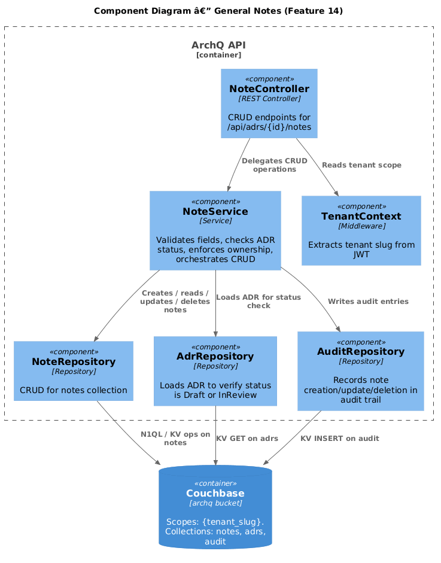
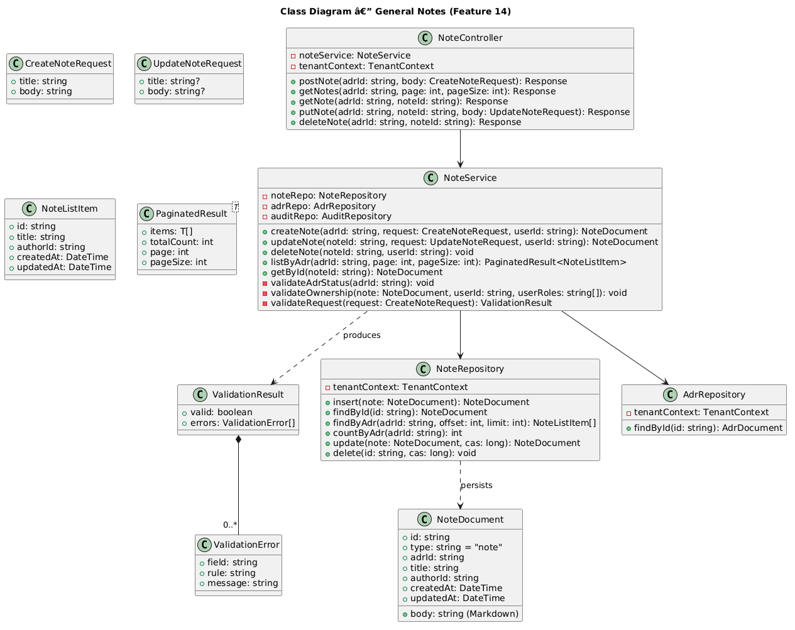
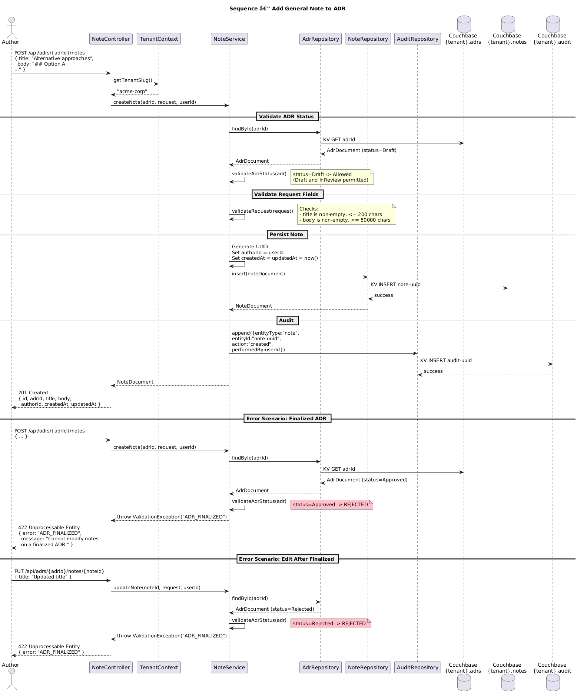

# Feature 14: General Notes

**Traces to:** L2-016

## 1. Overview

The General Notes feature allows users to attach free-form Markdown notes to ADRs in Draft or InReview status. Each note has a title and Markdown body, is authored via the integrated Markdown editor, and records the author's identity and timestamps. Notes are editable while the parent ADR remains in an editable status. Once the ADR is finalized (Approved, Rejected, Superseded, Deprecated), existing notes become read-only and no new notes can be added.

## 2. Architecture

### 2.1 C4 Component Diagram



### 2.2 Key Components

| Component | Responsibility |
|-----------|---------------|
| `NoteController` | REST endpoints for CRUD operations on general notes |
| `NoteService` | Business logic: validation, ADR status checks, orchestration |
| `NoteRepository` | CRUD for note documents in tenant-scoped `notes` collection |
| `AdrRepository` | Loads ADR to verify status before allowing note operations |
| `AuditRepository` | Records note creation/update/deletion in audit trail |
| `TenantContext` | Provides tenant scope from JWT |

## 3. Component Details

### 3.1 NoteService

**Methods:**

| Method | Signature | Description |
|--------|-----------|-------------|
| `createNote` | `(adrId: string, request: CreateNoteRequest, userId: string) -> NoteDocument` | Creates a new note |
| `updateNote` | `(noteId: string, request: UpdateNoteRequest, userId: string) -> NoteDocument` | Updates an existing note |
| `deleteNote` | `(noteId: string, userId: string) -> void` | Deletes a note |
| `listByAdr` | `(adrId: string, page: int, pageSize: int) -> PaginatedResult<NoteListItem>` | Lists notes for an ADR |
| `getById` | `(noteId: string) -> NoteDocument` | Retrieves a single note |

**Validation rules:**

| Rule | Error Code | Condition |
|------|-----------|-----------|
| ADR must be Draft or InReview | `ADR_FINALIZED` | ADR status is Approved, Rejected, Superseded, or Deprecated |
| Title required | `TITLE_REQUIRED` | Title is empty or missing |
| Title max length | `TITLE_TOO_LONG` | Title exceeds 200 characters |
| Body required | `BODY_REQUIRED` | Markdown body is empty |
| Body max length | `BODY_TOO_LONG` | Body exceeds 50,000 characters |

### 3.2 Editability Rules

Notes can be created and edited only when the parent ADR is in Draft or InReview status:

- **Create**: Allowed when `adr.status in [Draft, InReview]`
- **Update**: Allowed when `adr.status in [Draft, InReview]` AND (`note.authorId === userId` OR user has Admin role)
- **Delete**: Allowed when `adr.status in [Draft, InReview]` AND (`note.authorId === userId` OR user has Admin role)
- **Read**: Always allowed for any authenticated user in the tenant

When updating, the `updatedAt` timestamp is set to the current time, preserving the original `createdAt`.

## 4. Data Model

### 4.1 Class Diagram



### 4.2 Note Document (notes collection)

```json
{
  "type": "note",
  "id": "note-uuid",
  "adrId": "adr-uuid",
  "title": "Alternative approaches considered",
  "body": "## Option A: Event Sourcing\n\nPros:\n- Full audit trail\n- Temporal queries\n\nCons:\n- Complexity\n- Learning curve\n\n## Option B: CRUD with Audit Log\n\nPros:\n- Simpler implementation\n- Familiar patterns",
  "authorId": "user-uuid",
  "createdAt": "2026-04-10T14:00:00Z",
  "updatedAt": "2026-04-11T09:30:00Z"
}
```

### 4.3 Indexes

```sql
CREATE INDEX idx_notes_by_adr
ON `archq`.`{tenant_slug}`.`notes`(adrId, createdAt DESC)
WHERE type = "note"
```

## 5. Key Workflows

### 5.1 Add Note



**Steps:**

1. User calls `POST /api/adrs/{adrId}/notes` with title and Markdown body
2. `NoteController` extracts tenant and user from JWT, delegates to `NoteService`
3. `NoteService` loads the parent ADR from `AdrRepository`
4. Verifies ADR status is Draft or InReview
5. Validates request fields (title, body)
6. Generates a UUID for the note document
7. Sets `authorId`, `createdAt`, and `updatedAt` to current timestamp
8. Persists via `NoteRepository`
9. Writes an audit entry
10. Returns the created note with 201 Created

### 5.2 Update Note

**Steps:**

1. User calls `PUT /api/adrs/{adrId}/notes/{noteId}` with updated title and/or body
2. `NoteService` loads the parent ADR and verifies status is Draft or InReview
3. Loads the note, verifies `note.authorId === userId` or user is Admin
4. Applies updates, sets `updatedAt` to current timestamp
5. Persists via CAS-based update
6. Writes an audit entry
7. Returns the updated note

### 5.3 Error Scenarios

**Attempt to edit after ADR finalized:**
- User calls PUT on a note whose parent ADR is Approved
- Service returns 422 `ADR_FINALIZED`: "Cannot modify notes on a finalized ADR."

**Attempt to edit another user's note:**
- User calls PUT on a note authored by someone else (and user is not Admin)
- Service returns 403 `FORBIDDEN`: "You can only edit your own notes."

## 6. API Contracts

### 6.1 Create Note

```
POST /api/adrs/{adrId}/notes
Authorization: Bearer <jwt>
Roles: Author, Reviewer, Admin
Content-Type: application/json

Request Body:
{
  "title": "Alternative approaches considered",
  "body": "## Option A\n\n..."
}

Response 201:
{
  "id": "note-uuid",
  "adrId": "adr-uuid",
  "title": "Alternative approaches considered",
  "body": "## Option A\n\n...",
  "authorId": "user-uuid",
  "createdAt": "2026-04-10T14:00:00Z",
  "updatedAt": "2026-04-10T14:00:00Z"
}
```

### 6.2 List Notes

```
GET /api/adrs/{adrId}/notes?page=1&pageSize=20
Authorization: Bearer <jwt>

Response 200:
{
  "items": [
    {
      "id": "note-uuid-2",
      "title": "Performance benchmarks",
      "authorId": "user-uuid",
      "createdAt": "2026-04-11T09:00:00Z",
      "updatedAt": "2026-04-11T09:30:00Z"
    },
    {
      "id": "note-uuid-1",
      "title": "Alternative approaches considered",
      "authorId": "user-uuid",
      "createdAt": "2026-04-10T14:00:00Z",
      "updatedAt": "2026-04-10T14:00:00Z"
    }
  ],
  "totalCount": 2,
  "page": 1,
  "pageSize": 20
}
```

### 6.3 Get Note

```
GET /api/adrs/{adrId}/notes/{noteId}
Authorization: Bearer <jwt>

Response 200:
{
  "id": "note-uuid",
  "adrId": "adr-uuid",
  "title": "Alternative approaches considered",
  "body": "## Option A\n\n...",
  "authorId": "user-uuid",
  "createdAt": "2026-04-10T14:00:00Z",
  "updatedAt": "2026-04-10T14:00:00Z"
}
```

### 6.4 Update Note

```
PUT /api/adrs/{adrId}/notes/{noteId}
Authorization: Bearer <jwt>
Roles: Author (own notes), Admin
Content-Type: application/json

Request Body:
{
  "title": "Alternative approaches considered (revised)",
  "body": "## Updated analysis\n\n..."
}

Response 200:
{
  "id": "note-uuid",
  "adrId": "adr-uuid",
  "title": "Alternative approaches considered (revised)",
  "body": "## Updated analysis\n\n...",
  "authorId": "user-uuid",
  "createdAt": "2026-04-10T14:00:00Z",
  "updatedAt": "2026-04-11T09:30:00Z"
}
```

### 6.5 Delete Note

```
DELETE /api/adrs/{adrId}/notes/{noteId}
Authorization: Bearer <jwt>
Roles: Author (own notes), Admin

Response 204: No Content
```

### 6.6 Error Codes

| HTTP Status | Error Code | Condition |
|------------|------------|-----------|
| 400 | `VALIDATION_FAILED` | Missing or invalid fields |
| 403 | `FORBIDDEN` | User lacks permission to edit/delete this note |
| 404 | `ADR_NOT_FOUND` | ADR does not exist in tenant |
| 404 | `NOTE_NOT_FOUND` | Note does not exist |
| 409 | `CONFLICT` | Optimistic concurrency conflict |
| 422 | `ADR_FINALIZED` | ADR status does not allow note modifications |

## 7. Couchbase Queries

### 7.1 List Notes by ADR (reverse chronological)

```sql
SELECT META().id, n.title, n.authorId, n.createdAt, n.updatedAt
FROM `archq`.`{tenant_slug}`.`notes` n
WHERE n.type = "note"
  AND n.adrId = $adrId
ORDER BY n.createdAt DESC
LIMIT $pageSize OFFSET $offset
```

### 7.2 Count Notes for ADR

```sql
SELECT COUNT(*) AS totalCount
FROM `archq`.`{tenant_slug}`.`notes` n
WHERE n.type = "note"
  AND n.adrId = $adrId
```

### 7.3 Get Note by ID

```sql
SELECT META().id, n.*
FROM `archq`.`{tenant_slug}`.`notes` n
WHERE META().id = $noteId
  AND n.type = "note"
  AND n.adrId = $adrId
```

## 8. UI Behavior

### 8.1 Desktop — ADR Detail Right Sidebar

**Artifacts Card — Notes Section:**

- Section titled "Notes" with a count badge (e.g., "Notes (3)")
- Each note row displays:
  - Title (truncated to 1 line)
  - Author name and relative timestamp ("Alice, 2 days ago")
  - "Edited" indicator if `updatedAt !== createdAt`
- Button/Ghost "Add Note" at bottom of section (hidden when ADR is finalized)
- Clicking a note row opens the note detail view with rendered Markdown

### 8.2 Mobile — ADR Detail

- Accordion section "Notes (3)" in the artifacts area
- Same row layout, stacked vertically
- Button/Primary "Add Note" as full-width button within accordion (hidden when finalized)

### 8.3 Add/Edit Note Form

- Input/Default for Title (placeholder: "Note title")
- Markdown editor with live preview for Body
  - Split-pane on desktop (editor left, preview right)
  - Tabbed on mobile (Edit / Preview tabs)
- Button/Primary "Save Note" and Button/Ghost "Cancel"
- When editing, the existing title and body are pre-populated

### 8.4 Read-Only State

When the ADR is finalized:
- "Add Note" button is hidden
- Note rows do not show edit/delete actions
- Opening a note displays rendered Markdown without the editor
- A subtle banner: "This ADR is finalized. Notes are read-only."

## 9. Security Considerations

| Concern | Mitigation |
|---------|-----------|
| Editing other users' notes | Service checks `note.authorId === userId` or Admin role |
| Adding notes to foreign ADRs | Service verifies ADR exists in tenant scope |
| XSS in Markdown body | Markdown rendered client-side with DOMPurify sanitization |
| Tenant isolation | All queries scoped via `TenantContext`; `notes` collection per tenant scope |
| Large body payloads | 50,000 character limit enforced server-side; request body size limit at API gateway |
| Concurrent edits | CAS-based updates; 409 returned on conflict |

## 10. Open Questions

| # | Question | Status |
|---|----------|--------|
| 1 | Should notes support rich-text (WYSIWYG) editing in addition to raw Markdown? | Open |
| 2 | Should notes be versioned (track edit history) or just update in place? | Open |
| 3 | Should Reviewers be able to create notes, or only Authors and Admins? | Open |
| 4 | Should notes support @mentions to notify other users? | Open |
