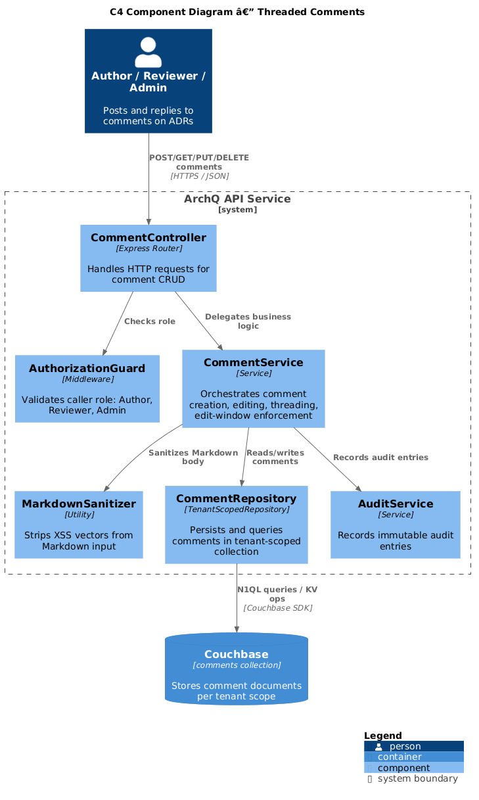
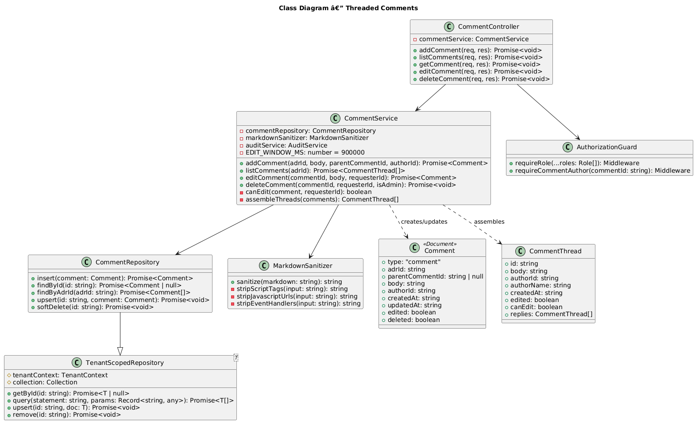
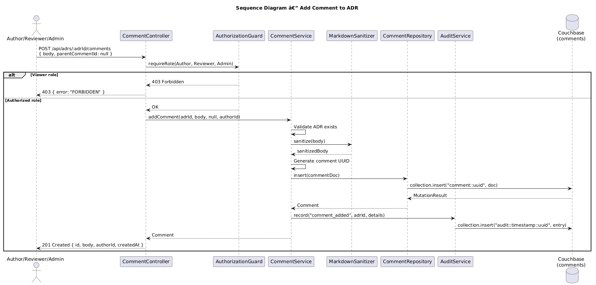
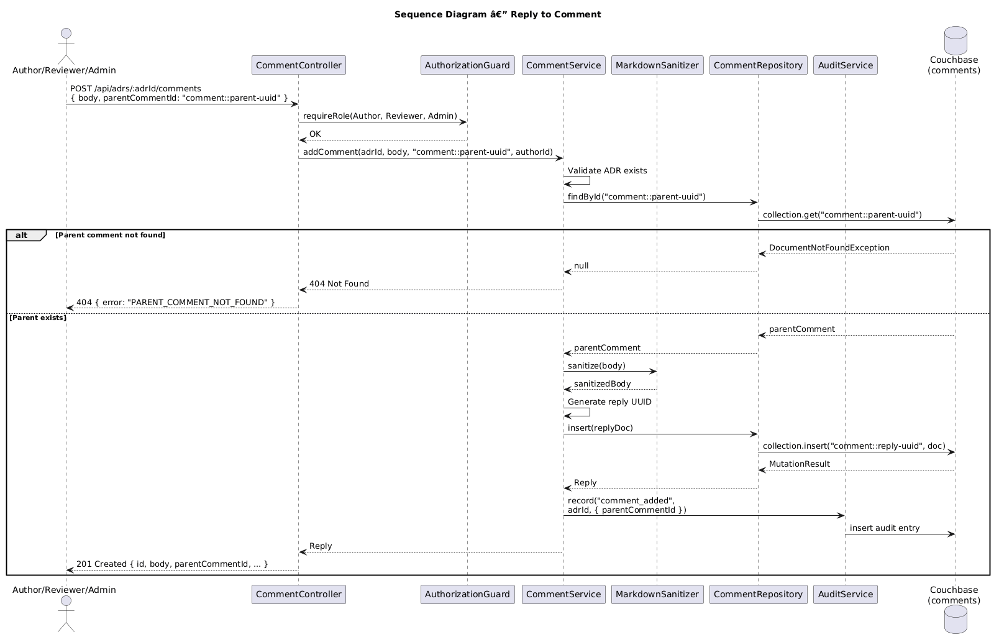

# Feature 15: Threaded Comments

**Traces to:** L2-017

---

## 1. Overview

Threaded comments enable collaborative discussion directly on ADR documents. Users with Author, Reviewer, or Admin roles can post comments on any ADR regardless of its workflow status. Comments support Markdown formatting, nested threading via parent-child relationships, and a time-limited edit window of 15 minutes to balance correction flexibility with discussion integrity.

### Goals

- Allow Author, Reviewer, and Admin roles to add comments to any ADR (Viewer receives 403).
- Support Markdown formatting in comment bodies.
- Enable threaded replies nested under a parent comment.
- Permit editing of own comments within 15 minutes of creation, with an "edited" indicator.
- Enforce the 15-minute edit window server-side.

---

## 2. Architecture

### 2.1 C4 Component Diagram



The comment subsystem comprises the following components within the ArchQ API:

| Component | Responsibility |
|-----------|----------------|
| `CommentController` | Handles HTTP requests for comment CRUD operations |
| `CommentService` | Orchestrates comment creation, editing, threading, and edit-window enforcement |
| `CommentRepository` | Persists and queries comments in the tenant-scoped `comments` collection |
| `MarkdownSanitizer` | Sanitizes Markdown input to prevent XSS while preserving formatting |
| `AuthorizationGuard` | Validates that the caller has Author, Reviewer, or Admin role |
| `AuditService` | Records audit entries for comment additions and edits |

---

## 3. Component Details

### 3.1 CommentController

```
POST   /api/adrs/:adrId/comments              — Add a new comment or reply
GET    /api/adrs/:adrId/comments               — List all comments (threaded)
GET    /api/adrs/:adrId/comments/:commentId    — Get a single comment
PUT    /api/adrs/:adrId/comments/:commentId    — Edit own comment (within 15 min)
DELETE /api/adrs/:adrId/comments/:commentId    — Delete own comment (Admin can delete any)
```

### 3.2 CommentService

Orchestrates comment workflows:

1. **Add comment:** Validate role (Author/Reviewer/Admin), sanitize Markdown body, persist with `parentCommentId` (null for top-level), write audit entry.
2. **Edit comment:** Verify ownership, check 15-minute window (`createdAt + 15 min > now`), update body, set `edited: true` and `updatedAt`, write audit entry.
3. **List comments:** Query all comments for the ADR, assemble into threaded tree structure sorted by `createdAt` ascending.
4. **Delete comment:** Verify ownership or Admin role, soft-delete by setting `deleted: true`.

### 3.3 CommentRepository

Extends `TenantScopedRepository<Comment>` targeting the `comments` collection.

Key queries:

```sql
-- List comments for an ADR (threaded assembly done in application layer)
SELECT META().id, c.*
FROM comments c
WHERE c.type = "comment" AND c.adrId = $adrId
  AND (c.deleted IS MISSING OR c.deleted = false)
ORDER BY c.createdAt ASC

-- Count comments for an ADR
SELECT COUNT(*) AS count
FROM comments c
WHERE c.type = "comment" AND c.adrId = $adrId
  AND (c.deleted IS MISSING OR c.deleted = false)
```

### 3.4 MarkdownSanitizer

Strips dangerous HTML constructs from Markdown before storage:

- Remove `<script>` tags and `javascript:` URLs.
- Allow safe Markdown-rendered HTML: `<strong>`, `<em>`, `<code>`, `<pre>`, `<ul>`, `<ol>`, `<li>`, `<blockquote>`, `<a href="https://...">`, ``.
- Applied on write (not just render) to ensure stored content is safe.

### 3.5 Edit Window Enforcement

The 15-minute edit window is enforced server-side in `CommentService.editComment()`:

```
const EDIT_WINDOW_MS = 15 * 60 * 1000; // 15 minutes

function canEdit(comment: Comment, requesterId: string): boolean {
  if (comment.authorId !== requesterId) return false;
  const elapsed = Date.now() - new Date(comment.createdAt).getTime();
  return elapsed <= EDIT_WINDOW_MS;
}
```

If the window has expired, the API returns `403 Forbidden` with error code `EDIT_WINDOW_EXPIRED`.

---

## 4. Data Model



### 4.1 Comment Document

Stored in the tenant-scoped `comments` collection. Document key: `comment::{id}`.

```json
{
  "type": "comment",
  "adrId": "adr-uuid",
  "parentCommentId": null,
  "body": "## Concern\nThis approach may not scale under load.\n\nSee [benchmarks](https://example.com).",
  "authorId": "user-uuid",
  "createdAt": "2026-04-15T14:30:00Z",
  "updatedAt": "2026-04-15T14:30:00Z",
  "edited": false,
  "deleted": false
}
```

### 4.2 Reply Document

Same structure with `parentCommentId` set:

```json
{
  "type": "comment",
  "adrId": "adr-uuid",
  "parentCommentId": "comment::parent-uuid",
  "body": "Good point. I'll add capacity projections.",
  "authorId": "user-uuid-2",
  "createdAt": "2026-04-15T14:35:00Z",
  "updatedAt": "2026-04-15T14:35:00Z",
  "edited": false,
  "deleted": false
}
```

### 4.3 Indexes

```sql
CREATE INDEX idx_comments_by_adr
ON comments(adrId, createdAt)
WHERE type = "comment";

CREATE INDEX idx_comments_by_parent
ON comments(parentCommentId, createdAt)
WHERE type = "comment";

CREATE INDEX idx_comments_by_author
ON comments(authorId, createdAt)
WHERE type = "comment";
```

### 4.4 Thread Assembly

Comments are returned as a flat list from Couchbase and assembled into a tree in the application layer:

1. Query all comments for the ADR.
2. Group by `parentCommentId`.
3. Build nested tree with `replies[]` array on each comment.
4. Sort each level by `createdAt` ascending.

---

## 5. Key Workflows

### 5.1 Add Comment



**Actor:** Author, Reviewer, or Admin

**Steps:**

1. Client sends `POST /api/adrs/:adrId/comments` with `{ body, parentCommentId? }`.
2. `CommentController` invokes `AuthorizationGuard` to verify role is Author, Reviewer, or Admin.
3. If Viewer role, return `403 Forbidden`.
4. `CommentService.addComment()` validates that the ADR exists.
5. `MarkdownSanitizer.sanitize()` cleans the comment body.
6. `CommentRepository.insert()` persists the comment document with generated UUID.
7. `AuditService.record()` writes an audit entry for `comment_added`.
8. Response: `201 Created` with the new comment.

### 5.2 Reply to Comment



**Actor:** Author, Reviewer, or Admin

**Steps:**

1. Client sends `POST /api/adrs/:adrId/comments` with `{ body, parentCommentId: "comment::parent-uuid" }`.
2. `CommentController` invokes `AuthorizationGuard`.
3. `CommentService.addComment()` validates the ADR exists and the parent comment exists.
4. If parent comment not found, return `404 Not Found`.
5. `MarkdownSanitizer.sanitize()` cleans the reply body.
6. `CommentRepository.insert()` persists the reply with `parentCommentId` set.
7. `AuditService.record()` writes an audit entry for `comment_added` with `parentCommentId` in details.
8. Response: `201 Created` with the new reply.

### 5.3 Edit Comment

**Actor:** Comment author (within 15-minute window)

**Steps:**

1. Client sends `PUT /api/adrs/:adrId/comments/:commentId` with `{ body }`.
2. `CommentService.editComment()` loads the existing comment.
3. Verify `comment.authorId === requesterId`. If not, return `403 Forbidden`.
4. Check edit window: `now - comment.createdAt <= 15 minutes`. If expired, return `403 EDIT_WINDOW_EXPIRED`.
5. Sanitize new body, update `body`, set `edited: true`, set `updatedAt`.
6. Persist via `CommentRepository.upsert()`.
7. Write audit entry for `comment_edited`.
8. Response: `200 OK` with updated comment.

---

## 6. API Contracts

### 6.1 Add Comment

```
POST /api/adrs/:adrId/comments
Authorization: Bearer <jwt>
Content-Type: application/json

Request:
{
  "body": "This approach may not scale under load.",
  "parentCommentId": null
}

Response 201:
{
  "id": "comment::550e8400-e29b-41d4-a716-446655440000",
  "adrId": "adr-uuid",
  "parentCommentId": null,
  "body": "This approach may not scale under load.",
  "authorId": "user-uuid",
  "authorName": "Jane Smith",
  "createdAt": "2026-04-15T14:30:00Z",
  "updatedAt": "2026-04-15T14:30:00Z",
  "edited": false
}

Response 403:
{
  "error": "FORBIDDEN",
  "message": "Viewers cannot add comments."
}
```

### 6.2 List Comments (Threaded)

```
GET /api/adrs/:adrId/comments
Authorization: Bearer <jwt>

Response 200:
{
  "adrId": "adr-uuid",
  "totalCount": 5,
  "comments": [
    {
      "id": "comment::uuid-1",
      "body": "Top-level comment in Markdown",
      "authorId": "user-uuid",
      "authorName": "Jane Smith",
      "createdAt": "2026-04-15T14:30:00Z",
      "edited": false,
      "canEdit": true,
      "replies": [
        {
          "id": "comment::uuid-2",
          "parentCommentId": "comment::uuid-1",
          "body": "Reply to top-level",
          "authorId": "user-uuid-2",
          "authorName": "Bob Jones",
          "createdAt": "2026-04-15T14:35:00Z",
          "edited": false,
          "canEdit": false,
          "replies": []
        }
      ]
    }
  ]
}
```

### 6.3 Edit Comment

```
PUT /api/adrs/:adrId/comments/:commentId
Authorization: Bearer <jwt>
Content-Type: application/json

Request:
{
  "body": "Updated comment text with **formatting**."
}

Response 200:
{
  "id": "comment::uuid-1",
  "body": "Updated comment text with **formatting**.",
  "edited": true,
  "updatedAt": "2026-04-15T14:32:00Z"
}

Response 403 (window expired):
{
  "error": "EDIT_WINDOW_EXPIRED",
  "message": "Comments can only be edited within 15 minutes of creation."
}
```

---

## 7. Security Considerations

| Concern | Mitigation |
|---------|------------|
| XSS via Markdown | `MarkdownSanitizer` strips `<script>`, `javascript:` URLs, and event handlers on write |
| Unauthorized commenting | `AuthorizationGuard` rejects Viewer role with 403 |
| Edit tampering | Server-side ownership check and 15-minute window enforcement |
| Cross-tenant comment access | `CommentRepository` extends `TenantScopedRepository`; queries scoped to tenant |
| Comment body injection into N1QL | All queries use parameterized N1QL (`$adrId`, `$commentId`) |
| Excessive comment body size | Request body limited to 1 MB; comment body validated to max 10,000 characters |

---

## 8. Open Questions

| # | Question | Status |
|---|----------|--------|
| 1 | Should comment deletion be soft-delete (show "deleted" placeholder) or hard-delete? | Decided: Soft-delete |
| 2 | Should Admins be able to edit any comment regardless of ownership/window? | Open |
| 3 | Should comments support @mentions with user notifications? | Open |
| 4 | Maximum nesting depth for reply threads? | Open |
| 5 | Should the `canEdit` field account for remaining edit time (return seconds left)? | Open |
