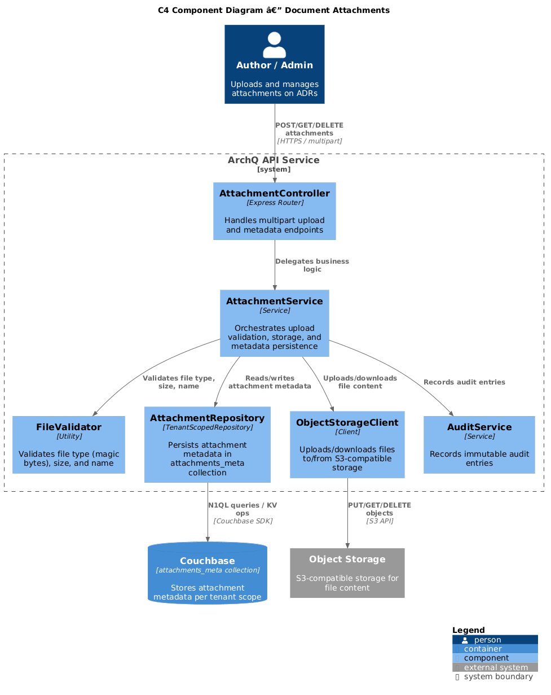
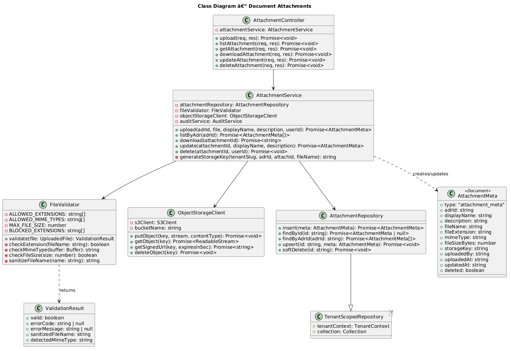
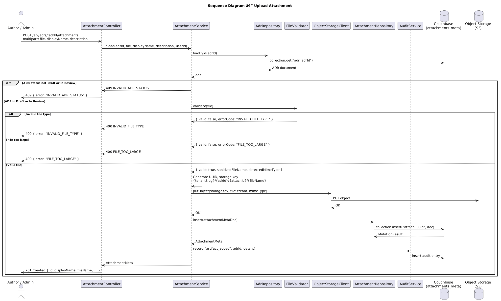

# Feature 16: Document Attachments

**Traces to:** L2-018

---

## 1. Overview

Document attachments allow users to upload architecture-related files (diagrams, PDFs, images) to ADR records. Uploads are restricted to ADRs in Draft or In Review status and limited to approved file types (PDF, PNG, JPG, SVG, DRAWIO) with a maximum size of 10 MB per file. Attachment metadata is stored in the tenant-scoped `attachments_meta` Couchbase collection while actual file content is persisted to S3-compatible object storage, ensuring efficient storage and retrieval at scale.

### Goals

- Allow file uploads on ADRs in Draft or In Review status only.
- Restrict to permitted file types: PDF, PNG, JPG, SVG, DRAWIO.
- Enforce 10 MB maximum file size per attachment.
- Support display name and optional description per attachment.
- Reject disallowed file types (.exe, .bat, .sh, etc.) with clear error messages.
- List attachments with name, file type icon, size, and upload date.
- Store file content in S3-compatible object storage with metadata in Couchbase.

---

## 2. Architecture

### 2.1 C4 Component Diagram



The attachment subsystem comprises the following components:

| Component | Responsibility |
|-----------|----------------|
| `AttachmentController` | Handles HTTP multipart upload and metadata endpoints |
| `AttachmentService` | Orchestrates upload validation, storage, and metadata persistence |
| `AttachmentRepository` | Persists and queries attachment metadata in tenant-scoped `attachments_meta` collection |
| `FileValidator` | Validates file type (by extension and MIME magic bytes), size, and name |
| `ObjectStorageClient` | Uploads/downloads file content to/from S3-compatible storage |
| `AuditService` | Records audit entries for attachment operations |

---

## 3. Component Details

### 3.1 AttachmentController

```
POST   /api/adrs/:adrId/attachments                  — Upload attachment (multipart)
GET    /api/adrs/:adrId/attachments                   — List attachments for an ADR
GET    /api/adrs/:adrId/attachments/:attachmentId     — Get attachment metadata
GET    /api/adrs/:adrId/attachments/:attachmentId/download — Download file content
PUT    /api/adrs/:adrId/attachments/:attachmentId     — Update display name / description
DELETE /api/adrs/:adrId/attachments/:attachmentId     — Remove attachment
```

### 3.2 AttachmentService

Orchestrates attachment workflows:

1. **Upload:** Validate ADR status (Draft or In Review), validate file type and size via `FileValidator`, generate storage key, upload to object storage, persist metadata to Couchbase, write audit entry.
2. **Download:** Look up metadata, generate pre-signed URL or stream from object storage.
3. **Delete:** Remove from object storage, mark metadata as deleted, write audit entry.

### 3.3 FileValidator

Validates uploads against security and business rules:

```
ALLOWED_EXTENSIONS = ['.pdf', '.png', '.jpg', '.jpeg', '.svg', '.drawio']
ALLOWED_MIME_TYPES = [
  'application/pdf',
  'image/png',
  'image/jpeg',
  'image/svg+xml',
  'application/xml'  // .drawio files
]
MAX_FILE_SIZE = 10 * 1024 * 1024  // 10 MB
BLOCKED_EXTENSIONS = ['.exe', '.bat', '.sh', '.cmd', '.com', '.msi', '.dll', '.scr']
```

Validation steps:
1. Check file extension against `ALLOWED_EXTENSIONS`.
2. Verify MIME type via magic bytes (not just `Content-Type` header).
3. Check file size does not exceed `MAX_FILE_SIZE`.
4. Sanitize display name (strip path traversal characters).

### 3.4 ObjectStorageClient

Manages file content in S3-compatible storage:

```
Storage key pattern: {tenantSlug}/{adrId}/{attachmentId}/{filename}

Operations:
- putObject(key, stream, contentType): Promise<void>
- getObject(key): Promise<ReadableStream>
- getSignedUrl(key, expiresIn): Promise<string>
- deleteObject(key): Promise<void>
```

### 3.5 AttachmentRepository

Extends `TenantScopedRepository<AttachmentMeta>` targeting the `attachments_meta` collection.

Key queries:

```sql
-- List attachments for an ADR
SELECT META().id, a.*
FROM attachments_meta a
WHERE a.type = "attachment_meta" AND a.adrId = $adrId
  AND (a.deleted IS MISSING OR a.deleted = false)
ORDER BY a.uploadedAt DESC

-- Count attachments for an ADR
SELECT COUNT(*) AS count
FROM attachments_meta a
WHERE a.type = "attachment_meta" AND a.adrId = $adrId
  AND (a.deleted IS MISSING OR a.deleted = false)
```

---

## 4. Data Model



### 4.1 Attachment Metadata Document

Stored in the tenant-scoped `attachments_meta` collection. Document key: `attach::{id}`.

```json
{
  "type": "attachment_meta",
  "adrId": "adr-uuid",
  "displayName": "System Architecture Diagram",
  "description": "C4 container diagram showing service boundaries",
  "fileName": "architecture-v2.pdf",
  "fileExtension": ".pdf",
  "mimeType": "application/pdf",
  "fileSizeBytes": 2458624,
  "storageKey": "acme-corp/adr-uuid/attach-uuid/architecture-v2.pdf",
  "uploadedBy": "user-uuid",
  "uploadedAt": "2026-04-15T10:30:00Z",
  "updatedAt": "2026-04-15T10:30:00Z",
  "deleted": false
}
```

### 4.2 Indexes

```sql
CREATE INDEX idx_attachments_by_adr
ON attachments_meta(adrId, uploadedAt)
WHERE type = "attachment_meta";
```

### 4.3 File Type Icon Mapping

| Extension | Icon | Label |
|-----------|------|-------|
| `.pdf` | PDF icon | PDF Document |
| `.png` | Image icon | PNG Image |
| `.jpg` / `.jpeg` | Image icon | JPEG Image |
| `.svg` | Vector icon | SVG Vector |
| `.drawio` | Diagram icon | Draw.io Diagram |

---

## 5. Key Workflows

### 5.1 Upload Attachment



**Actor:** Author or Admin (ADR must be in Draft or In Review)

**Steps:**

1. Client sends `POST /api/adrs/:adrId/attachments` with multipart form data: `file`, `displayName`, `description`.
2. `AttachmentController` extracts the file and metadata fields.
3. `AttachmentService.upload()` loads the ADR to check status.
4. If ADR status is not Draft or In Review, return `409 Conflict`.
5. `FileValidator.validate()` checks extension, MIME magic bytes, and size.
6. If validation fails, return `400 Bad Request` with specific error code.
7. Generate attachment UUID and storage key.
8. `ObjectStorageClient.putObject()` uploads the file content.
9. `AttachmentRepository.insert()` persists metadata document.
10. `AuditService.record()` writes `artifact_added` audit entry.
11. Response: `201 Created` with attachment metadata.

### 5.2 Download Attachment

**Actor:** Any authenticated user with access to the tenant

**Steps:**

1. Client sends `GET /api/adrs/:adrId/attachments/:attachmentId/download`.
2. `AttachmentService.download()` loads metadata from `AttachmentRepository`.
3. `ObjectStorageClient.getSignedUrl()` generates a time-limited pre-signed URL (5-minute expiry).
4. Response: `302 Redirect` to the pre-signed URL, or `200` with streamed content.

### 5.3 Delete Attachment

**Actor:** Author (uploader) or Admin

**Steps:**

1. Client sends `DELETE /api/adrs/:adrId/attachments/:attachmentId`.
2. Verify ADR is in Draft or In Review status.
3. `ObjectStorageClient.deleteObject()` removes file from storage.
4. `AttachmentRepository.softDelete()` marks metadata as deleted.
5. `AuditService.record()` writes `artifact_modified` audit entry with action "deleted".
6. Response: `204 No Content`.

---

## 6. API Contracts

### 6.1 Upload Attachment

```
POST /api/adrs/:adrId/attachments
Authorization: Bearer <jwt>
Content-Type: multipart/form-data

Form Fields:
  file: <binary>
  displayName: "System Architecture Diagram"
  description: "C4 container diagram showing service boundaries"

Response 201:
{
  "id": "attach::550e8400-e29b-41d4-a716-446655440000",
  "adrId": "adr-uuid",
  "displayName": "System Architecture Diagram",
  "description": "C4 container diagram showing service boundaries",
  "fileName": "architecture-v2.pdf",
  "fileExtension": ".pdf",
  "mimeType": "application/pdf",
  "fileSizeBytes": 2458624,
  "uploadedBy": "user-uuid",
  "uploadedAt": "2026-04-15T10:30:00Z"
}

Response 400 (invalid type):
{
  "error": "INVALID_FILE_TYPE",
  "message": "File type '.exe' is not permitted. Allowed types: PDF, PNG, JPG, SVG, DRAWIO."
}

Response 400 (too large):
{
  "error": "FILE_TOO_LARGE",
  "message": "File size 15.2 MB exceeds the 10 MB limit."
}

Response 409 (wrong ADR status):
{
  "error": "INVALID_ADR_STATUS",
  "message": "Attachments can only be added to ADRs in Draft or In Review status."
}
```

### 6.2 List Attachments

```
GET /api/adrs/:adrId/attachments
Authorization: Bearer <jwt>

Response 200:
{
  "adrId": "adr-uuid",
  "totalCount": 3,
  "attachments": [
    {
      "id": "attach::uuid-1",
      "displayName": "System Architecture Diagram",
      "fileName": "architecture-v2.pdf",
      "fileExtension": ".pdf",
      "mimeType": "application/pdf",
      "fileSizeBytes": 2458624,
      "uploadedBy": "user-uuid",
      "uploaderName": "Jane Smith",
      "uploadedAt": "2026-04-15T10:30:00Z"
    }
  ]
}
```

### 6.3 Download Attachment

```
GET /api/adrs/:adrId/attachments/:attachmentId/download
Authorization: Bearer <jwt>

Response 302:
Location: https://s3.example.com/archq/acme-corp/adr-uuid/attach-uuid/architecture-v2.pdf?X-Amz-Signature=...
```

---

## 7. Security Considerations

| Concern | Mitigation |
|---------|------------|
| Malicious file upload | Validate MIME via magic bytes, not just extension or Content-Type header |
| Path traversal in file name | Sanitize file names; storage key uses UUIDs, not user-supplied paths |
| Cross-tenant file access | Storage key includes tenant slug; pre-signed URLs are scoped |
| Oversized uploads | 10 MB enforced at middleware level (multer/busboy limit) before full upload |
| Executable uploads | Explicit blocklist of dangerous extensions; allowlist-only approach |
| Object storage key enumeration | Keys include UUIDs; pre-signed URLs expire in 5 minutes |
| Storage exhaustion | Per-tenant and per-ADR attachment count limits (configurable) |

---

## 8. Open Questions

| # | Question | Status |
|---|----------|--------|
| 1 | Should we support inline image preview for PNG/JPG attachments in the ADR body? | Open |
| 2 | Maximum number of attachments per ADR? | Open (suggest 20) |
| 3 | Should attachment deletion be allowed after ADR leaves Draft/In Review? | Open |
| 4 | Virus/malware scanning for uploaded files? | Open |
| 5 | Should we support versioning of attachments (replace with new version)? | Open |
