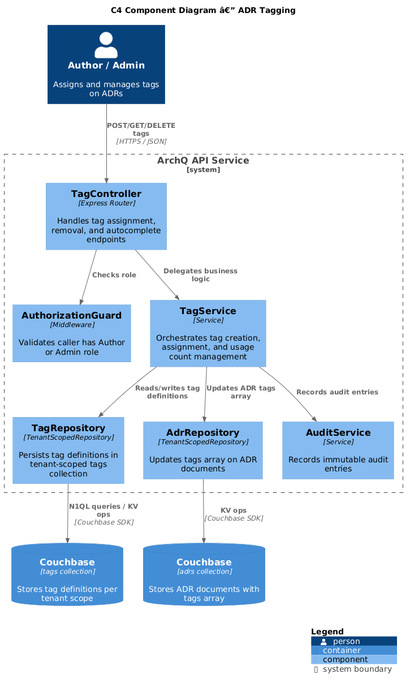
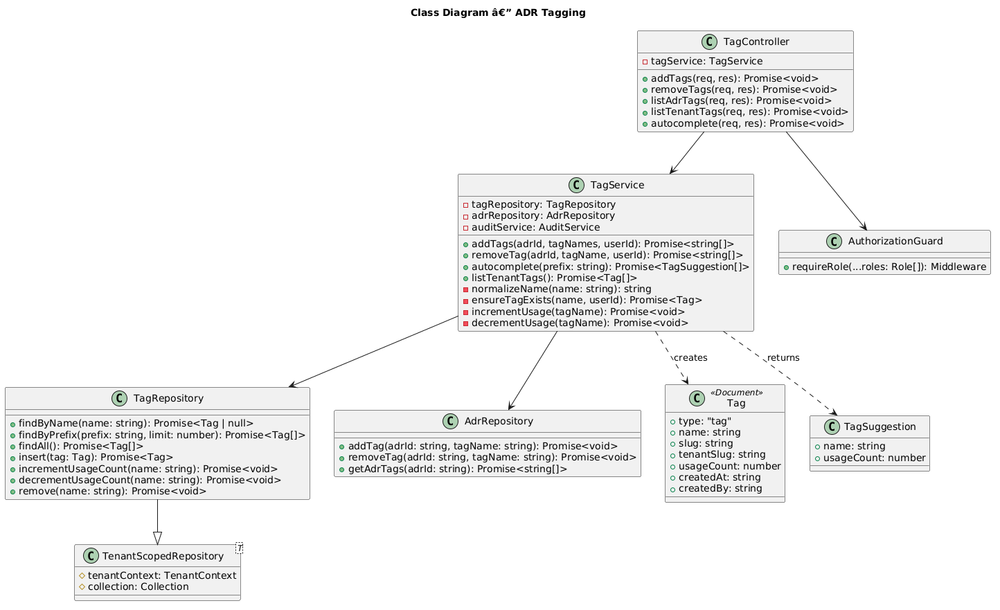
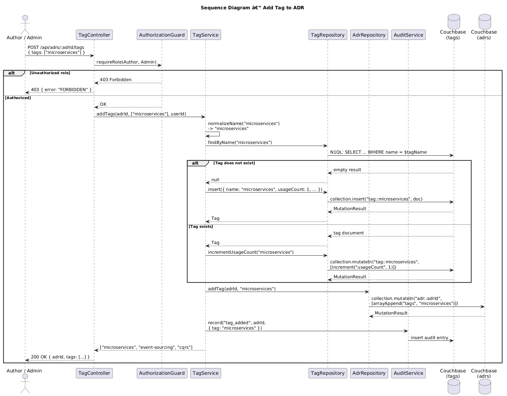

# Feature 17: ADR Tagging

**Traces to:** L2-021

---

## 1. Overview

ADR tagging enables categorization and discovery of architecture decision records through tenant-scoped, reusable tags. Authors and Admins can assign tags to ADRs with autocomplete suggestions drawn from the tenant's existing tag pool. New tags are created automatically on first use, and cross-tenant isolation ensures that tags from one organization are never visible to another.

### Goals

- Allow Authors and Admins to assign tags to ADRs.
- Scope tags to the tenant -- tags from tenant A are invisible to tenant B.
- Provide autocomplete suggestions from existing tags as the user types.
- Create new tags automatically on first use within the tenant's tag pool.
- Track tag usage counts for sorting and relevance in autocomplete.
- Support tag removal from ADRs with automatic usage count decrement.

---

## 2. Architecture

### 2.1 C4 Component Diagram



The tagging subsystem comprises the following components:

| Component | Responsibility |
|-----------|----------------|
| `TagController` | Handles HTTP requests for tag assignment, removal, and autocomplete |
| `TagService` | Orchestrates tag creation, assignment, usage count management |
| `TagRepository` | Persists and queries tag definitions in the tenant-scoped `tags` collection |
| `AdrRepository` | Updates the `tags` array on ADR documents |
| `AuthorizationGuard` | Validates that the caller has Author or Admin role |
| `AuditService` | Records audit entries for tag operations |

---

## 3. Component Details

### 3.1 TagController

```
GET    /api/tags                        — List all tags for the tenant
GET    /api/tags/autocomplete?q=<query> — Autocomplete tag suggestions
POST   /api/adrs/:adrId/tags            — Add tag(s) to an ADR
DELETE /api/adrs/:adrId/tags/:tagName   — Remove a tag from an ADR
GET    /api/adrs/:adrId/tags            — List tags on an ADR
```

### 3.2 TagService

Orchestrates tagging workflows:

1. **Add tag to ADR:** Normalize tag name (lowercase, trim), check if tag exists in `tags` collection. If not, create it with `usageCount: 1`. If it exists, increment `usageCount`. Append tag name to ADR's `tags` array. Write audit entry.
2. **Remove tag from ADR:** Remove tag name from ADR's `tags` array. Decrement `usageCount` in `tags` collection. If `usageCount` reaches 0, optionally remove the tag definition. Write audit entry.
3. **Autocomplete:** Query `tags` collection with prefix match, return sorted by `usageCount` descending (most popular first), limited to 10 results.

### 3.3 TagRepository

Extends `TenantScopedRepository<Tag>` targeting the `tags` collection.

Key queries:

```sql
-- Autocomplete: prefix search on tag name
SELECT META().id, t.*
FROM tags t
WHERE t.type = "tag" AND LOWER(t.name) LIKE $prefix || "%"
ORDER BY t.usageCount DESC
LIMIT 10

-- List all tags for tenant
SELECT META().id, t.*
FROM tags t
WHERE t.type = "tag"
ORDER BY t.usageCount DESC

-- Get tag by name
SELECT META().id, t.*
FROM tags t
WHERE t.type = "tag" AND t.name = $tagName
```

### 3.4 Tag Name Normalization

- Convert to lowercase.
- Trim leading/trailing whitespace.
- Replace spaces with hyphens.
- Remove characters not matching `[a-z0-9-]`.
- Maximum length: 50 characters.
- Minimum length: 2 characters.

---

## 4. Data Model



### 4.1 Tag Document

Stored in the tenant-scoped `tags` collection. Document key: `tag::{slug}`.

```json
{
  "type": "tag",
  "name": "microservices",
  "slug": "microservices",
  "tenantSlug": "acme-corp",
  "usageCount": 7,
  "createdAt": "2026-04-10T09:00:00Z",
  "createdBy": "user-uuid"
}
```

### 4.2 ADR Document Tags Array

The ADR document includes a `tags` array field:

```json
{
  "type": "adr",
  "id": "adr-uuid",
  "title": "Use Event Sourcing for Audit Trail",
  "tags": ["microservices", "event-sourcing", "cqrs"],
  "...": "..."
}
```

### 4.3 Indexes

```sql
-- Tag autocomplete index
CREATE INDEX idx_tags_by_name
ON tags(name, usageCount)
WHERE type = "tag";

-- ADR tags index for filtering ADRs by tag
CREATE INDEX idx_adrs_by_tag
ON adrs(DISTINCT ARRAY t FOR t IN tags END)
WHERE type = "adr";
```

### 4.4 Cross-Tenant Isolation

Tags are stored in the tenant-scoped `tags` collection (e.g., `archq.acme-corp.tags`). Because `TagRepository` extends `TenantScopedRepository`, all queries automatically target the correct tenant scope. There is no global tags collection; each tenant has its own independent tag namespace.

---

## 5. Key Workflows

### 5.1 Add Tag to ADR



**Actor:** Author or Admin

**Steps:**

1. Client sends `POST /api/adrs/:adrId/tags` with `{ tags: ["microservices"] }`.
2. `TagController` invokes `AuthorizationGuard` to verify Author or Admin role.
3. `TagService.addTags()` normalizes each tag name.
4. For each tag, check if it exists in `TagRepository`.
5. If tag does not exist, create a new tag document with `usageCount: 1`.
6. If tag exists, increment `usageCount` via atomic counter operation.
7. Append tag name to ADR's `tags` array (skip if already present).
8. `AdrRepository.upsert()` persists the updated ADR.
9. `AuditService.record()` writes audit entry for each tag addition.
10. Response: `200 OK` with updated tags array.

### 5.2 Tag Autocomplete

**Actor:** Any authenticated user

**Steps:**

1. Client sends `GET /api/tags/autocomplete?q=micro`.
2. `TagService.autocomplete("micro")` queries `TagRepository` with prefix `micro%`.
3. Results returned sorted by `usageCount` descending, limited to 10.
4. Response: `200 OK` with tag suggestions.

### 5.3 Remove Tag from ADR

**Actor:** Author or Admin

**Steps:**

1. Client sends `DELETE /api/adrs/:adrId/tags/microservices`.
2. Remove `"microservices"` from ADR's `tags` array.
3. Decrement `usageCount` on the tag document.
4. Persist updated ADR and tag.
5. Write audit entry.
6. Response: `200 OK` with updated tags array.

---

## 6. API Contracts

### 6.1 Add Tags

```
POST /api/adrs/:adrId/tags
Authorization: Bearer <jwt>
Content-Type: application/json

Request:
{
  "tags": ["microservices", "event-sourcing"]
}

Response 200:
{
  "adrId": "adr-uuid",
  "tags": ["microservices", "event-sourcing", "cqrs"]
}

Response 403:
{
  "error": "FORBIDDEN",
  "message": "Only Authors and Admins can assign tags."
}
```

### 6.2 Autocomplete

```
GET /api/tags/autocomplete?q=micro
Authorization: Bearer <jwt>

Response 200:
{
  "query": "micro",
  "suggestions": [
    { "name": "microservices", "usageCount": 7 },
    { "name": "micro-frontend", "usageCount": 3 }
  ]
}
```

### 6.3 Remove Tag

```
DELETE /api/adrs/:adrId/tags/microservices
Authorization: Bearer <jwt>

Response 200:
{
  "adrId": "adr-uuid",
  "tags": ["event-sourcing", "cqrs"]
}
```

### 6.4 List Tenant Tags

```
GET /api/tags
Authorization: Bearer <jwt>

Response 200:
{
  "tags": [
    { "name": "microservices", "slug": "microservices", "usageCount": 7 },
    { "name": "event-sourcing", "slug": "event-sourcing", "usageCount": 5 },
    { "name": "cqrs", "slug": "cqrs", "usageCount": 3 }
  ]
}
```

---

## 7. Security Considerations

| Concern | Mitigation |
|---------|------------|
| Cross-tenant tag leakage | Tags stored in tenant-scoped collection; `TenantScopedRepository` enforces isolation |
| Tag name injection | Names normalized and validated against `[a-z0-9-]` pattern |
| N1QL injection via autocomplete query | Parameterized queries (`$prefix`) used for all tag lookups |
| Unauthorized tag assignment | `AuthorizationGuard` restricts to Author and Admin roles |
| Tag enumeration across tenants | No global tag endpoint; autocomplete scoped to active tenant |
| Excessive tag creation | Optional per-tenant tag limit (configurable in `config` collection) |

---

## 8. Open Questions

| # | Question | Status |
|---|----------|--------|
| 1 | Should tags support a color or category for visual grouping? | Open |
| 2 | Maximum number of tags per ADR? | Open (suggest 10) |
| 3 | Should Reviewers be able to add tags, or only Authors and Admins? | Open |
| 4 | Should orphaned tags (usageCount = 0) be auto-deleted or retained? | Open |
| 5 | Should we support tag merge/rename operations for Admins? | Open |
