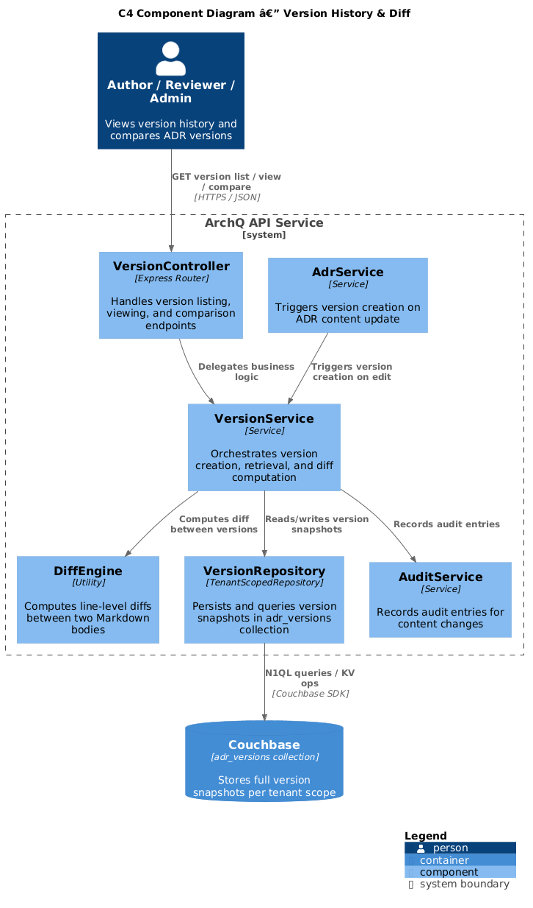
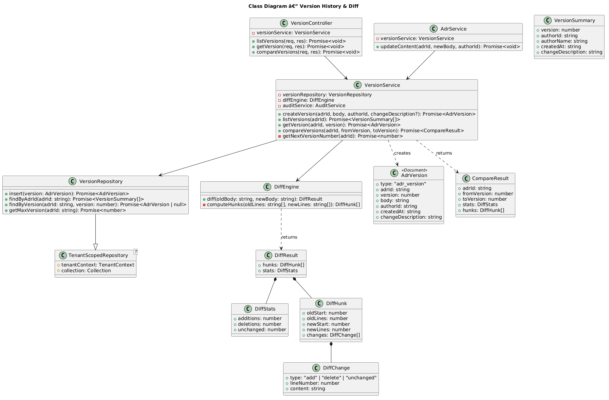
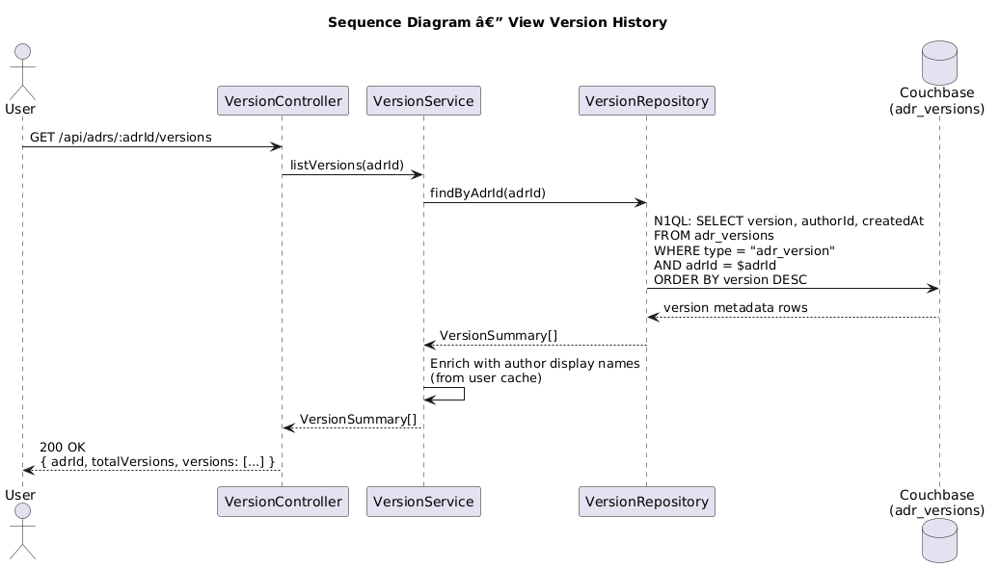
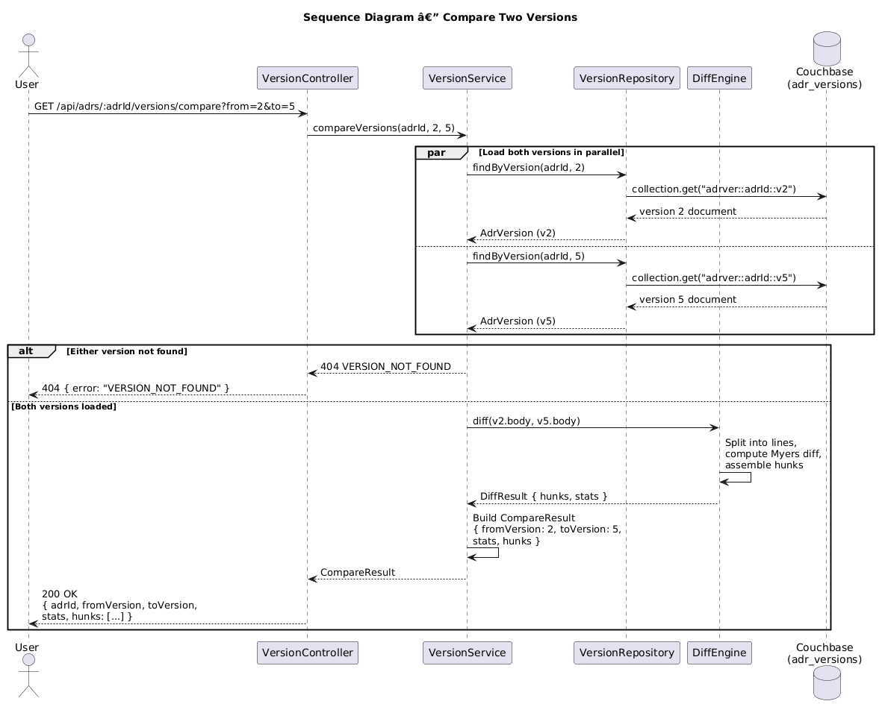

# Feature 18: Version History & Diff

**Traces to:** L2-023

---

## 1. Overview

Version history maintains a complete, immutable record of every edit made to an ADR's Markdown content. Each edit creates a new version snapshot in the `adr_versions` collection, enabling users to browse the full revision timeline, view any previous version's exact content, and compare any two versions side by side with additions highlighted in green and deletions in red.

### Goals

- Create a new version snapshot in `adr_versions` on every ADR content edit.
- Display a chronological list of all versions with version number, author, and timestamp.
- Allow viewing any previous version's exact Markdown content.
- Support side-by-side diff comparison of any two selected versions.
- Render additions in green and deletions in red in the diff view.

---

## 2. Architecture

### 2.1 C4 Component Diagram



The version history subsystem comprises the following components:

| Component | Responsibility |
|-----------|----------------|
| `VersionController` | Handles HTTP requests for version listing, viewing, and comparison |
| `VersionService` | Orchestrates version creation on ADR edit, retrieval, and diff computation |
| `VersionRepository` | Persists and queries version snapshots in tenant-scoped `adr_versions` collection |
| `DiffEngine` | Computes line-level diffs between two version bodies |
| `AdrService` | Triggers version creation when ADR content is saved |
| `AuditService` | Records audit entries for content changes |

---

## 3. Component Details

### 3.1 VersionController

```
GET  /api/adrs/:adrId/versions                              — List all versions
GET  /api/adrs/:adrId/versions/:version                     — View a specific version
GET  /api/adrs/:adrId/versions/compare?from=:v1&to=:v2      — Compare two versions
```

### 3.2 VersionService

Orchestrates version workflows:

1. **Create version:** Called by `AdrService` when ADR body is updated. Determines next version number, snapshots the full Markdown content, persists to `adr_versions`.
2. **List versions:** Query all versions for an ADR, return metadata (version number, author, timestamp) without body content.
3. **View version:** Retrieve a specific version's full body content.
4. **Compare versions:** Load two version bodies, run `DiffEngine.diff()`, return structured diff result.

### 3.3 VersionRepository

Extends `TenantScopedRepository<AdrVersion>` targeting the `adr_versions` collection.

Key queries:

```sql
-- List versions for an ADR (metadata only, no body for performance)
SELECT META().id, v.version, v.authorId, v.createdAt
FROM adr_versions v
WHERE v.type = "adr_version" AND v.adrId = $adrId
ORDER BY v.version DESC

-- Get specific version with body
SELECT META().id, v.*
FROM adr_versions v
WHERE v.type = "adr_version" AND v.adrId = $adrId AND v.version = $version

-- Get latest version number
SELECT MAX(v.version) AS latestVersion
FROM adr_versions v
WHERE v.type = "adr_version" AND v.adrId = $adrId
```

### 3.4 DiffEngine

Computes a line-level diff between two Markdown strings using a standard diff algorithm (Myers or similar):

```
class DiffEngine {
  diff(oldBody: string, newBody: string): DiffResult

  DiffResult {
    hunks: DiffHunk[]
    stats: { additions: number, deletions: number, unchanged: number }
  }

  DiffHunk {
    oldStart: number
    oldLines: number
    newStart: number
    newLines: number
    changes: DiffChange[]
  }

  DiffChange {
    type: "add" | "delete" | "unchanged"
    lineNumber: number
    content: string
  }
}
```

The frontend renders `add` lines with a green background and `delete` lines with a red background in the side-by-side view.

### 3.5 Version Creation Integration

`AdrService.updateContent()` triggers version creation:

```
async updateContent(adrId, newBody, authorId):
  1. Load current ADR
  2. Compare old body with new body (skip if identical)
  3. Call VersionService.createVersion(adrId, newBody, authorId)
  4. Update ADR document body
  5. Record audit entry "content_updated"
```

---

## 4. Data Model



### 4.1 ADR Version Document

Stored in the tenant-scoped `adr_versions` collection. Document key: `adrver::{adrId}::v{version}`.

```json
{
  "type": "adr_version",
  "adrId": "adr-uuid",
  "version": 3,
  "body": "# ADR-042: Use Event Sourcing\n\n## Status\nIn Review\n\n## Context\n...",
  "authorId": "user-uuid",
  "createdAt": "2026-04-15T14:00:00Z",
  "changeDescription": "Updated context section with performance benchmarks"
}
```

### 4.2 Indexes

```sql
-- Version listing index
CREATE INDEX idx_versions_by_adr
ON adr_versions(adrId, version DESC)
WHERE type = "adr_version";

-- Author lookup
CREATE INDEX idx_versions_by_author
ON adr_versions(authorId, createdAt DESC)
WHERE type = "adr_version";
```

### 4.3 Version Numbering

- Versions are sequential integers starting at 1.
- Version 1 is created when the ADR is first created.
- Each subsequent edit increments the version number by 1.
- Version numbers are never reused or decremented.
- The next version number is determined by `MAX(version) + 1` for the given ADR.

---

## 5. Key Workflows

### 5.1 View Version History



**Actor:** Any authenticated user with tenant access

**Steps:**

1. Client sends `GET /api/adrs/:adrId/versions`.
2. `VersionController` delegates to `VersionService.listVersions(adrId)`.
3. `VersionRepository` queries `adr_versions` for the ADR, returning metadata only (no body content for performance).
4. Service enriches each version with author display name from user cache.
5. Response: `200 OK` with list of versions sorted by version number descending.

### 5.2 Compare Two Versions



**Actor:** Any authenticated user with tenant access

**Steps:**

1. Client sends `GET /api/adrs/:adrId/versions/compare?from=2&to=5`.
2. `VersionController` delegates to `VersionService.compareVersions(adrId, 2, 5)`.
3. `VersionRepository` loads version 2 body and version 5 body in parallel.
4. If either version is not found, return `404 Not Found`.
5. `DiffEngine.diff(v2Body, v5Body)` computes the line-level diff.
6. Response: `200 OK` with diff hunks and statistics.

### 5.3 Version Creation on Edit

**Actor:** Author or Admin (triggered by ADR content save)

**Steps:**

1. `AdrService.updateContent()` is called with new body.
2. Service compares old body with new body; if identical, no version is created.
3. `VersionService.createVersion()` determines next version number.
4. Full Markdown content is snapshotted into a new `adr_version` document.
5. `AuditService.record()` writes `content_updated` with version number in details.
6. ADR document is updated with new body.

---

## 6. API Contracts

### 6.1 List Versions

```
GET /api/adrs/:adrId/versions
Authorization: Bearer <jwt>

Response 200:
{
  "adrId": "adr-uuid",
  "totalVersions": 5,
  "versions": [
    {
      "version": 5,
      "authorId": "user-uuid",
      "authorName": "Jane Smith",
      "createdAt": "2026-04-15T14:00:00Z",
      "changeDescription": "Updated context section"
    },
    {
      "version": 4,
      "authorId": "user-uuid-2",
      "authorName": "Bob Jones",
      "createdAt": "2026-04-14T10:30:00Z",
      "changeDescription": "Added decision rationale"
    }
  ]
}
```

### 6.2 View Specific Version

```
GET /api/adrs/:adrId/versions/3
Authorization: Bearer <jwt>

Response 200:
{
  "adrId": "adr-uuid",
  "version": 3,
  "body": "# ADR-042: Use Event Sourcing\n\n## Status\nDraft\n\n## Context\n...",
  "authorId": "user-uuid",
  "authorName": "Jane Smith",
  "createdAt": "2026-04-13T09:15:00Z"
}
```

### 6.3 Compare Versions

```
GET /api/adrs/:adrId/versions/compare?from=2&to=5
Authorization: Bearer <jwt>

Response 200:
{
  "adrId": "adr-uuid",
  "fromVersion": 2,
  "toVersion": 5,
  "stats": {
    "additions": 12,
    "deletions": 3,
    "unchanged": 45
  },
  "hunks": [
    {
      "oldStart": 10,
      "oldLines": 3,
      "newStart": 10,
      "newLines": 5,
      "changes": [
        { "type": "unchanged", "content": "## Context" },
        { "type": "delete", "content": "The system uses a simple CRUD model." },
        { "type": "add", "content": "The system requires full audit history of all changes." },
        { "type": "add", "content": "Event sourcing provides this capability natively." },
        { "type": "add", "content": "" },
        { "type": "unchanged", "content": "## Decision" }
      ]
    }
  ]
}

Response 404:
{
  "error": "VERSION_NOT_FOUND",
  "message": "Version 2 not found for ADR adr-uuid."
}
```

---

## 7. Security Considerations

| Concern | Mitigation |
|---------|------------|
| Cross-tenant version access | `VersionRepository` extends `TenantScopedRepository`; queries scoped to tenant |
| Version tampering | Versions are immutable once created; no UPDATE or DELETE API endpoints for versions |
| Large body content in list responses | List endpoint returns metadata only; body loaded on demand for single-version or compare requests |
| Diff computation DoS (very large documents) | Maximum ADR body size enforced (see Feature 20); diff computation has timeout |
| N1QL injection | All queries use parameterized N1QL (`$adrId`, `$version`) |
| Unauthorized version viewing | Versions inherit the ADR's access control; tenant scoping applies |

---

## 8. Open Questions

| # | Question | Status |
|---|----------|--------|
| 1 | Should version creation include an optional change description (commit message)? | Open |
| 2 | Should old versions be archived/compacted after a configurable retention period? | Open |
| 3 | Word-level diff in addition to line-level diff? | Open |
| 4 | Should the compare endpoint support three-way merge view? | Open |
| 5 | Maximum number of versions per ADR before performance concerns? | Open |
