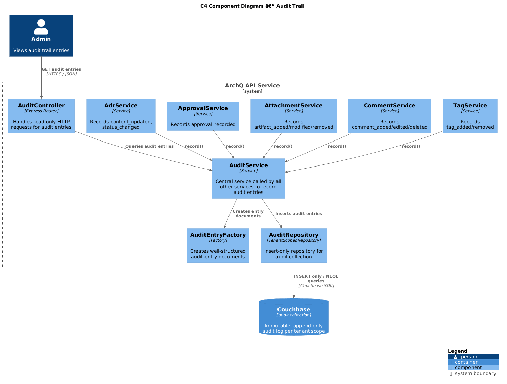
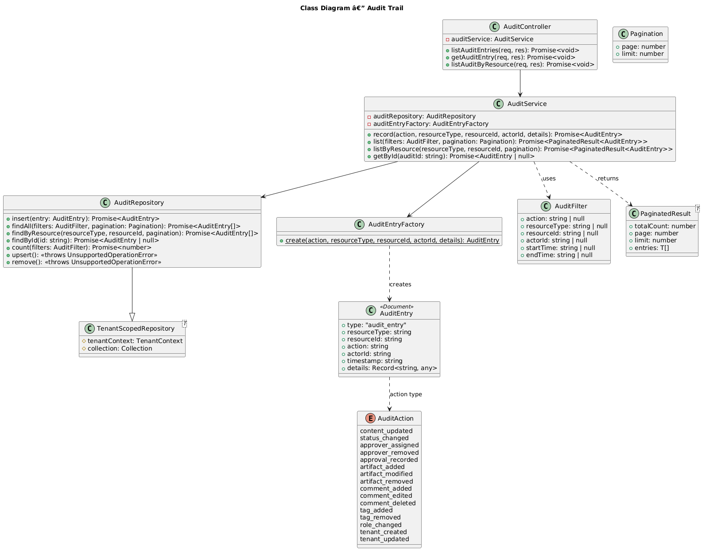
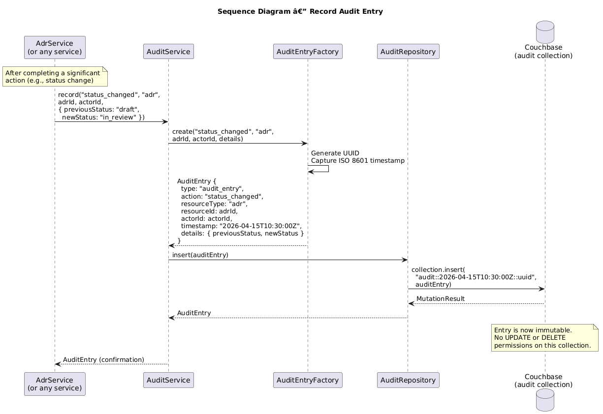

# Feature 19: Audit Trail

**Traces to:** L2-022

---

## 1. Overview

The audit trail provides an immutable, append-only log of all significant actions performed within a tenant's scope. Every content change, status transition, approver assignment, approval decision, and artifact modification is recorded with the acting user, action type, timestamp, and structured change details. Audit entries cannot be edited or deleted by any user, enforced both at the API layer (no UPDATE/DELETE endpoints) and at the database layer (append-only RBAC for the `audit` collection).

### Goals

- Record immutable audit entries for all significant system actions.
- Capture actor, action, timestamp, and structured change details for each entry.
- Display entries in reverse chronological order.
- Prevent editing or deletion of audit entries at both API and database layers.
- Support filtering by resource, action type, actor, and time range.

---

## 2. Architecture

### 2.1 C4 Component Diagram



The audit subsystem comprises the following components:

| Component | Responsibility |
|-----------|----------------|
| `AuditController` | Handles HTTP requests for reading audit entries (no write endpoints exposed) |
| `AuditService` | Central service called by all other services to record audit entries |
| `AuditRepository` | Persists audit entries to and queries the tenant-scoped `audit` collection |
| `AuditEntryFactory` | Creates well-structured audit entry documents from action parameters |

---

## 3. Component Details

### 3.1 AuditController

```
GET  /api/audit                                — List all audit entries (paginated, filterable)
GET  /api/audit/:auditId                       — Get a single audit entry
GET  /api/adrs/:adrId/audit                    — List audit entries for a specific ADR
```

No POST, PUT, PATCH, or DELETE endpoints are exposed. Audit entries are created internally by `AuditService` and cannot be modified through any API.

### 3.2 AuditService

Central service invoked by other services to record actions:

```
class AuditService {
  record(action, resourceType, resourceId, actorId, details): Promise<AuditEntry>
}
```

Called by:
- `AdrService` -- content_updated, status_changed
- `ApproverService` -- approver_assigned, approver_removed
- `ApprovalService` -- approval_recorded
- `AttachmentService` -- artifact_added, artifact_modified, artifact_removed
- `CommentService` -- comment_added, comment_edited, comment_deleted
- `TagService` -- tag_added, tag_removed
- `RoleService` -- role_changed
- `TenantService` -- tenant_created, tenant_updated

### 3.3 AuditRepository

Extends `TenantScopedRepository<AuditEntry>` targeting the `audit` collection.

**Critical:** This repository only exposes `insert` and `query` methods. The `upsert`, `update`, and `remove` methods inherited from `TenantScopedRepository` are overridden to throw `UnsupportedOperationError`.

Key queries:

```sql
-- List audit entries, reverse chronological, paginated
SELECT META().id, a.*
FROM audit a
WHERE a.type = "audit_entry"
ORDER BY a.timestamp DESC
LIMIT $limit OFFSET $offset

-- Filter by resource
SELECT META().id, a.*
FROM audit a
WHERE a.type = "audit_entry"
  AND a.resourceType = $resourceType
  AND a.resourceId = $resourceId
ORDER BY a.timestamp DESC
LIMIT $limit OFFSET $offset

-- Filter by action type
SELECT META().id, a.*
FROM audit a
WHERE a.type = "audit_entry"
  AND a.action = $action
ORDER BY a.timestamp DESC
LIMIT $limit OFFSET $offset

-- Filter by actor
SELECT META().id, a.*
FROM audit a
WHERE a.type = "audit_entry"
  AND a.actorId = $actorId
ORDER BY a.timestamp DESC
LIMIT $limit OFFSET $offset

-- Filter by time range
SELECT META().id, a.*
FROM audit a
WHERE a.type = "audit_entry"
  AND a.timestamp BETWEEN $startTime AND $endTime
ORDER BY a.timestamp DESC
LIMIT $limit OFFSET $offset
```

### 3.4 AuditEntryFactory

Creates consistently structured audit documents:

```
class AuditEntryFactory {
  static create(action, resourceType, resourceId, actorId, details): AuditEntry {
    return {
      type: "audit_entry",
      id: uuid(),
      action,
      resourceType,
      resourceId,
      actorId,
      timestamp: new Date().toISOString(),
      details
    }
  }
}
```

### 3.5 Supported Actions

| Action | Resource Type | Description | Details |
|--------|--------------|-------------|---------|
| `content_updated` | adr | ADR body was edited | `{ version: 3 }` |
| `status_changed` | adr | ADR status transitioned | `{ previousStatus, newStatus }` |
| `approver_assigned` | adr | Approver was assigned to ADR | `{ approverId, approverName }` |
| `approver_removed` | adr | Approver was removed from ADR | `{ approverId, approverName }` |
| `approval_recorded` | adr | Approver submitted decision | `{ decision: "approved"\|"rejected", approverId }` |
| `artifact_added` | adr | Attachment was uploaded | `{ attachmentId, fileName }` |
| `artifact_modified` | adr | Attachment metadata updated | `{ attachmentId, changes }` |
| `artifact_removed` | adr | Attachment was deleted | `{ attachmentId, fileName }` |
| `comment_added` | adr | Comment was posted | `{ commentId, parentCommentId }` |
| `comment_edited` | adr | Comment was edited | `{ commentId }` |
| `comment_deleted` | adr | Comment was deleted | `{ commentId }` |
| `tag_added` | adr | Tag was assigned | `{ tag }` |
| `tag_removed` | adr | Tag was removed | `{ tag }` |
| `role_changed` | user | User role was changed | `{ previousRole, newRole }` |
| `tenant_created` | tenant | Tenant was provisioned | `{ tenantSlug }` |
| `tenant_updated` | tenant | Tenant settings changed | `{ changes }` |

### 3.6 Immutability Enforcement

Immutability is enforced at multiple layers:

1. **API layer:** No PUT, PATCH, or DELETE endpoints exist for audit entries.
2. **Service layer:** `AuditService` exposes only a `record()` method; no update/delete.
3. **Repository layer:** `AuditRepository` overrides `upsert()` and `remove()` to throw errors.
4. **Database layer:** Couchbase RBAC role for the application user on the `audit` collection grants only `INSERT` and `SELECT` permissions -- no `UPDATE` or `DELETE`.

---

## 4. Data Model



### 4.1 Audit Entry Document

Stored in the tenant-scoped `audit` collection. Document key: `audit::{timestamp}::{id}`.

```json
{
  "type": "audit_entry",
  "resourceType": "adr",
  "resourceId": "adr-uuid",
  "action": "status_changed",
  "actorId": "user-uuid",
  "timestamp": "2026-04-15T10:30:00Z",
  "details": {
    "previousStatus": "draft",
    "newStatus": "in_review"
  }
}
```

### 4.2 Indexes

```sql
-- Primary audit listing index
CREATE INDEX idx_audit_by_timestamp
ON audit(timestamp DESC)
WHERE type = "audit_entry";

-- Filter by resource
CREATE INDEX idx_audit_by_resource
ON audit(resourceType, resourceId, timestamp DESC)
WHERE type = "audit_entry";

-- Filter by action
CREATE INDEX idx_audit_by_action
ON audit(action, timestamp DESC)
WHERE type = "audit_entry";

-- Filter by actor
CREATE INDEX idx_audit_by_actor
ON audit(actorId, timestamp DESC)
WHERE type = "audit_entry";
```

### 4.3 Document Key Strategy

The document key pattern `audit::{timestamp}::{id}` uses an ISO 8601 timestamp prefix to enable efficient range scans and natural ordering. The trailing UUID ensures uniqueness for entries created at the same millisecond.

---

## 5. Key Workflows

### 5.1 Record Audit Entry



**Actor:** Internal -- triggered by other services (not directly by users)

**Steps:**

1. A service (e.g., `AdrService`) completes a significant action (e.g., status change).
2. The service calls `AuditService.record("status_changed", "adr", adrId, actorId, { previousStatus, newStatus })`.
3. `AuditEntryFactory.create()` builds the audit entry document with generated UUID and current timestamp.
4. `AuditRepository.insert()` persists the entry to the tenant-scoped `audit` collection.
5. The audit entry is now immutable -- no subsequent modification is possible.

### 5.2 View Audit Trail for ADR

**Actor:** Admin or any authenticated user with tenant access

**Steps:**

1. Client sends `GET /api/adrs/:adrId/audit`.
2. `AuditController` delegates to `AuditService.listByResource("adr", adrId, pagination)`.
3. `AuditRepository` queries with resource filter, returns paginated results.
4. Service enriches entries with actor display names.
5. Response: `200 OK` with paginated audit entries.

### 5.3 View Global Audit Trail

**Actor:** Admin

**Steps:**

1. Client sends `GET /api/audit?action=status_changed&from=2026-04-01&to=2026-04-15&page=1&limit=50`.
2. `AuditController` delegates to `AuditService.list(filters, pagination)`.
3. `AuditRepository` queries with applied filters.
4. Response: `200 OK` with paginated, filtered audit entries.

---

## 6. API Contracts

### 6.1 List Audit Entries (Global)

```
GET /api/audit?action=status_changed&actorId=user-uuid&from=2026-04-01T00:00:00Z&to=2026-04-15T23:59:59Z&page=1&limit=50
Authorization: Bearer <jwt>

Response 200:
{
  "totalCount": 127,
  "page": 1,
  "limit": 50,
  "entries": [
    {
      "id": "audit::2026-04-15T10:30:00Z::uuid-1",
      "action": "status_changed",
      "resourceType": "adr",
      "resourceId": "adr-uuid",
      "actorId": "user-uuid",
      "actorName": "Jane Smith",
      "timestamp": "2026-04-15T10:30:00Z",
      "details": {
        "previousStatus": "draft",
        "newStatus": "in_review"
      }
    }
  ]
}
```

### 6.2 List Audit Entries for ADR

```
GET /api/adrs/:adrId/audit?page=1&limit=20
Authorization: Bearer <jwt>

Response 200:
{
  "adrId": "adr-uuid",
  "totalCount": 15,
  "page": 1,
  "limit": 20,
  "entries": [
    {
      "id": "audit::2026-04-15T10:30:00Z::uuid-1",
      "action": "status_changed",
      "actorId": "user-uuid",
      "actorName": "Jane Smith",
      "timestamp": "2026-04-15T10:30:00Z",
      "details": {
        "previousStatus": "draft",
        "newStatus": "in_review"
      }
    },
    {
      "id": "audit::2026-04-15T09:00:00Z::uuid-2",
      "action": "content_updated",
      "actorId": "user-uuid",
      "actorName": "Jane Smith",
      "timestamp": "2026-04-15T09:00:00Z",
      "details": {
        "version": 3
      }
    }
  ]
}
```

### 6.3 Get Single Audit Entry

```
GET /api/audit/:auditId
Authorization: Bearer <jwt>

Response 200:
{
  "id": "audit::2026-04-15T10:30:00Z::uuid-1",
  "action": "status_changed",
  "resourceType": "adr",
  "resourceId": "adr-uuid",
  "actorId": "user-uuid",
  "actorName": "Jane Smith",
  "timestamp": "2026-04-15T10:30:00Z",
  "details": {
    "previousStatus": "draft",
    "newStatus": "in_review"
  }
}
```

---

## 7. Security Considerations

| Concern | Mitigation |
|---------|------------|
| Audit entry tampering | No UPDATE/DELETE API endpoints; repository blocks upsert/remove; Couchbase RBAC restricts to INSERT + SELECT only |
| Audit log deletion | Application database user has no DELETE permission on `audit` collection |
| Cross-tenant audit access | `AuditRepository` extends `TenantScopedRepository`; queries scoped to tenant |
| Actor impersonation | `actorId` extracted from JWT by middleware, never from request body |
| Audit flooding (DoS) | Rate limiting on upstream actions; audit writes are fire-and-forget (non-blocking) |
| N1QL injection in filters | All filter parameters use parameterized N1QL queries |
| Sensitive data in details | Details contain only action metadata (status, version numbers), never full document bodies or credentials |

---

## 8. Open Questions

| # | Question | Status |
|---|----------|--------|
| 1 | Should audit entries be exportable as CSV/JSON for compliance reporting? | Open |
| 2 | Retention period for audit entries (indefinite vs. configurable)? | Open |
| 3 | Should audit entries capture IP address and user agent? | Open |
| 4 | Should there be a separate "security audit" log for auth events (login, failed login)? | Open |
| 5 | Should audit writes be async (message queue) to avoid latency on the main request path? | Open |
