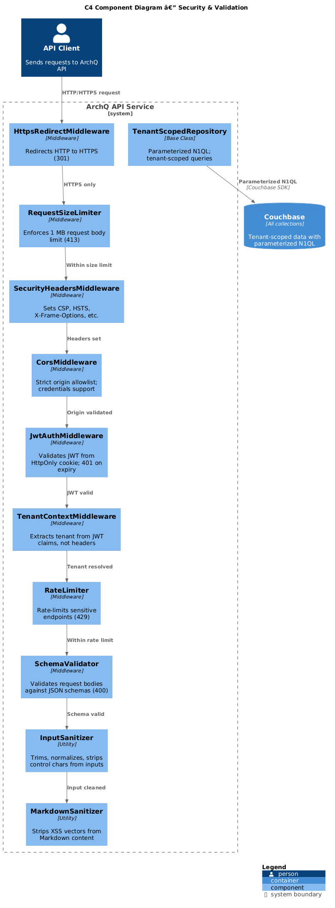
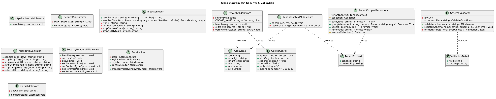
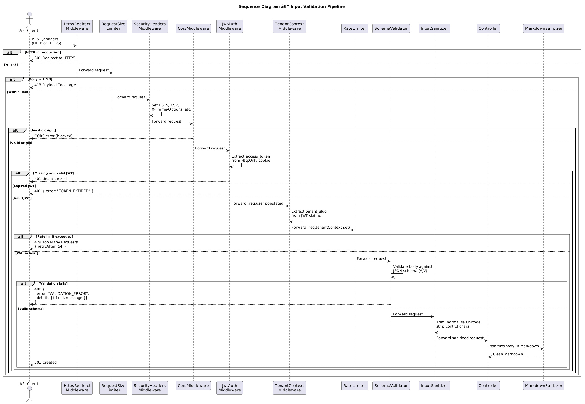
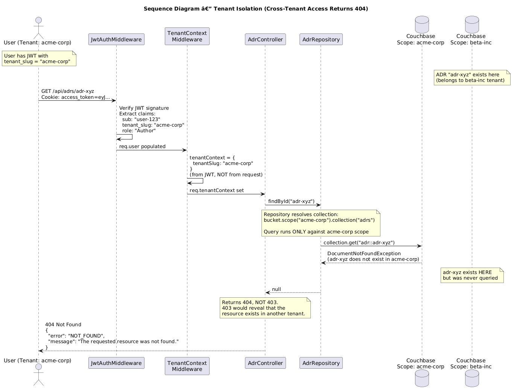

# Feature 20: Security & Validation

**Traces to:** L2-024, L2-025, L2-026

---

## 1. Overview

Security and validation form the cross-cutting foundation that protects the ArchQ platform against injection, cross-site scripting, cross-tenant data leakage, authentication bypass, and other threats from the OWASP Top 10. This design covers client-side and server-side input validation, Markdown sanitization, API schema validation, request size limits, HTTPS enforcement, JWT cookie security, tenant isolation, and parameterized N1QL queries.

### Goals

- Enforce input validation on both client and server.
- Sanitize Markdown on render to strip XSS vectors (script tags, `javascript:` URLs).
- Validate all API request bodies against JSON schemas; reject malformed requests.
- Enforce 1 MB request body limit (413 Payload Too Large).
- Enforce 200-character ADR title limit (400 Bad Request).
- Require HTTPS; redirect HTTP with 301.
- Store JWT in HttpOnly, Secure, SameSite=Strict cookies.
- Return 401 for expired JWTs.
- Resolve tenant from session/JWT, not from request headers.
- Return 404 (not 403) for cross-tenant resource access.
- Use parameterized N1QL queries to prevent injection.
- Mitigate OWASP Top 10 threats.

---

## 2. Architecture

### 2.1 C4 Component Diagram



The security and validation subsystem comprises the following middleware and utility components:

| Component | Responsibility |
|-----------|----------------|
| `HttpsRedirectMiddleware` | Redirects HTTP to HTTPS with 301 |
| `RequestSizeLimiter` | Enforces 1 MB request body limit |
| `JwtAuthMiddleware` | Validates JWT from HttpOnly cookie; rejects expired tokens with 401 |
| `TenantContextMiddleware` | Extracts tenant from JWT claims (not request headers) |
| `SchemaValidator` | Validates request bodies against JSON schemas using AJV |
| `InputSanitizer` | Sanitizes string inputs (trim, normalize, strip control characters) |
| `MarkdownSanitizer` | Strips XSS vectors from Markdown on render |
| `TenantScopedRepository` | Ensures all queries are scoped to the authenticated tenant |
| `SecurityHeadersMiddleware` | Sets security response headers (CSP, X-Frame-Options, etc.) |
| `RateLimiter` | Protects against brute-force and DoS attacks |
| `CorsMiddleware` | Configures strict CORS policy |

---

## 3. Component Details

### 3.1 HttpsRedirectMiddleware

Runs as the first middleware in the stack. In production, any request over plain HTTP is redirected:

```
if (req.protocol !== 'https' && env === 'production') {
  return res.redirect(301, `https://${req.headers.host}${req.url}`);
}
```

### 3.2 RequestSizeLimiter

Configures Express body-parser with a 1 MB limit:

```
app.use(express.json({ limit: '1mb' }));
app.use(express.urlencoded({ limit: '1mb', extended: true }));
```

Requests exceeding 1 MB receive `413 Payload Too Large`.

### 3.3 JwtAuthMiddleware

Extracts JWT from the `access_token` HttpOnly cookie (not from the `Authorization` header in production):

```
Cookie configuration:
  name: "access_token"
  httpOnly: true
  secure: true
  sameSite: "Strict"
  path: "/"
  maxAge: 3600000  (1 hour)
```

Validation steps:
1. Extract `access_token` cookie from request.
2. If missing, return `401 Unauthorized`.
3. Verify JWT signature against the signing key.
4. Check `exp` claim; if expired, return `401 { error: "TOKEN_EXPIRED" }`.
5. Extract `sub` (user ID), `tenant_id`, `tenant_slug`, `role` claims.
6. Populate `req.user` with authenticated user context.

### 3.4 TenantContextMiddleware

Extracts tenant identity exclusively from the JWT -- never from request headers, query parameters, or path segments that could be manipulated:

```
const tenantSlug = req.user.tenant_slug;  // From JWT claims
const tenantId = req.user.tenant_id;      // From JWT claims
req.tenantContext = new TenantContext(tenantId, tenantSlug);
```

Cross-tenant isolation guarantee: If a user requests a resource that exists in another tenant's scope, the query returns no results (because it runs against the wrong scope), and the API returns `404 Not Found` -- never `403 Forbidden`, which would confirm the resource exists.

### 3.5 SchemaValidator

Uses AJV (Another JSON Validator) to validate request bodies against predefined JSON schemas:

```
Schemas defined for:
- POST /api/adrs            — { title: maxLength(200), body: string, ... }
- PUT  /api/adrs/:id        — { title: maxLength(200), body: string, ... }
- POST /api/comments        — { body: maxLength(10000), parentCommentId: uuid|null }
- POST /api/tags            — { tags: array, items: { maxLength(50), pattern: "^[a-z0-9-]+$" } }
- POST /api/tenants         — { displayName: maxLength(100), slug: pattern }
```

Validation errors return `400 Bad Request` with structured error details:

```json
{
  "error": "VALIDATION_ERROR",
  "message": "Request body validation failed.",
  "details": [
    { "field": "title", "message": "must NOT have more than 200 characters" }
  ]
}
```

### 3.6 InputSanitizer

Applied to all string inputs before processing:

1. Trim leading/trailing whitespace.
2. Normalize Unicode (NFC normalization).
3. Strip null bytes and control characters (except newlines in body fields).
4. Truncate to field-specific maximum length.

### 3.7 MarkdownSanitizer

Strips dangerous HTML from Markdown content on render:

**Blocked patterns:**
- `<script>` and `</script>` tags
- `javascript:` URLs in any attribute
- `data:` URLs (except `data:image/` for inline images)
- `on*` event handler attributes (`onclick`, `onerror`, etc.)
- `<iframe>`, `<object>`, `<embed>`, `<form>` tags
- CSS `expression()` and `url(javascript:)` patterns

**Allowed safe HTML:**
- `<strong>`, `<em>`, `<code>`, `<pre>`, `<blockquote>`
- `<ul>`, `<ol>`, `<li>`, `<p>`, `<br>`, `<hr>`
- `<h1>` through `<h6>`
- `<a href="https://...">` (https only)
- `` (https only)
- `<table>`, `<thead>`, `<tbody>`, `<tr>`, `<th>`, `<td>`

### 3.8 SecurityHeadersMiddleware

Sets the following response headers on every response:

```
Strict-Transport-Security: max-age=31536000; includeSubDomains; preload
Content-Security-Policy: default-src 'self'; script-src 'self'; style-src 'self' 'unsafe-inline'; img-src 'self' data: https:; connect-src 'self'
X-Content-Type-Options: nosniff
X-Frame-Options: DENY
X-XSS-Protection: 0
Referrer-Policy: strict-origin-when-cross-origin
Permissions-Policy: camera=(), microphone=(), geolocation=()
Cache-Control: no-store (for API responses)
```

### 3.9 RateLimiter

Protects sensitive endpoints:

| Endpoint Pattern | Window | Max Requests |
|-----------------|--------|--------------|
| `POST /api/auth/login` | 15 min | 10 |
| `POST /api/auth/register` | 1 hour | 5 |
| `POST /api/auth/forgot-password` | 1 hour | 3 |
| `* /api/*` (general) | 1 min | 100 |

Exceeded limits return `429 Too Many Requests`.

### 3.10 Parameterized N1QL Queries

All N1QL queries use parameterized placeholders to prevent injection:

```
// CORRECT: Parameterized
const query = 'SELECT * FROM adrs WHERE type = "adr" AND title LIKE $search';
const params = { search: `%${sanitizedInput}%` };
cluster.query(query, { parameters: params });

// NEVER: String concatenation
const query = `SELECT * FROM adrs WHERE title LIKE '%${userInput}%'`;  // FORBIDDEN
```

### 3.11 CorsMiddleware

Strict CORS configuration:

```
cors({
  origin: ['https://app.archq.io'],  // Exact origin, no wildcards
  methods: ['GET', 'POST', 'PUT', 'PATCH', 'DELETE'],
  credentials: true,                  // Required for cookie-based auth
  allowedHeaders: ['Content-Type'],
  maxAge: 86400                       // Preflight cache 24 hours
})
```

---

## 4. Data Model



### 4.1 Validation Rules Summary

| Field | Max Length | Pattern | Error Code |
|-------|-----------|---------|------------|
| ADR title | 200 chars | Non-empty string | `TITLE_TOO_LONG` |
| ADR body | 500,000 chars | Markdown string | `BODY_TOO_LONG` |
| Comment body | 10,000 chars | Markdown string | `COMMENT_TOO_LONG` |
| Tag name | 50 chars | `^[a-z0-9-]+$` | `INVALID_TAG_NAME` |
| Tenant slug | 63 chars | `^[a-z0-9][a-z0-9-]{1,61}[a-z0-9]$` | `INVALID_SLUG` |
| Display name | 100 chars | Non-empty string | `NAME_TOO_LONG` |
| Attachment display name | 200 chars | Non-empty string | `NAME_TOO_LONG` |
| Request body (overall) | 1 MB | -- | `413 Payload Too Large` |

### 4.2 OWASP Top 10 Mitigation Matrix

| OWASP Category | Threat | Mitigation |
|---------------|--------|------------|
| A01: Broken Access Control | Cross-tenant data access | Tenant from JWT only; scope-level isolation; 404 for cross-tenant |
| A02: Cryptographic Failures | Token interception | HTTPS only; Secure cookie flag; HSTS |
| A03: Injection | N1QL injection | Parameterized queries; no string concatenation |
| A03: Injection | XSS | Markdown sanitization; CSP headers; HttpOnly cookies |
| A04: Insecure Design | Missing authorization | Role-based AuthorizationGuard on every endpoint |
| A05: Security Misconfiguration | Permissive CORS | Strict origin allowlist; no wildcard origins |
| A06: Vulnerable Components | Outdated dependencies | Automated dependency scanning (npm audit, Snyk) |
| A07: Auth Failures | Brute-force login | Rate limiting on auth endpoints |
| A08: Data Integrity Failures | Audit tampering | Append-only audit collection; no UPDATE/DELETE RBAC |
| A09: Logging & Monitoring | Missing audit trail | Comprehensive audit logging (Feature 19) |
| A10: SSRF | Server-side request forgery | No user-supplied URLs fetched server-side; allowlist for external calls |

---

## 5. Key Workflows

### 5.1 Input Validation Flow



**Actor:** Any API client

**Steps:**

1. Client sends a request (e.g., `POST /api/adrs`).
2. `HttpsRedirectMiddleware` ensures HTTPS (redirects if HTTP).
3. `RequestSizeLimiter` checks body size; rejects with 413 if over 1 MB.
4. `SecurityHeadersMiddleware` sets response security headers.
5. `CorsMiddleware` validates origin.
6. `JwtAuthMiddleware` validates JWT from cookie; rejects with 401 if expired/invalid.
7. `TenantContextMiddleware` extracts tenant from JWT claims.
8. `RateLimiter` checks request rate; rejects with 429 if exceeded.
9. `SchemaValidator` validates request body against JSON schema; rejects with 400 if invalid.
10. `InputSanitizer` cleans string fields.
11. Controller processes the request.
12. `MarkdownSanitizer` sanitizes any Markdown content before storage.

### 5.2 Tenant Isolation Flow



**Actor:** Authenticated user attempting to access a resource

**Steps:**

1. User authenticates and receives JWT with `tenant_slug: "acme-corp"`.
2. User sends `GET /api/adrs/adr-uuid-from-other-tenant`.
3. `TenantContextMiddleware` sets tenant context to `acme-corp` (from JWT, not request).
4. `AdrRepository` resolves collection as `archq.acme-corp.adrs`.
5. N1QL query runs against `acme-corp` scope only.
6. Document `adr-uuid-from-other-tenant` does not exist in `acme-corp` scope.
7. Repository returns `null`.
8. Controller returns `404 Not Found` (not 403, which would confirm resource exists elsewhere).

---

## 6. API Contracts

### 6.1 Standard Error Responses

```
401 Unauthorized (expired JWT):
{
  "error": "TOKEN_EXPIRED",
  "message": "Your session has expired. Please log in again."
}

400 Bad Request (validation):
{
  "error": "VALIDATION_ERROR",
  "message": "Request body validation failed.",
  "details": [
    { "field": "title", "message": "must NOT have more than 200 characters" },
    { "field": "body", "message": "is a required property" }
  ]
}

413 Payload Too Large:
{
  "error": "PAYLOAD_TOO_LARGE",
  "message": "Request body exceeds the 1 MB limit."
}

429 Too Many Requests:
{
  "error": "RATE_LIMITED",
  "message": "Too many requests. Please try again in 54 seconds.",
  "retryAfter": 54
}

404 Not Found (cross-tenant):
{
  "error": "NOT_FOUND",
  "message": "The requested resource was not found."
}
```

### 6.2 Security Response Headers (Example)

```
HTTP/1.1 200 OK
Strict-Transport-Security: max-age=31536000; includeSubDomains; preload
Content-Security-Policy: default-src 'self'; script-src 'self'; ...
X-Content-Type-Options: nosniff
X-Frame-Options: DENY
Referrer-Policy: strict-origin-when-cross-origin
Set-Cookie: access_token=eyJ...; HttpOnly; Secure; SameSite=Strict; Path=/; Max-Age=3600
```

---

## 7. Security Considerations

| Concern | Mitigation |
|---------|------------|
| XSS via Markdown | `MarkdownSanitizer` strips scripts, javascript: URLs, event handlers; CSP blocks inline scripts |
| JWT theft | HttpOnly + Secure + SameSite=Strict cookie; no localStorage |
| Session fixation | New JWT issued on login; old cookies overwritten |
| CSRF | SameSite=Strict cookie prevents cross-origin cookie sending |
| Cross-tenant enumeration | 404 (not 403) for all cross-tenant access; no timing differences |
| N1QL injection | Parameterized queries enforced by code review and linting rules |
| Oversized payloads | 1 MB body limit at middleware; field-specific length limits in schema |
| Brute-force attacks | Rate limiting with exponential backoff on auth endpoints |
| Clickjacking | X-Frame-Options: DENY; CSP frame-ancestors 'none' |
| Man-in-the-middle | HTTPS only with HSTS preload; TLS 1.2+ required |

---

## 8. Open Questions

| # | Question | Status |
|---|----------|--------|
| 1 | Should we implement Content-Security-Policy reporting (`report-uri`)? | Open |
| 2 | Should API responses include a request ID header for tracing? | Open |
| 3 | Should we implement Subresource Integrity (SRI) for frontend assets? | Open |
| 4 | Should failed validation attempts be logged to the audit trail? | Open |
| 5 | Should we implement certificate pinning for mobile clients (future)? | Open |
| 6 | Should the rate limiter use a distributed store (Redis) for multi-instance deployments? | Open |
