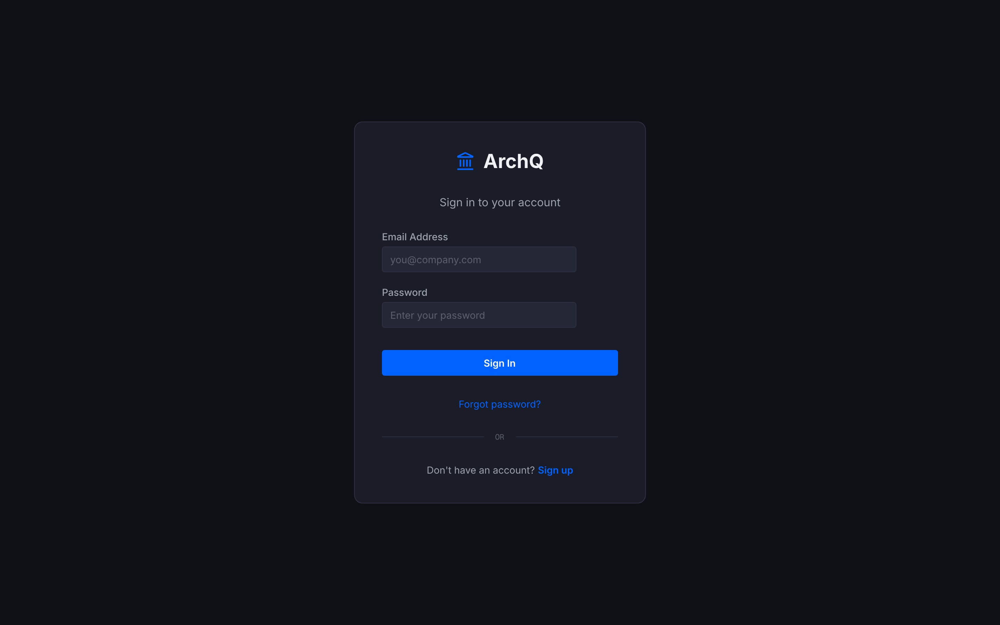
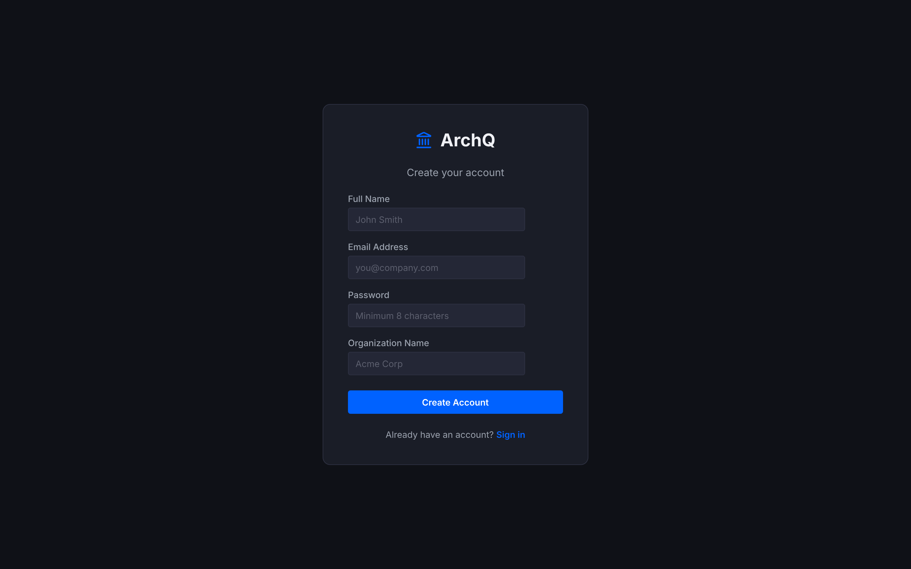
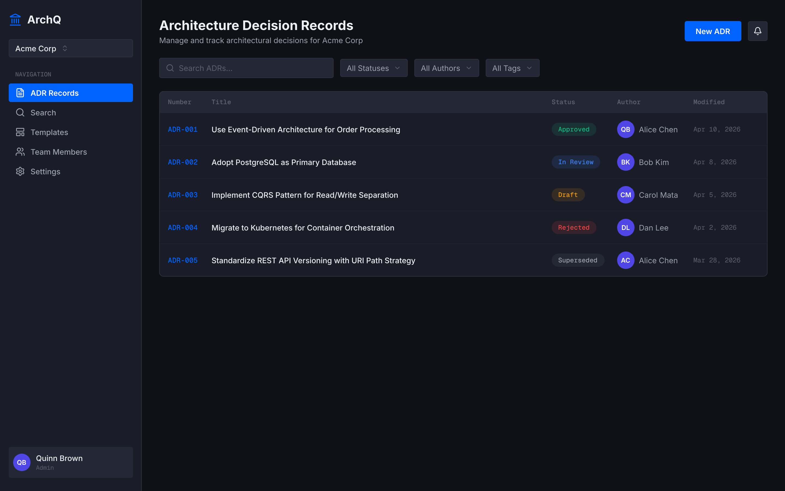
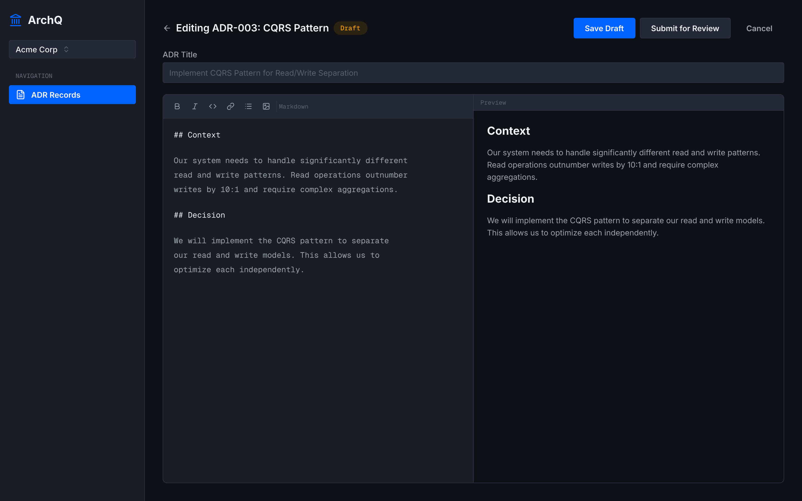
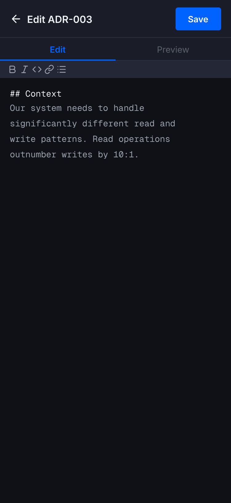
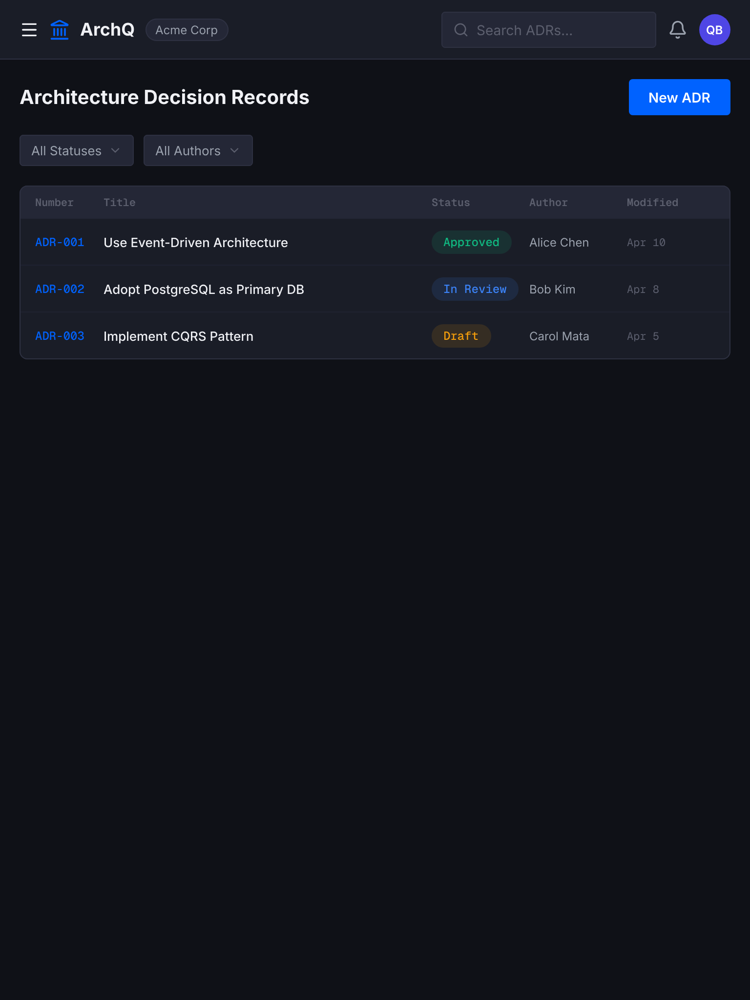
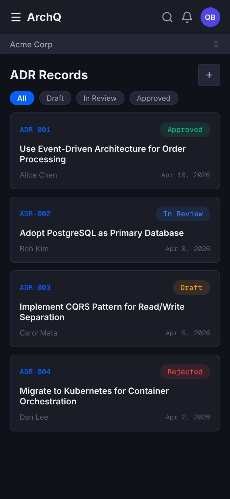
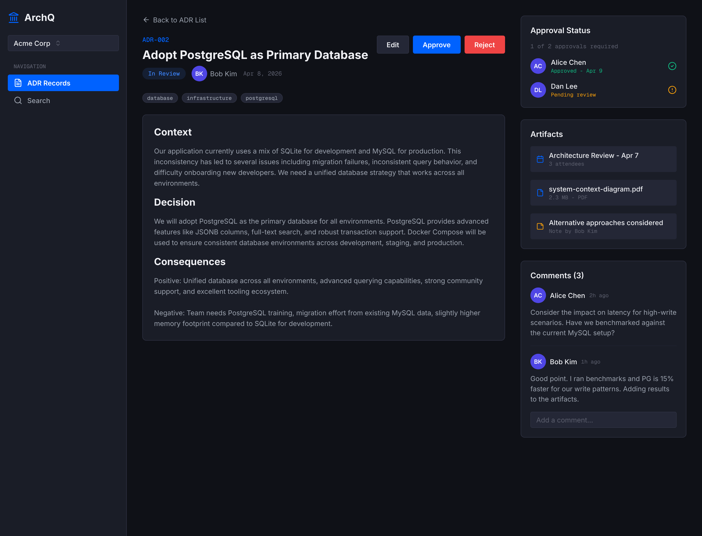
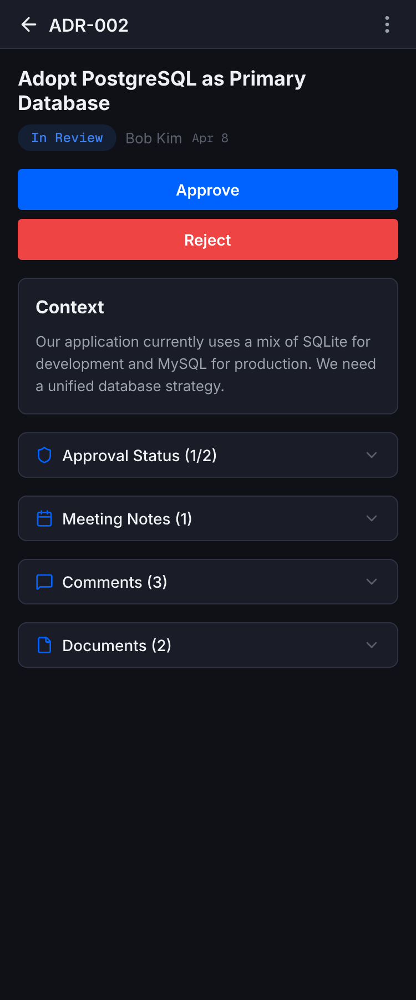

# 3. Using ArchQ

This chapter walks you through the end-to-end flow a new user sees: register, create an organisation, write your first ADR, invite teammates, and collaborate.

> **Prerequisite:** The app must be running — see [2. Running Locally](02-running-locally.md) or point your browser at your Azure deployment.

---

## 3.1 Register an account

Open <http://localhost:4200> and click **Sign up** on the login screen.

Fill in the registration form:

| Field | Notes |
|-------|-------|
| Full Name | Shown next to comments and approvals |
| Email Address | Used for sign-in and verification |
| Password | Minimum 8 characters. Hashed with bcrypt (cost 12). |
| Organization Name | Creates your first tenant. Becomes the default slug (e.g. `Acme Corp` -> `acme-corp`). |

Click **Create Account**. You'll receive a verification email with a link; in local dev the email body is printed to the API console. Click the link (or paste the token into `/verify-email`) to activate the account.

After verification you are automatically signed in and become the **Admin** of the organisation you just created.

---

## 3.2 Understand the screen you land on

Key regions:

| Region | Purpose |
|--------|---------|
| Left sidebar | Organisation switcher + primary nav (ADR Records, Search, Templates, Team Members, Settings) |
| Page header | Title, subtitle, **New ADR** button, notifications bell |
| Filter row | Search box + Status, Author, and Tag filters |
| Data table | One row per ADR with number, title, status, author, modified date |
| User card (bottom-left) | Your name, role, and sign-out |

Click the **ArchQ** wordmark or **ADR Records** any time to return here.

---

## 3.3 Invite your team (optional, admin only)

1. Open **Settings -> Team Members** from the sidebar.
2. Click **Invite User**.
3. Enter an email, pick a role (Admin, Author, Reviewer, Viewer).
4. Send the invite. The recipient gets an email with a one-time registration link tied to your tenant.

Role cheat-sheet (full matrix in [6. Administration](06-administration.md#roles-and-permissions)):

| Role | Can do |
|------|--------|
| **Admin** | Everything, including role changes and tenant settings |
| **Author** | Create and edit own ADRs, submit for review |
| **Reviewer** | Approve/reject ADRs (cannot approve own) |
| **Viewer** | Read-only |

---

## 3.4 Switch between organisations

If you belong to multiple tenants, click the **organisation dropdown** at the top of the sidebar (e.g. `Acme Corp`) and pick another. The route, data, and permissions update instantly — no re-login required.

---

## 3.5 Write your first ADR

1. Click **New ADR** (top-right).
2. ArchQ pre-populates the editor with your tenant's template. The default template has `## Context`, `## Decision`, `## Consequences` sections.

3. Give the ADR a clear, outcome-oriented title — e.g. *"Adopt PostgreSQL as Primary Database"* is better than *"DB stuff"*.
4. Write in **Markdown** on the left pane. The right pane previews the rendered output live (sanitised by DOMPurify).
5. Use the toolbar for **bold**, *italic*, `code`, links, lists, and images.
6. Click **Save Draft** to persist without submitting.

Your ADR is assigned the next sequential number for your tenant (`ADR-001`, `ADR-002`, …) and starts in the **Draft** state.

### Mobile layout

On phones the editor switches to a tabbed layout with Edit / Preview tabs and a full-width Save button:

---

## 3.6 Browsing and searching

### Filter

Use the **All Statuses**, **All Authors**, and **All Tags** dropdowns to narrow the list. Filters combine (AND).

### Search

Type in the search box. Results are ranked across ADR title, body, and tags with highlighted snippets.

### Tablet view

On medium screens the table condenses and the sidebar collapses to icons:

### Mobile view

On small screens the table becomes scannable cards with pill filters:

---

## 3.7 Collaborate on an ADR

Click any ADR row to open the detail view:

### What's on this page

| Panel | Use it for |
|-------|-----------|
| Header | Title, status badge, author, **Edit / Approve / Reject** actions |
| Body | Rendered Markdown content |
| Tags | Click a tag to filter the list by it |
| Approval Status | Who has approved, who is pending, progress toward the threshold |
| Artifacts | Attached meeting notes, uploaded documents (PDF, PNG, SVG, DRAWIO up to 10 MB) |
| Comments | Threaded comments. You have a 15-minute edit window after posting |

### Add a comment

Scroll to the Comments panel, type in the **Add a comment** field, press Enter. To reply, click **Reply** on a specific comment.

### Add a meeting note

1. Click **+ Add artifact** (or **Meeting Notes** accordion on mobile).
2. Choose **Meeting Note**.
3. Fill in date, attendees, and the Markdown body.
4. Save. The note appears in the Artifacts panel and is linked to the ADR forever.

### Upload a document

1. Click **+ Add artifact -> Document**.
2. Drag-drop or pick a file. Allowed types: PDF, PNG, SVG, DRAWIO. Size limit: 10 MB.
3. The file appears in the Artifacts panel with a preview.

### Mobile: accordion detail view

Phones show the same data stacked under accordions with a full-width Approve/Reject pair at the top:

---

## 3.8 Version history and diffs

Every edit creates an immutable version snapshot.

1. On an ADR detail page, open the **... menu** (top-right) and choose **Version History**.
2. Pick any two versions and click **Compare** to see a line-level diff.

Use version history to:

- Understand *why* a decision changed between drafts.
- Restore a previous body (admins only — creates a new version, never overwrites).

---

## 3.9 Next: the approval workflow

You know how to write and discuss ADRs. The next chapter covers the full approval workflow: submitting for review, collecting approvals, handling rejections, and superseding old decisions.

**Next:** [4. ADR Lifecycle: Draft -> Approved →](04-adr-lifecycle.md)
